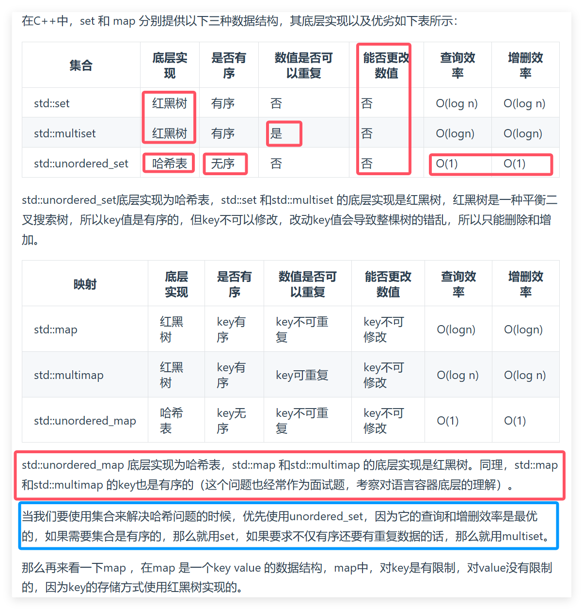

To do list: 哈希表理论基础，242.有效的字母异位词，349.两个数组的交集，202.快乐数，1. 两数之和

**当我们遇到了要快速判断一个元素是否出现集合里的时候，就要考虑哈希法。**

[哈希表理论基础](#01)，[242.有效的字母异位词](#02)，[349. 两个数组的交集](#03)，[202.快乐数](#04)，[1. 两数之和](#05)

# <span id="01">哈希表理论基础</span>

- 哈希表是根据关键码的值而直接进行访问的数据结构。一般哈希表都是用来快速判断一个元素是否出现集合里。

- 哈希函数，把学生的姓名直接映射为哈希表上的索引，然后就可以通过查询索引下标快速知道这位同学是否在这所学校里了。此时为了保证映射出来的索引数值都落在哈希表上，我们会在再次对数值做一个取模的操作，这样我们就保证了学生姓名一定可以映射到哈希表上了。

- 哈希碰撞有两种解决方法， 拉链法和线性探测法.

拉链法就是要选择适当的哈希表的大小，这样既不会因为数组空值而浪费大量内存，也不会因为链表太长而在查找上浪费太多时间。

线性探测法，一定要保证tableSize大于dataSize。 我们需要依靠哈希表中的空位来解决碰撞问题。例如冲突的位置，放了小李，那么就向下找一个空位放置小王的信息。

- 常见的三种哈希结构
  


  

# <span id="02">242.有效的字母异位词</span>

[Leetcode Problem](https://leetcode.cn/problems/valid-anagram/description/)

[Related Interpretation](https://programmercarl.com/0242.%E6%9C%89%E6%95%88%E7%9A%84%E5%AD%97%E6%AF%8D%E5%BC%82%E4%BD%8D%E8%AF%8D.html#%E7%AE%97%E6%B3%95%E5%85%AC%E5%BC%80%E8%AF%BE)

思路：1.哈希数组26个大小；2.每个空位记录字符串A对应字母出现次数；3.每个位置对冲字符串B对应字母出现次数；4.判断哈希表是否是空的

**口诀**：先记录出现的次数，再对冲出现的次数，全为0则符合。

```python
class Solution:
    def isAnagram(self, s: str, t: str) -> bool:
        hash_table = [0 for i in range(26)]
        for i in s :
            hash_table[ord(i) - ord("a")] += 1 #并不需要记住字符a的ASCII
        for i in t:
            hash_table[ord(i) - ord("a")] -= 1
        for i in range(26):
            if hash_table[i] != 0: 
                return False #record数组如果有的元素不为零0，说明字符串s和t 一定是谁多了字符或者谁少了字符
        return True
```

# <span id="03">349. 两个数组的交集</span>

[Leetcode Problem](https://leetcode.cn/problems/intersection-of-two-arrays/description/)

[Related Interpretation](https://programmercarl.com/0349.%E4%B8%A4%E4%B8%AA%E6%95%B0%E7%BB%84%E7%9A%84%E4%BA%A4%E9%9B%86.html)


- 思路：

输出结果中的每个元素一定是唯一的，也就是说输出的结果的去重的， 同时可以不考虑输出结果的顺序

1.将字符串1记录到哈希表中，2.在哈希表中判断字符串2有没有，3.有就记录到结果中

如果哈希值比较少、特别分散、跨度非常大，使用数组就造成空间的极大浪费，所以选用set。由于不在乎顺序，也不需要重复，选用无序set即可。

- 使用字典和集合：
  
```python
class Solution:
    def intersection(self, nums1: List[int], nums2: List[int]) -> List[int]:
        table = {} #创建字典
        for i in nums1:
            table[i] = table.get(i, 0) + 1 #将 num 作为键，将其对应的值加 1 后存入 table 中。这样做的目的是统计 num 在 nums1 中出现的次数。
        result = set() #创建集合
        for i in nums2:
            if i in table:
                result.add(i)
                del table[i]  #确保唯一性
        return list(result)
```

- 使用集合：

```python
class Solution:
    def intersection(self, nums1: List[int], nums2: List[int]) -> List[int]:
        return list(set(nums1) & set(nums2))
```

- 使用数组：

```python
class Solution:
    def intersection(self, nums1: List[int], nums2: List[int]) -> List[int]:
        table = [0 for i in range(1005)]
        for num in nums1:
            table[num] = 1
        result = []
        for num in nums2:
            if table[num] == 1 and num not in result:
                result.append(num)
        return result
```

# <span id="04">202.快乐数</span>

[Leetcode Problem](https://leetcode.cn/problems/happy-number/description/)

[Related Interpretation](https://programmercarl.com/0202.%E5%BF%AB%E4%B9%90%E6%95%B0.html#%E6%80%9D%E8%B7%AF)

- 破题：

无限循环：求和的过程中，sum会重复出现！→ 当我们遇到了要快速判断一个元素是否出现集合里的时候，就要考虑哈希法了。如果sum重复了，要考虑哈希！

- 使用集合：

```python
class Solution:
    def isHappy(self, n: int) -> bool:
        res = set()
        while True:
            n = self.getsum(n)
            if n == 1:
                return True
            if n in res:
                return False
            res.add(n)

    
    def getsum(self, n):
        sum = 0
        while n:
            sum += (n % 10) * (n % 10)
            n = n // 10
        return sum
```


# <span id="05">1. 两数之和</span>

[Leetcode Problem](https://leetcode.cn/problems/two-sum/description/)

[Related Interpretation](https://programmercarl.com/0001.%E4%B8%A4%E6%95%B0%E4%B9%8B%E5%92%8C.html#%E7%AE%97%E6%B3%95%E5%85%AC%E5%BC%80%E8%AF%BE)

- 为什么要用哈希法：需要一个集合来存放我们遍历过的元素，然后在遍历数组的时候去询问这个集合，某元素是否遍历过，也就是是否出现在这个集合

- 选用哪种数据结构：不仅要知道元素有没有遍历过，还要知道这个元素对应的下标，需要使用 key value结构来存放，key来存元素，value来存下标，那么使用map正合适。

- map 目的：用来存放我们访问过的元素，因为遍历数组的时候，需要记录我们之前遍历过哪些元素和对应的下标，这样才能找到与当前元素相匹配的（也就是相加等于target）。

- 所以 map中的存储结构为 {key：数据元素，value：数组元素对应的下标}。

- 使用字典：

```python
class Solution:
    def twoSum(self, nums: List[int], target: int) -> List[int]:
        result = dict()
        for index, value in enumerate(nums) :
            if target - value in result:
                return [result[target - value], index]
            result[value] = index
        return []
```

- 使用集合

```python
class Solution:
    def twoSum(self, nums: List[int], target: int) -> List[int]:
        result = set()
        for index, num in enumerate(nums) :
            if target - num in result:
                return [nums.index(target - num), index]
            result.add(num)
        return []
```
