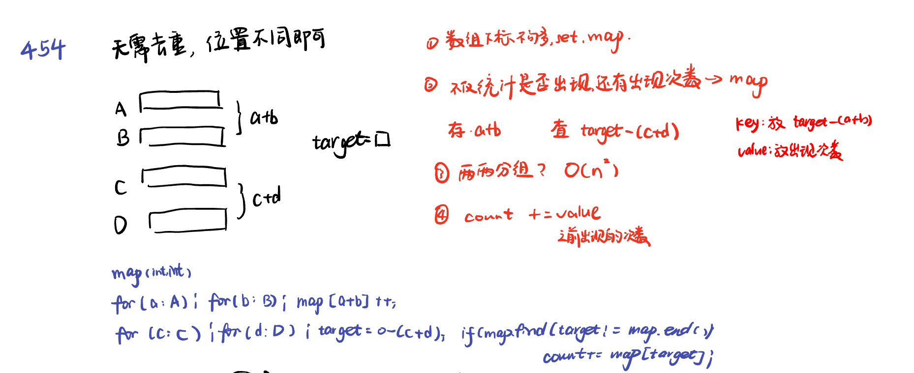
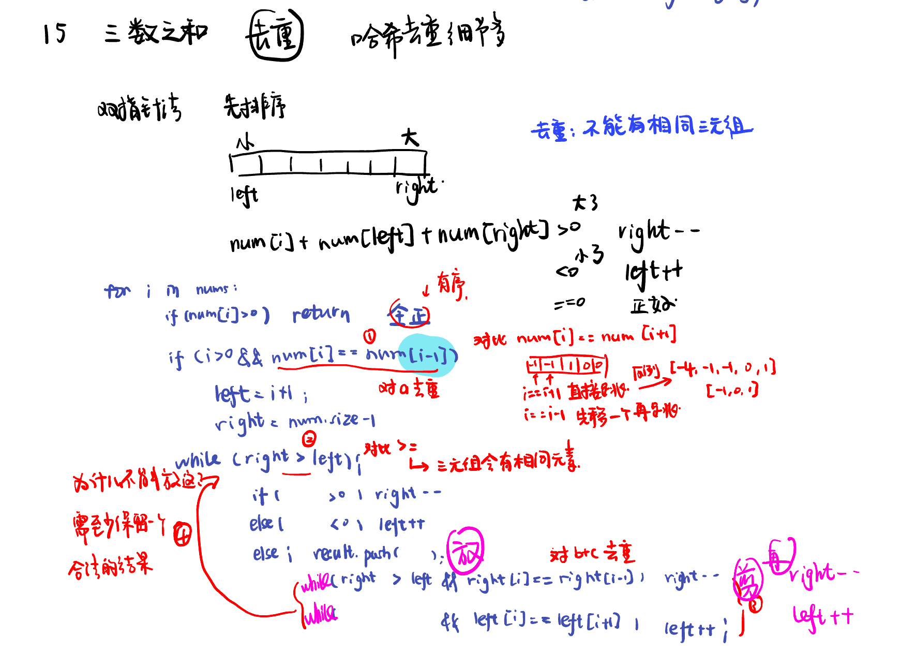
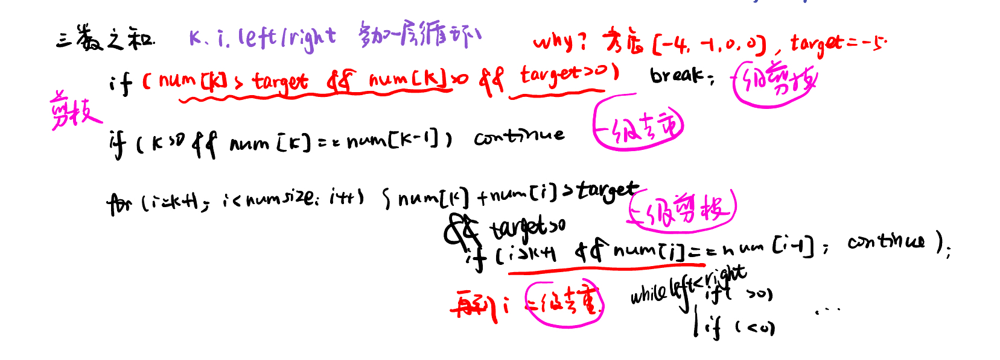

**当我们遇到了要快速判断一个元素是否出现集合里的时候，就要考虑哈希法。**

[454.四数相加II](#01)，[383. 赎金信](#02)，[15.三数之和](#03)，[18.四数之和](#04)，[总结](#05)

# <span id="01">454.四数相加II</span>

**value为和，key记出现次数。**

[Related Interpretation](https://programmercarl.com/0454.%E5%9B%9B%E6%95%B0%E7%9B%B8%E5%8A%A0II.html#%E7%AE%97%E6%B3%95%E5%85%AC%E5%BC%80%E8%AF%BE)
  


```python
class Solution:
    def fourSumCount(self, nums1: List[int], nums2: List[int], nums3: List[int], nums4: List[int]) -> int:
        table = dict()
        for n1 in nums1:
            for n2 in nums2:
                table[n1 + n2] = table.get(n1 + n2, 0 ) + 1
        count = 0
        for n3 in nums3:
            for n4 in nums4:
                target = 0 - (n3 + n4)
                if target in table:
                    count += table[target]
        return count
```

# <span id="02">383. 赎金信</span>

[Related Interpretation](https://programmercarl.com/0383.%E8%B5%8E%E9%87%91%E4%BF%A1.html#%E6%80%9D%E8%B7%AF)

第一点“为了不暴露赎金信字迹，要从杂志上搜索各个需要的字母，组成单词来表达意思”  这里说明杂志里面的字母不可重复使用。

第二点 “你可以假设两个字符串均只含有小写字母。” 说明只有小写字母，那可以采用空间换取时间的哈希策略，用一个长度为26的数组来记录magazine里字母出现的次数。

在本题的情况下，使用map的空间消耗要比数组大一些的，因为map要维护红黑树或者哈希表，而且还要做哈希函数，是费时的。本题可以选用数组。

```python
class Solution:
    def canConstruct(self, ransomNote: str, magazine: str) -> bool:
        record = [0 for _ in range(26)]
        if len(ransomNote) > len(magazine):
            return False
        for i in magazine:
            record[ord(i) - ord("a")] += 1
        for i in ransomNote:
            record[ord(i) - ord("a")] -= 1
            if record[ord(i) - ord("a")] < 0:
                return False
        return True
```

# <span id="03">15.三数之和</span>

[Related Interpretation](https://programmercarl.com/0015.%E4%B8%89%E6%95%B0%E4%B9%8B%E5%92%8C.html#%E7%AE%97%E6%B3%95%E5%85%AC%E5%BC%80%E8%AF%BE)



**剪枝：排序首数就很大。
去重a：后数前数不相同；
去重b+c：反复看后数前数不相同。**

```python
class Solution:
    def threeSum(self, nums: List[int]) -> List[List[int]]:
        nums.sort()
        result = []
        for i in range(len(nums)):
            if nums[i] > 0:
                return result
            if i > 0 and nums[i] == nums[i-1]:
                continue

            left = i + 1
            right = len(nums) - 1

            while left < right:
                if nums[i] + nums[left] + nums[right] > 0:
                    right -= 1
                elif nums[i] + nums[left] + nums[right] < 0: #使用了 if-elif-else 结构，确保每次只执行一个分
                    left += 1
                else :
                    result.append([nums[i], nums[left], nums[right]])
                    
                    while right > left and nums[right] == nums[right - 1]:
                        right -= 1
                    while right > left and nums[left] == nums[left + 1]:
                        left += 1
                    
                    right -= 1
                    left += 1
        return result
```

# <span id="04">18.四数之和</span>

[Related Interpretation](https://programmercarl.com/0018.%E5%9B%9B%E6%95%B0%E4%B9%8B%E5%92%8C.html#%E7%AE%97%E6%B3%95%E5%85%AC%E5%BC%80%E8%AF%BE)



**剪枝：排序首数就很大。
去重a：后数前数不相同；
去重b+c：反复看后数前数不相同。
两次去重，两次剪枝。**

```python
class Solution:
    def fourSum(self, nums: List[int], target: int) -> List[List[int]]:
        nums.sort()
        result = []
        
        for k in range(len(nums)):
            if nums[k] > target and nums[k] > 0 and target > 0:
                break
            if k > 0 and nums[k] == nums[k-1]:
                continue
            for i in range(k + 1, len(nums)):
                if nums[i] + nums[k] > target and target > 0:
                    break
                if i > k + 1 and nums[i] == nums[i-1]:
                    continue
                left = i + 1
                right = len(nums) - 1
                while left < right:
                    if nums[k] + nums[i] + nums[left] + nums[right] > target:
                        right -= 1
                    elif nums[k] + nums[i] + nums[left] + nums[right] < target: 
                        left += 1
                    else :
                        result.append([nums[k], nums[i], nums[left], nums[right]])
                        while right > left and nums[right] == nums[right - 1]:
                            right -= 1
                        while right > left and nums[left] == nums[left + 1]:
                            left += 1
                        right -= 1
                        left += 1
        return result
```

# <span id="05">总结</span>

[Related Interpretation](https://programmercarl.com/%E5%93%88%E5%B8%8C%E8%A1%A8%E6%80%BB%E7%BB%93.html#%E5%93%88%E5%B8%8C%E8%A1%A8%E7%90%86%E8%AE%BA%E5%9F%BA%E7%A1%80)

数组局限：数组的大小是有限的，受到系统栈空间（不是数据结构的栈）的限制。如果数组空间够大，但哈希值比较少、特别分散、跨度非常大，使用数组就造成空间的极大浪费。

数组和set局限：数组的大小是受限制的，而且如果元素很少，而哈希值太大会造成内存空间的浪费。set是一个集合，里面放的元素只能是一个key，而两数之和这道题目，不仅要判断y是否存在而且还要记录y的下标位置，因为要返回x 和 y的下标。所以set 也不能用。
