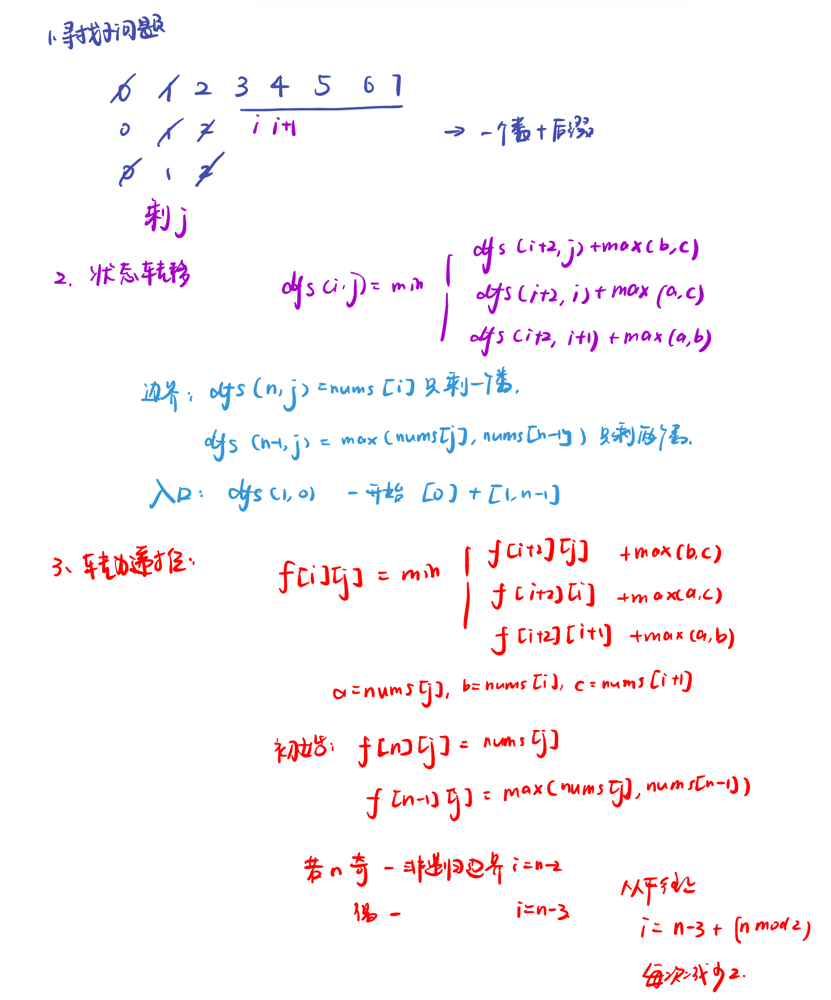
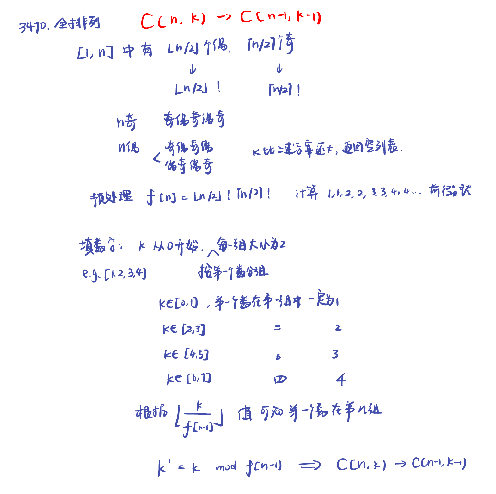

LeetCode Biweekly Contest 150

# [3467. 将数组按照奇数偶数转化](https://leetcode.cn/problems/transform-array-by-parity/description/)

破题：取余，记录几个奇数几个偶数

```python
class Solution:
    def transformArray(self, nums: List[int]) -> List[int]:
        cnt = Counter(x % 2 for x in nums)
        return [0] * cnt[0] + [1] * cnt[1]
```

# [3468.可行数组的数目](https://leetcode.cn/problems/find-the-number-of-copy-arrays/description/)

```python
class Solution:
    def countArrays(self, original: List[int], bounds: List[List[int]]) -> int:
        mn, mx = -inf, inf
        for x, (u, v) in zip(original, bounds):
            d = x - original[0]
            mn = max(mn, u - d)
            mx = min(mx, v - d)
        return max(mx - mn + 1, 0)

"""
    1.copy[i]−copy[i−1]=original[i]−original[i−1]

    copy[1]−copy[0] = original[1]−original[0]
    copy[2]−copy[1] = original[2]−original[1]
    copy[3]−copy[2] = original[3]−original[2]
      ⋮
    copy[i]−copy[i−1] = original[i]−original[i−1] 

    累加等号左边的所有项，累加等号右边的所有项，得:copy[i]−copy[0]=original[i]−original[0]
    移项得:copy[i]=copy[0]+original[i]−original[0]
    确定了 copy[0]，那么整个数组也就确定了。
    所以 copy[0] 的取值范围（整数集合）的大小就是答案。

    2.题目要求

    ui ≤ copy[i] ≤vi
    ​设di = original[i] − original[0] 用 copy[i]=copy[0]+di替换上式中的 copy[i]，得
    ui ≤ copy[0] + di ≤vi
    ​移项得 ui - di ≤ copy[i] ≤vi - di

    可以得到 n 个关于 copy[0] 的不等式，或者说区间：

    [u0, v0]
    [u1 - d1, v1 - d1]
    [u2 - d2, v2 - d2]
      ⋮
    [u_{n - 1} - d1_{n - 1}, v1_{n - 1} - d1_{n - 1}]
    
    的交集，即为 copy[0] 能取到的值。

    区间交集的大小即为答案。如果交集为空，返回 0。

    交集的范围：所有区间左端点取最大值，右端点取最小值。
"""
```


# [3469.移除所有数组元素的最小代价](https://leetcode.cn/problems/find-minimum-cost-to-remove-array-elements/description/)



```python
class Solution:
    def minCost(self, nums: List[int]) -> int:
        n = len(nums)
        f = [[0] * i for i in range(n + 1)]
        f[n] = nums
        f[n - 1] = [max(x, nums[-1]) for x in nums]
        for i in range(n - 3 + n % 2, 0, -2):
            b, c = nums[i], nums[i + 1]
            for j in range(i):
                a = nums[j]
                f[i][j] = min(f[i + 2][j] + max(b, c),
                            f[i + 2][i] + max(a, c),
                            f[i + 2][i + 1] + max(a, b))
        return f[1][0]
```

# [3470.全排列Ⅳ](https://leetcode.cn/problems/permutations-iv/description/)



```python
# 初始化列表 f，作为一个动态规划表，用于存储特定计算结果
f = [1]
# 初始化变量 i，用于控制后续的循环和计算乘数
i = 1
# 开始一个 while 循环，只要列表 f 的最后一个元素小于 10 的 15 次方，就会持续执行循环体
while f[-1] < 10 ** 15:
    # 将列表 f 的最后一个元素乘以当前的 i 值，然后添加到列表 f 的末尾
    f.append(f[-1] * i)
    # 再次将列表 f 的新最后一个元素乘以当前的 i 值，添加到列表 f 的末尾
    f.append(f[-1] * i)
    # i 的值增加 1，为下一次循环的计算做准备
    i += 1

# 定义一个名为 Solution 的类，用于封装解决排列问题的方法
class Solution:
    # 定义类中的 permute 方法，接收两个参数 n 和 k
    # n 表示要生成排列的数字范围是从 1 到 n
    # k 表示要获取的是第 k 个排列（这里后续会将其转换为从 0 开始计数）
    def permute(self, n: int, k: int) -> list[int]:
        # 将 k 的值减 1，使 k 从 0 开始计数，方便后续的计算
        k -= 1 
        # 检查 n 是否小于列表 f 的长度，并且 k 是否大于等于 f[n] 乘以 (2 - n % 2)
        # 当 n 是偶数时，排列的方案数会乘以 2
        # 如果满足这个条件，说明不存在第 k 个排列，返回空列表
        if n < len(f) and k >= f[n] * (2 - n % 2):
            return []
        # 初始化一个二维列表 cand，用于存储剩余未填入排列结果 ans 的数字
        # cand[0] 存储从 2 开始到 n 的所有偶数
        # cand[1] 存储从 1 开始到 n 的所有奇数
        cand = [list(range(2, n + 1, 2)), list(range(1, n + 1, 2))]
        # 初始化一个长度为 n 的列表 ans，用于存储最终的排列结果，初始元素都为 0
        ans = [0] * n
        # 初始化变量 parity，用于控制当前选择数字是从偶数列表还是奇数列表中选取
        # 初始值为 1，表示先从奇数列表开始
        parity = 1
        # 开始一个 for 循环，循环次数为 n 次，用于依次确定排列结果中的每个位置的数字
        for i in range(n):
            # 检查 n - 1 - i 是否小于列表 f 的长度
            if n - 1 - i < len(f):
                # 使用 divmod 函数将 k 除以 f[n - 1 - i]，得到商 j 和余数 k
                # j 表示当前要从 cand[parity] 列表中选取的元素的索引
                # k 则用于后续位置的计算
                j, k = divmod(k, f[n - 1 - i])
                # 当 n 是偶数且处于第一次循环（i == 0）时
                if n % 2 == 0 and i == 0:
                    # 根据 j 的奇偶性来更新 parity 的值
                    # 如果 j 是奇数，parity 变为 0（从偶数列表选取）；如果 j 是偶数，parity 保持 1（从奇数列表选取）
                    parity = 1 - j % 2
                    # 将 j 除以 2 取整，因为在偶数 n 的情况下排列方案数翻倍，需要调整索引
                    j //= 2
            else:
                # 如果 n - 1 - i 不小于列表 f 的长度，将 j 设为 0
                j = 0
            # 从 cand[parity] 列表中取出索引为 j 的元素，放入排列结果 ans 的第 i 个位置
            # 同时将该元素从 cand[parity] 列表中移除
            ans[i] = cand[parity].pop(j)
            # 切换 parity 的值，即从 0 变为 1 或者从 1 变为 0
            # 用于下一次循环时从另一个列表中选取数字
            parity ^= 1
        # 返回最终的排列结果列表 ans
        return ans
```
