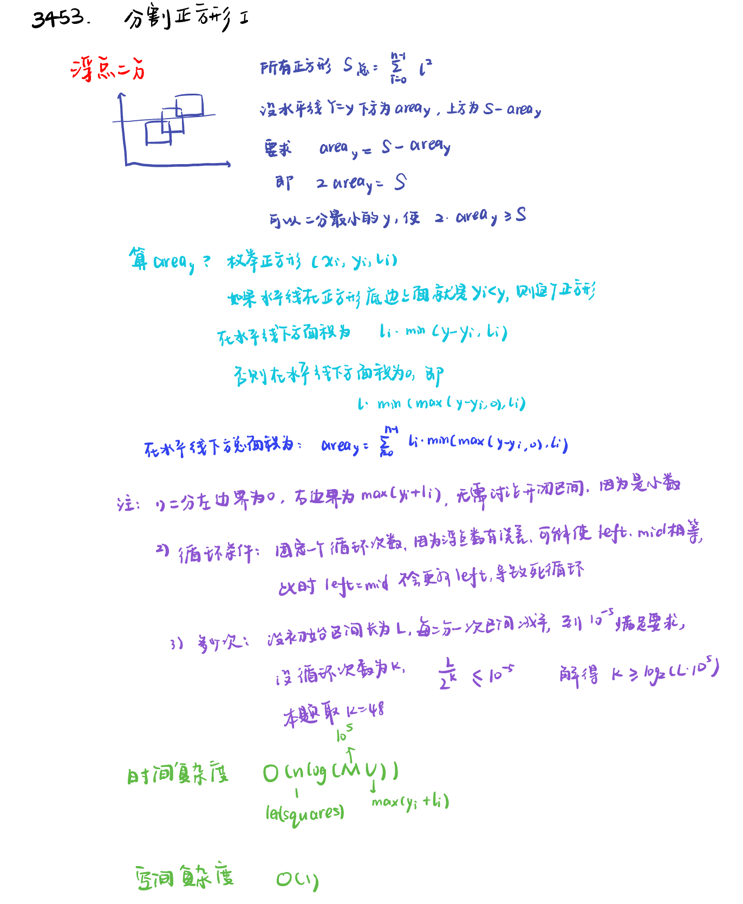
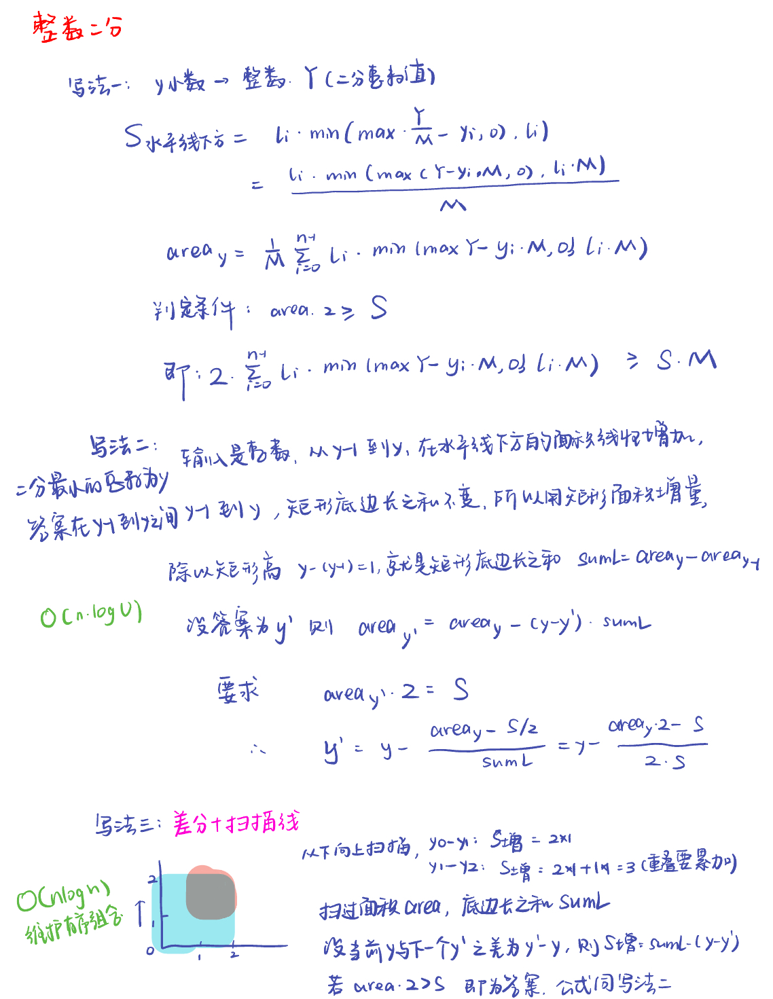

LeetCode Biweekly Contest 150

# 3452.好数字之和

[LeetCode](https://leetcode.cn/problems/sum-of-good-numbers/description/)

## 审题

- 当`i - k`和`i + k`这两个下标对应的元素都存在时，需要同时满足`nums[i] > nums[i - k]`和`nums[i] > nums[i + k]`，`nums[i]`才是好元素。
  
- 当`i - k`不存在但`i + k`存在时，只需要满足`nums[i] > nums[i + k]`，`nums[i]`就是好元素。
  
- 当`i + k`不存在但`i - k`存在时，只需要满足`nums[i] > nums[i - k]`，`nums[i]`就是好元素。
  
- 当`i - k`和`i + k`都不存在时，`nums[i]`直接就是好元素。
  
```python
class Solution:
    def sumOfGoodNumbers(self, nums: List[int], k: int) -> int:
        n = len(nums)
        good_sum = 0
        for i in range(n):
            # i - k不存在且i + k不存在
            if i < k and i + k >= n:
                good_sum += nums[i]
            # i - k不存在但i + k存在
            elif i < k and nums[i] > nums[i + k]:
                good_sum += nums[i]
            # i + k不存在但i - k存在
            elif i + k >= n and nums[i] > nums[i - k]:
                good_sum += nums[i]
            # i - k和i + k都存在
            elif nums[i] > nums[i - k] and nums[i] > nums[i + k]:
                good_sum += nums[i]
        return good_sum
```

## 简化代码

对于数组 `nums` 中的元素 `nums[i]`，如果它严格大于下标 `i - k` 和 `i + k` 处的元素（前提是这两个下标对应的元素存在），那么 `nums[i]` 就是好元素；若 `i - k` 和 `i + k` 这两个下标都不存在，`nums[i]` 同样被视为好元素。

### 分别分析 `i - k` 和 `i + k` 的情况

#### 分析 `i - k` 的情况
- **`i - k` 不存在**：当 `i < k` 时，`i - k` 为负数，这意味着 `i - k` 位置在数组中没有对应的元素。根据题目规则，此时 `nums[i]` 天然满足关于 `i - k` 位置的要求。
- **`i - k` 存在**：当 `i >= k` 时，`i - k` 是一个有效的数组索引。此时要使 `nums[i]` 满足关于 `i - k` 位置的要求，就需要 `nums[i] > nums[i - k]`。

综合这两种情况，对于 `i - k` 位置的判断可以用逻辑或（`or`）连接起来，得到子条件 `i < k or nums[i] > nums[i - k]`。逻辑或的特点是只要其中一个条件为 `True`，整个子条件就为 `True`，正好符合上述两种情况中只要满足其一即可的逻辑。

#### 分析 `i + k` 的情况
- **`i + k` 不存在**：当 `i + k >= len(nums)` 时，说明 `i + k` 超出了数组的长度范围，即 `i + k` 位置在数组中没有对应的元素。按照题目规则，此时 `nums[i]` 满足关于 `i + k` 位置的要求。
- **`i + k` 存在**：当 `i + k < len(nums)` 时，`i + k` 是一个有效的数组索引。要使 `nums[i]` 满足关于 `i + k` 位置的要求，就需要 `nums[i] > nums[i + k]`。

### 合并两个子条件
由于要同时满足关于 `i - k` 位置和 `i + k` 位置的要求，所以需要用逻辑与（`and`）将上述两个子条件连接起来，最终就得到了判断条件 `(i < k or nums[i] > nums[i - k]) and (i + k >= len(nums) or nums[i] > nums[i + k])`。逻辑与的特点是只有当两个子条件都为 `True` 时，整个判断条件才为 `True`，这与题目要求的同时满足两个位置的条件相契合。

```python
class Solution:
    def sumOfGoodNumbers(self, nums: List[int], k: int) -> int:
        ans = 0
        for i in range(len(nums)):
            if (i < k or nums[i] > nums[i - k]) and (i + k >= len(nums) or nums[i] > nums[i + k]):
                ans += nums[i]
        return ans
```


# 3453. 分割正方形Ⅰ

[Leetcode](https://leetcode.cn/problems/separate-squares-i/description/)

## 方法一：浮点二分



```python
class Solution:
    def separateSquares(self, squares: List[List[int]]) -> float:
        M = 100000
        S = sum(l * l for xi, yi, l in squares)

        def check(y: float) -> bool:
            area = 0
            for xi, yi, l in squares:
                if yi < y:
                    area += l * min(y - yi, l)
            return area >= S / 2
        
        left = 0
        right = maxy = max(y + l for _, y, l in squares)
        for i in range((maxy * M).bit_length()):
            mid = (left + right) / 2
            if check(mid):
                right = mid
            else:
                left = mid
        return (left + right) / 2  # 区间中点误差小
```

## 方法二： 整数二分



### 写法一：

```python
class Solution:
    def separateSquares(self, squares: List[List[int]]) -> float:
        M = 100000
        S = sum(l * l for xi, yi, l in squares)

        def check(y: int) -> bool:
            area = 0
            for xi, yi, l in squares:
                if yi * M < y:
                    area += l * min(y - yi * M, l * M)
            return area >= (S * M) / 2
        
        maxy = max(y + l for _, y, l in squares)
        return bisect_left(range(maxy * M), True, key = check) / M
# return bisect_left(range(maxy * M), True, key = check) / M 这行代码的整体作用是利用二分查找算法，在所有可能的分割线位置中，找到满足分割线下方正方形面积之和至少为总面积一半的最小分割线位置，并将其转换为浮点数形式返回。
```

### 写法二：

```python
class Solution:
    def separateSquares(self, squares: List[List[int]]) -> float:
        def calcarea(y: int) -> int:
            area = 0
            for xi, yi, l in squares:
                if yi < y:
                    area += l * min(y - yi, l)
            return area
                    
        S = sum(l * l for xi, yi, l in squares)
        maxy = max(y + l for _, y, l in squares)
        y = bisect_left(range(maxy), S, key = lambda y : calcarea(y) * 2) 

        area_y = calcarea(y)
        sum_l = area_y - calcarea(y - 1)
        return y - (area_y * 2 - S) / (sum_l * 2)
```

### 写法三：

```python
class Solution:
    def separateSquares(self, squares: List[List[int]]) -> float:
        S = 0
        diff = defaultdict(int)
        for xi, yi, l in squares:
            S += l * l 
            diff[yi] += l 
            diff[yi + l] -= l 

        area = sum_l = 0
        for y, y2 in pairwise(sorted(diff)):
            sum_l += diff[y]
            area += sum_l * (y2 - y)
            if area * 2 >= S:
                return y2 - (area * 2 - S) / (sum_l * 2) 
```

- 差分数组

差分数组是一种用于高效处理数组区间操作的数据结构。作用是：

**快速区间更新**：在一些需要对数组的某个区间进行频繁更新操作的场景中，差分数组能发挥很大的作用。比如要对原数组`arr`的`[l, r]`区间内的所有元素都加上一个值`x`，如果直接操作原数组，时间复杂度为$O(r - l + 1)$。但利用差分数组，只需要让`diff[l] += x`，`diff[r + 1] -= x`，时间复杂度为$O(1)$。之后通过对差分数组求前缀和就可以得到更新后的原数组。

本题中，差分数组能够记录每个高度上正方形边长的变化情况，并据此计算不同高度区间内的面积。

**底部增加边长**：当在正方形的底部高度 `yi` 处执行 `diff[yi] += l` 时，这意味着在这个高度上开始有一个边长为 `l` 的正方形出现，记录下这个增加量，就可以知道在该高度有新的正方形覆盖进来，边长总和增加了 `l`。

**顶部减少边长**：在正方形的顶部高度 `yi + l` 处执行 `diff[yi + l] -= l`，表示在这个高度上之前在 `yi` 开始的正方形结束了，所以要把对应的边长 `l` 减掉。这样，差分数组中每个键值对就清晰地反映了在对应高度上正方形边长的变化情况，即哪些高度有正方形开始，哪些高度有正方形结束，从而整体上能反映出所有正方形在不同高度的覆盖情况。


题解参考：灵茶山艾府
