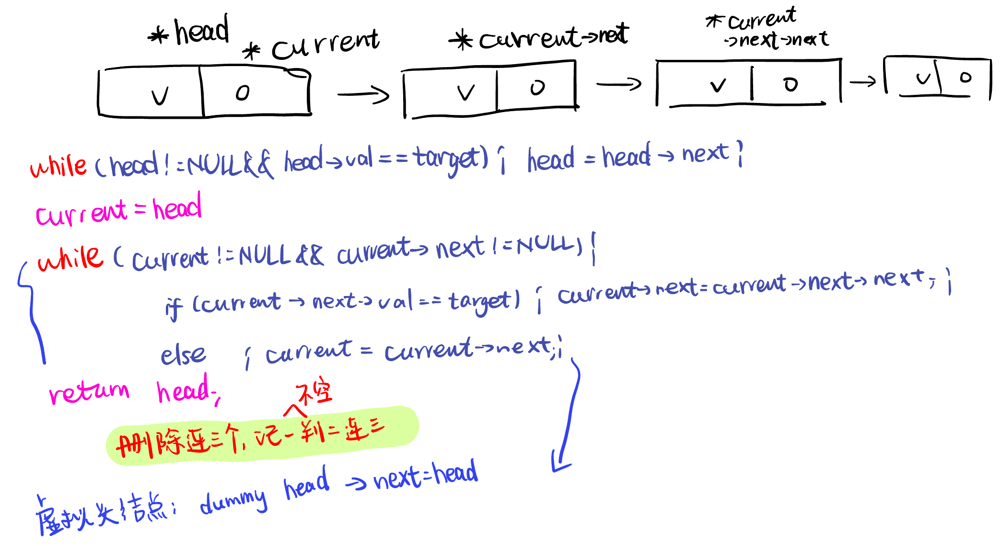
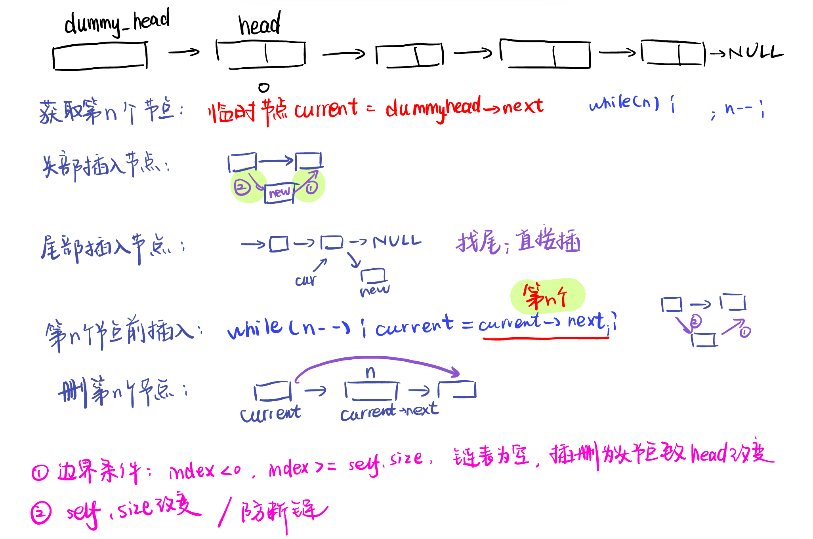

[链表理论基础](#01)，[203.移除链表元素](#02)，[707.设计链表](#03)，[206.反转链表](#04)

# <span id="01">链表理论基础</span>

[Textual Interpretation](https://programmercarl.com/%E9%93%BE%E8%A1%A8%E7%90%86%E8%AE%BA%E5%9F%BA%E7%A1%80.html)

类型：单链表中的指针域只能指向节点的下一个节点。双链表的每一个节点有两个指针域，一个指向下一个节点，一个指向上一个节点。循环链表，就是链表首尾相连，可以用来解决约瑟夫环问题。

存储方式：链表在内存中可不是连续分布的。链表是通过指针域的指针链接在内存中各个节点。所以链表中的节点在内存中不是连续分布的 ，而是散乱分布在内存中的某地址上，分配机制取决于操作系统的内存管理。

定义：

```C++
// 单链表
struct ListNode {
    int val;  // 节点上存储的元素
    ListNode *next;  // 指向下一个节点的指针
    ListNode(int x) : val(x), next(NULL) {}  // 节点的构造函数
};
```

操作：删除-换连接，释放内存（Python自动回收），O(n)需要找到删除节点的位置；添加-插入节点O(1)

```Python
class ListNode:
    def __init__(self, val, next=None):
        self.val = val
        self.next = next
```

# <span id="02">203.移除链表元素</span>

[Related Explaination](https://programmercarl.com/0203.%E7%A7%BB%E9%99%A4%E9%93%BE%E8%A1%A8%E5%85%83%E7%B4%A0.html)

-直接删除：

```Python
# Definition for singly-linked list.
# class ListNode:
#     def __init__(self, val=0, next=None):
#         self.val = val
#         self.next = next
class Solution:
    def removeElements(self, head: Optional[ListNode], val: int) -> Optional[ListNode]:
        if not head:
            return None
        while head != None and head.val == val :
            head = head.next
        current = head
        while current != None and current.next != None:
            if current.next.val == val:
                current.next = current.next.next
            else:
                current = current.next
        return head
```

- 虚拟头节点：



```Python
# Definition for singly-linked list.
# class ListNode:
#     def __init__(self, val=0, next=None):
#         self.val = val
#         self.next = next
class Solution:
    def removeElements(self, head: Optional[ListNode], val: int) -> Optional[ListNode]:
        if not head:
            return None
        
        dummy_head = ListNode (next = head)

        current = dummy_head

        while current.next != None:
            if current.next.val == val:
                current.next = current.next.next
            else:
                current = current.next

        return dummy_head.next #头节点可能被删掉，不能直接返回head
```

# <span id="03">707.设计链表</span>

[Related Explaination](https://programmercarl.com/0707.%E8%AE%BE%E8%AE%A1%E9%93%BE%E8%A1%A8.html)



- 单链表：
  
```Python
class MyLinkedList:

    class ListNode:
        def __init__(self, val, next = None):
            self.val = val
            self.next = next

    def __init__(self) :
        self.head = None
        self.size = 0

    def get(self, index: int) -> int:
        if index < 0 or index >= self.size :
            return -1
        dummy_head = self.ListNode(0, self.head) 
        current = dummy_head
        while index != 0 :
            current = current.next
            index -= 1
        return current.next.val

    def addAtHead(self, val: int) -> None:
        newnode = self.ListNode(val)
        newnode.next = self.head
        self.head = newnode
        self.size += 1

    def addAtTail(self, val: int) -> None:
        if self.size == 0:
            self.head = self.ListNode(val)
        else:
            current = self.head
            while current.next != None :
                current = current.next
            newnode = self.ListNode(val)
            current.next = newnode
        self.size += 1

    def addAtIndex(self, index: int, val: int) -> None:
        if index > self.size :
            return
        if index <= 0:
            self.addAtHead(val)
        else:
            dummy_head = self.ListNode(0, self.head) 
            current = dummy_head
            while index != 0 :
                current = current.next
                index -= 1
            newnode = self.ListNode(val)
            
            newnode.next = current.next
            current.next = newnode
            self.size += 1

    def deleteAtIndex(self, index: int) -> None:
        if index < 0 or index >= self.size:
            return
        dummy_head = self.ListNode(0, self.head) 
        current = dummy_head
        while index != 0 :
            current = current.next
            index -= 1
        current.next = current.next.next
        self.head = dummy_head.next #有可能删掉头节点
        self.size -= 1

# Your MyLinkedList object will be instantiated and called as such:
# obj = MyLinkedList()
# param_1 = obj.get(index)
# obj.addAtHead(val)
# obj.addAtTail(val)
# obj.addAtIndex(index,val)
# obj.deleteAtIndex(index)
```

- 双链表：

```
class ListNode:
    def __init__(self, val=0, prev=None, next=None):
        self.val = val
        self.prev = prev
        self.next = next

class MyLinkedList:
    def __init__(self):
        self.head = None
        self.tail = None
        self.size = 0
    
    def get(self, index: int) -> int:
        if index < 0 or index >= self.size:
            return -1
        
        if index < self.size // 2:
            current = self.head
            for i in range(index):
                current = current.next
        else :
            current = self.tail
            for i in range(self.size - index -1):
                current = current.prev
        
        return current.val

    def addAtHead(self, val: int) -> None:
        new_node = ListNode(val, None, self.head)
        if self.head:
            self.head.prev = new_node
        else:
            self.tail = new_node  #处理链表为空的情况
        self.head = new_node
        self.size += 1

    def addAtTail(self, val: int) -> None:
        new_node = ListNode(val, self.tail, None)
        if self.tail:
            self.tail.next = new_node
        else:
            self.head = new_node
        self.tail = new_node
        self.size += 1

    def addAtIndex(self, index: int, val: int) -> None:
        if index < 0 or index > self.size:
            return
        
        if index == 0:
            self.addAtHead(val)
        elif index == self.size:
            self.addAtTail(val)
        else:
            if index < self.size // 2:
                current = self.head
                for i in range(index - 1):
                    current = current.next
            else:
                current = self.tail
                for i in range(self.size - index):
                    current = current.prev
            new_node = ListNode(val, current, current.next)
            current.next.prev = new_node
            current.next = new_node
            self.size += 1

    def deleteAtIndex(self, index: int) -> None:
        if index < 0 or index >= self.size:
            return
        
        if index == 0:
            self.head = self.head.next
            if self.head:
                self.head.prev = None
            else:
                self.tail = None
        elif index == self.size - 1:
            self.tail = self.tail.prev
            if self.tail:
                self.tail.next = None
            else:
                self.head = None
        else:
            if index < self.size // 2:
                current = self.head
                for i in range(index):
                    current = current.next
            else:
                current = self.tail
                for i in range(self.size - index - 1):
                    current = current.prev
            current.prev.next = current.next
            current.next.prev = current.prev
        self.size -= 1


# Your MyLinkedList object will be instantiated and called as such:
# obj = MyLinkedList()
# param_1 = obj.get(index)
# obj.addAtHead(val)
# obj.addAtTail(val)
# obj.addAtIndex(index,val)
# obj.deleteAtIndex(index)
```


# <span id="04">206.反转链表</span>

[Related Explaination](https://programmercarl.com/0206.%E7%BF%BB%E8%BD%AC%E9%93%BE%E8%A1%A8.html) 


