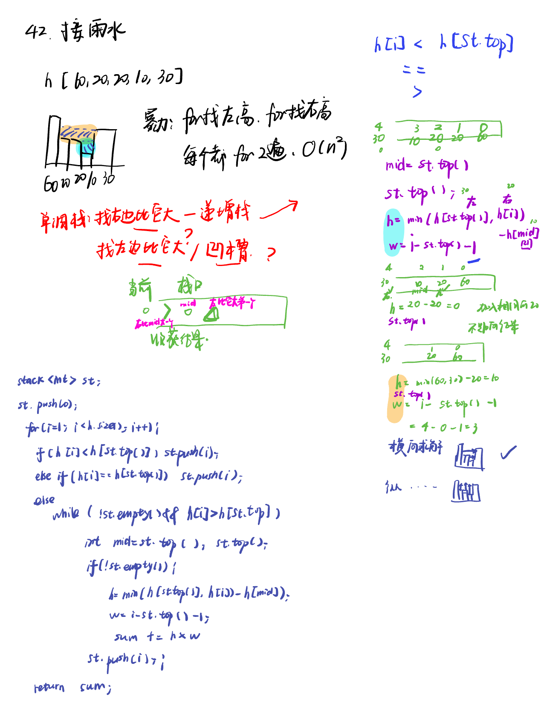
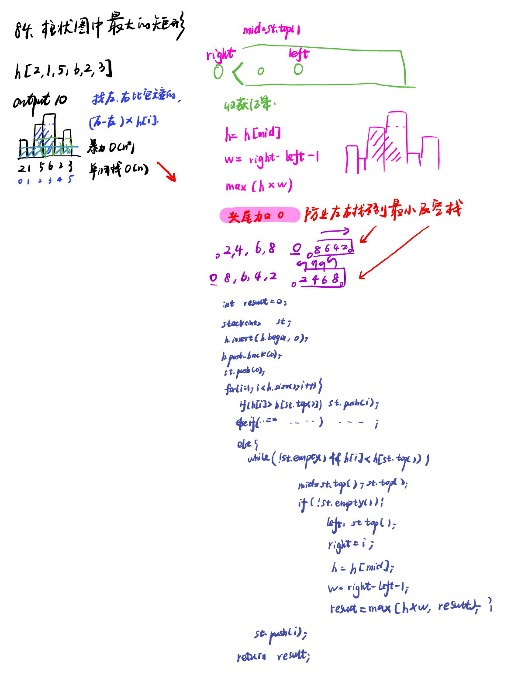

List: 42. 接雨水，84.柱状图中最大的矩形

[42. 接雨水trapping-rain-water](#01)，[](#02)

# <span id="01">42. 接雨水trapping-rain-water</span>

[Leetcode](https://leetcode.cn/problems/trapping-rain-water/description/) 

[Learning Materials](https://programmercarl.com/0042.%E6%8E%A5%E9%9B%A8%E6%B0%B4.html#%E7%AE%97%E6%B3%95%E5%85%AC%E5%BC%80%E8%AF%BE)



## 单调栈法

```python
class Solution:
    def trap(self, height: List[int]) -> int:
        st = []
        result = 0
        st.append(0)
        for i in range(1, len(height)):
            if height[i] <= height[st[-1]]:
                st.append(i)
            else:
                while st and height[i] > height[st[-1]]:
                    mid = st[-1]
                    st.pop()
                    if st:
                        h = min(height[i], height[st[-1]]) - height[mid]
                        w = i - st[-1] - 1
                        result += h * w
                st.append(i)
        return result
```

## 双指针法

```python
class Solution:
    def trap(self, height: List[int]) -> int:
        if len(height) <= 2:
            return 0
        maxLeft = [0] * len(height)
        maxRight = [0] * len(height)
        #记录每个柱子左边柱子最大高度
        maxLeft[0] = height[0]
        for i in range(1, len(height)):
            maxLeft[i] = max(height[i], maxLeft[i - 1])
        #记录每个柱子右边柱子最大高度
        maxRight[len(height) - 1] = height[len(height) - 1];
        for i in range(len(height) - 2, -1, -1):
            maxRight[i] = max(height[i], maxRight[i + 1])
        #求和
        sum = 0
        for i in range(len(height)):
            count = min(maxLeft[i], maxRight[i]) - height[i]
            if count > 0:
                sum += count
        return sum
```

# <span id="02">84.柱状图中最大的矩形largest-rectangle-in-histogram</span>

[Leetcode](https://leetcode.cn/problems/largest-rectangle-in-histogram/description/) 

[Learning Materials](https://programmercarl.com/0084.%E6%9F%B1%E7%8A%B6%E5%9B%BE%E4%B8%AD%E6%9C%80%E5%A4%A7%E7%9A%84%E7%9F%A9%E5%BD%A2.html#%E7%AE%97%E6%B3%95%E5%85%AC%E5%BC%80%E8%AF%BE)



## 单调栈法

```python
class Solution:
    def largestRectangleArea(self, heights: List[int]) -> int:
        st = []
        result = 0
        st.append(0)
        heights.append(0)
        heights.insert(0, 0)
        for i in range(1, len(heights)):
            if heights[i] >= heights[st[-1]]:
                st.append(i)
            else:
                while st and heights[i] < heights[st[-1]]:
                    mid = st[-1]
                    st.pop()
                    if st:
                        h = heights[mid]
                        w = i - st[-1] - 1
                        result = max(result, h * w)
                st.append(i)
        return result       
  ```

## 双指针法

难就难在本题要记录记录每个柱子 左边第一个小于该柱子的下标，而不是左边第一个小于该柱子的高度。

所以需要循环查找，也就是下面在寻找的过程中使用了while。

```python
class Solution:
    def largestRectangleArea(self, heights: List[int]) -> int:
        minLeftIndex = [0] * len(heights)
        minRightIndex = [0] * len(heights)
        #记录每个柱子左边第一个小于这个高度的柱子下标
        minLeftIndex[0] = -1
        for i in range(1, len(heights)):
            t = i - 1;
            #这里不是用if，而是不断向左寻找的过程
            while t >= 0 and heights[t] >= heights[i]:
                t = minLeftIndex[t]
            minLeftIndex[i] = t
        #记录每个柱子右边第一个小于这个高度的柱子下标
        minRightIndex[len(heights) - 1] = len(heights)
        for i in range(len(heights) - 2, -1, -1):
            t = i + 1
            #这里不是用if，而是不断向右寻找的过程
            while t < len(heights) and heights[t] >= heights[i]:
                t = minRightIndex[t]
            minRightIndex[i] = t
        #求和
        result = 0
        for i in range(len(heights)):
            sum = heights[i] * (minRightIndex[i] - minLeftIndex[i] - 1)
            result = max(sum, result)
        return result
```
