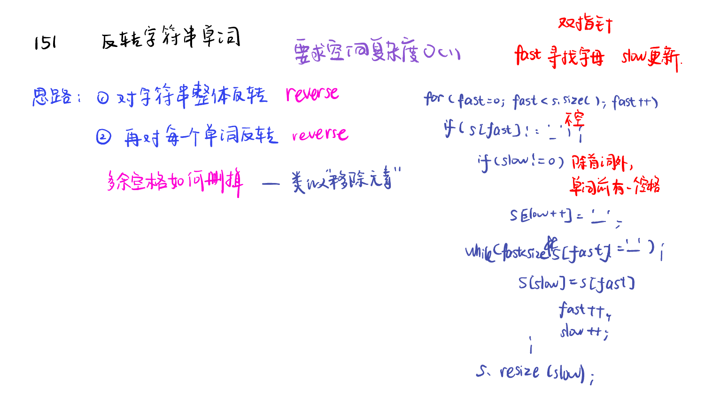

[理论基础](#01)，[232. 用栈实现队列implement-queue-using-stacks](#02)，[225. 用队列实现栈implement-stack-using-queues](#03)，[459.重复的子字符串repeated-substring-pattern](#04)，[字符串总结](#05)，[双指针总结](#06)

# <span id="01">理论基础</span>

 [Learning Materials](https://programmercarl.com/%E6%A0%88%E4%B8%8E%E9%98%9F%E5%88%97%E7%90%86%E8%AE%BA%E5%9F%BA%E7%A1%80.html)

 队列是先进先出，栈是先进后出。

我们使用的stack是属于哪个版本的STL: SGI STL 由Silicon Graphics Computer Systems公司参照HP STL实现，被Linux的C++编译器GCC所采用，SGI STL是开源软件，源码可读性甚高。

栈是以底层容器完成其所有的工作，对外提供统一的接口，底层容器是可插拔的（也就是说我们可以控制使用哪种容器来实现栈的功能）。

所以STL中栈往往不被归类为容器，而被归类为container adapter（容器适配器）。

我们常用的SGI STL，如果没有指定底层实现的话，默认是以deque为缺省情况下栈的底层结构。

deque是一个双向队列，只要封住一段，只开通另一端就可以实现栈的逻辑了。

SGI STL中 队列底层实现缺省情况下一样使用deque实现的。

队列中先进先出的数据结构，同样不允许有遍历行为，不提供迭代器, SGI STL中队列一样是以deque为缺省情况下的底部结构。

所以STL 队列也不被归类为容器，而被归类为container adapter（ 容器适配器）。


# <span id="02">232. 用栈实现队列implement-queue-using-stacks</span>
 
[Leetcode](https://leetcode.cn/problems/implement-queue-using-stacks/description/) [Learning Materials](https://programmercarl.com/0232.%E7%94%A8%E6%A0%88%E5%AE%9E%E7%8E%B0%E9%98%9F%E5%88%97.html#%E7%AE%97%E6%B3%95%E5%85%AC%E5%BC%80%E8%AF%BE)

需要两个栈一个输入栈，一个输出栈

push数据时，只要数据放进输入栈就好，但在pop的时候，输出栈如果为空，就把进栈数据全部导入进来，再从出栈弹出数据，如果输出栈不为空，则直接从出栈弹出数据。

最后如何判断队列为空呢？如果进栈和出栈都为空的话，说明模拟的队列为空了。

```Python
class MyQueue:

    def __init__(self):
        self.stack_in = [] #self实例化，在后面也可以用
        self.stack_out = []  #in主要负责push，out主要负责pop

    def push(self, x: int) -> None:
        self.stack_in.append(x)

    def pop(self) -> int:
        if self.empty():
            return None
        if self.stack_out:
            return self.stack_out.pop()
        else:
            for i in range(len(self.stack_in)):
                self.stack_out.append(self.stack_in.pop())
            return self.stack_out.pop()
        

    def peek(self) -> int:
        res = self.pop()
        self.stack_out.append(res)
        return res
```


# <span id="02">225. 用队列实现栈implement-stack-using-queues</span>
 
[Leetcode](https://leetcode.cn/problems/implement-stack-using-queues/description/) [Learning Materials](https://programmercarl.com/0225.用队列实现栈.html#算法公开课)


一个队列在模拟栈弹出元素的时候只要将队列头部的元素（除了最后一个元素外） 重新添加到队列尾部，此时再去弹出元素就是栈的顺序了。

```Python
class MyStack:

    def __init__(self):
        self.que = deque()

    def push(self, x: int) -> None:
        self.que.append(x)

    def pop(self) -> int:
        if self.empty():
            return None
        
        if self.que:
            for i in range(len(self.que)-1):
                self.que.append(self.que.popleft())
            return self.que.popleft()

    def top(self) -> int:
        # 写法一：
        # if self.empty():
        #     return None
        # return self.que[-1]
        # 写法二：
        res = self.pop()
        self.que.append(res)
        return res

    def empty(self) -> bool:
        return not self.que
```


