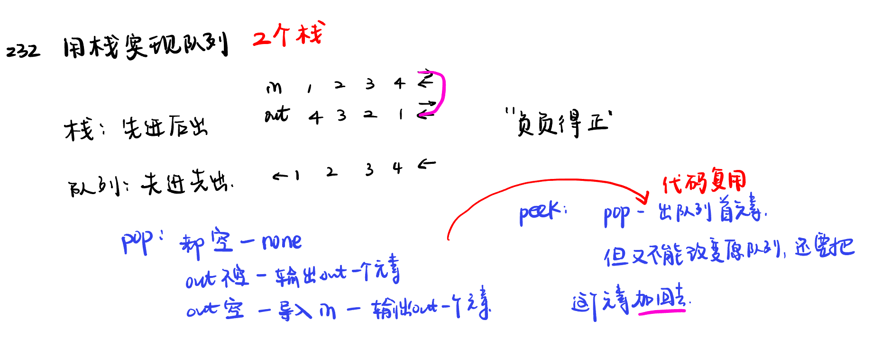

List:150. 逆波兰表达式求值，239. 滑动窗口最大值，347.前 K 个高频元素，栈和队列总结

[150. 逆波兰表达式求值evaluate-reverse-polish-notation](#01)，[239. 滑动窗口最大值sliding-window-maximum](#02)，[347.前 K 个高频元素top-k-frequent-elements](#03)，[栈和队列总结](#04)

# 150. 逆波兰表达式求值evaluate-reverse-polish-notation

[Leetcode](https://leetcode.cn/problems/evaluate-reverse-polish-notation/description/) [Learning Materials](https://programmercarl.com/0150.%E9%80%86%E6%B3%A2%E5%85%B0%E8%A1%A8%E8%BE%BE%E5%BC%8F%E6%B1%82%E5%80%BC.html)

# 239. 滑动窗口最大值sliding-window-maximum

[Leetcode](https://leetcode.cn/problems/sliding-window-maximum/description/) [Learning Materials](https://programmercarl.com/0239.%E6%BB%91%E5%8A%A8%E7%AA%97%E5%8F%A3%E6%9C%80%E5%A4%A7%E5%80%BC.html)

# 347.前 K 个高频元素top-k-frequent-elements

[Leetcode](https://leetcode.cn/problems/top-k-frequent-elements/description/) [Learning Materials](https://programmercarl.com/0347.%E5%89%8DK%E4%B8%AA%E9%AB%98%E9%A2%91%E5%85%83%E7%B4%A0.html)

# 栈和队列总结
 
[Learning Materials](https://programmercarl.com/%E6%A0%88%E4%B8%8E%E9%98%9F%E5%88%97%E6%80%BB%E7%BB%93.html)
