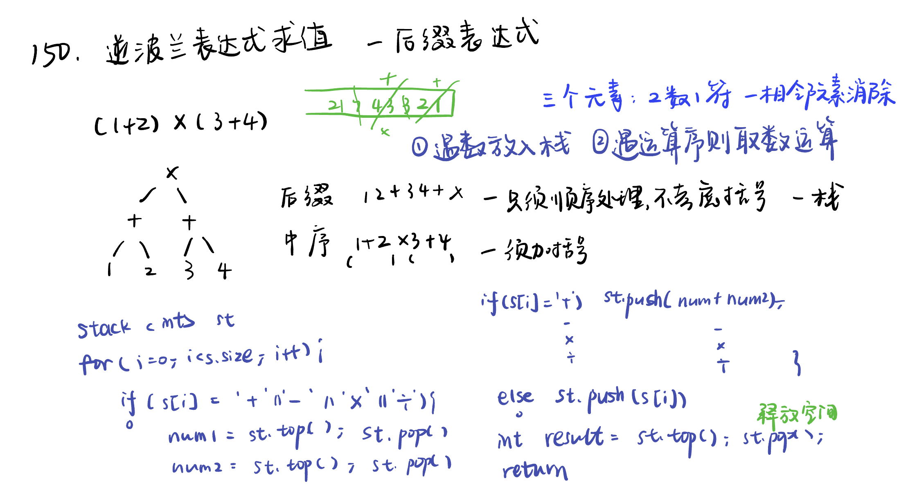

List:150. 逆波兰表达式求值，239. 滑动窗口最大值，347.前 K 个高频元素，栈和队列总结

[150. 逆波兰表达式求值evaluate-reverse-polish-notation](#01)，[239. 滑动窗口最大值sliding-window-maximum](#02)，[347.前 K 个高频元素top-k-frequent-elements](#03)，[栈和队列总结](#04)

# <span id="01">150. 逆波兰表达式求值evaluate-reverse-polish-notation</span>

[Leetcode](https://leetcode.cn/problems/evaluate-reverse-polish-notation/description/) [Learning Materials](https://programmercarl.com/0150.%E9%80%86%E6%B3%A2%E5%85%B0%E8%A1%A8%E8%BE%BE%E5%BC%8F%E6%B1%82%E5%80%BC.html)



```Python
class Solution:
    def evalRPN(self, tokens: List[str]) -> int:
        stack = []
        for char in tokens:
            if char == '+' or char == '-' or char == '*' or char == '/':
                nums2 = stack.pop()
                nums1 = stack.pop()
                if char == '+':
                    stack.append(nums1 + nums2)
                if char == '-':
                    stack.append(nums1 - nums2)
                if char == '*':
                    stack.append(nums1 * nums2)
                if char == '/':
                    stack.append(int(nums1 / nums2))  #两个整数之间的除法总是 向零截断 
            else:
                stack.append(int(char))  #若不将 "3" 和 "2" 转换为整数，在执行加法运算时，Python 会将它们视为字符串进行拼接操作。
        return stack[0]
```

# <span id="02">239. 滑动窗口最大值sliding-window-maximum</span>

[Leetcode](https://leetcode.cn/problems/sliding-window-maximum/description/) [Learning Materials](https://programmercarl.com/0239.%E6%BB%91%E5%8A%A8%E7%AA%97%E5%8F%A3%E6%9C%80%E5%A4%A7%E5%80%BC.html)


```Python
class Solution:
    def maxSlidingWindow(self, nums: List[int], k: int) -> List[int]:
        self.res = deque() #使用双端队列，允许在队列的两端（队首和队尾）进行元素的插入和移除操作
        result = []
        for i in range(k): #先将前k的元素放进队列
            self.push(nums[i])  #定义了自己的 push 和 pop 方法，应该使用 self.push 和 self.pop 来调用这些自定义方法
        result.append(self.getmax()) #result 记录前k的元素的最大值

        for i in range(k, len(nums)):
            self.pop(nums[i - k]) #滑动窗口移除最前面元素
            self.push(nums[i]) #滑动窗口前加入最后面的元素
            result.append(self.getmax()) #记录对应的最大值
        return result

    def pop(self, value):
        if self.res and self.res[0] == value:  #每次弹出的时候，比较当前要弹出的数值是否等于队列出口元素的数值，如果相等则弹出。
            self.res.popleft()

    def push(self, value):  #如果push的数值大于入口元素的数值，那么就将队列后端的数值弹出，直到push的数值小于等于队列入口元素的数值为止。
        while self.res and self.res[-1] < value:  #使用 while 循环，不断移除队尾小于当前值的元素，以保证队列中的元素始终是单调递减的。这样在每次获取最大值时，队首元素就是当前窗口的最大值。
            self.res.pop()
        self.res.append(value)

    def getmax(self) : #查询当前队列里的最大值 直接返回队列前端也就是front就可以了。
        return self.res[0] #用 self.res[0] 来访问队首元素
```

# <span id="03">347.前 K 个高频元素top-k-frequent-elements</span>

[Leetcode](https://leetcode.cn/problems/top-k-frequent-elements/description/) [Learning Materials](https://programmercarl.com/0347.%E5%89%8DK%E4%B8%AA%E9%AB%98%E9%A2%91%E5%85%83%E7%B4%A0.html)


```Python
import heapq
class Solution:
    def topKFrequent(self, nums: List[int], k: int) -> List[int]:
        mapp = {}
        #统计元素频率：遍历列表 nums，使用字典 mapp 统计每个元素的出现频率。
        for i in range(len(nums)):
            mapp[nums[i]] = mapp.get(nums[i] , 0) + 1
            # mapp.get(nums[i], 0) 表示在字典 mapp 中查找键 nums[i] 对应的值。如果 nums[i] 存在于 mapp 中，就返回该键对应的值；如果 nums[i] 不存在，就返回默认值 0。

        #构建小顶堆：使用 Python 的 heapq 库构建一个大小为 k 的小顶堆，堆中存储元素及其频率的元组。
        pri_que = []  # 初始化一个空列表 pri_que，用于存储小顶堆
        for key, freq in mapp.items():
            heapq.heappush(pri_que, (freq, key)) # 换顺序：使用 heapq.heappush 方法将元素及其频率的元组 (freq, key) 加入小顶堆
                    #堆会按照元组的第一个元素（即频率 freq）进行排序
            if len(pri_que) > k:
                heapq.heappop(pri_que) # 使用 heapq.heappop 方法弹出堆顶元素（频率最小的元素）
        
        #筛选前 k 个高频元素：遍历字典 mapp，将元素及其频率加入小顶堆。当堆的大小超过 k 时，弹出堆顶元素（频率最小的元素），保证堆中始终存储频率最高的 k 个元素。
        result = [0] * k
        for i in range(k-1, -1, -1): #从 k - 1 到 0 的递减整数序列，步长为 -1，小顶堆弹出的元素是按频率从小到大的顺序，而我们需要的结果是按频率从大到小排列
            result[i] = heapq.heappop(pri_que)[1] # 使用 heapq.heappop 方法弹出堆顶元素，并取元组的第二个元素（元素本身）存入结果列表
                    #堆中的元素是元组 (freq, key)，其中第一个元素 freq 是频率，第二个元素 key 是元素本身
                    #目标是找出出现频率前 k 高的元素，而不是频率值本身。
        return result
```

# <span id="04">栈和队列总结</span>
 
[Learning Materials](https://programmercarl.com/%E6%A0%88%E4%B8%8E%E9%98%9F%E5%88%97%E6%80%BB%E7%BB%93.html)

- 栈里面的元素在内存中是连续分布的么？

陷阱1：栈是容器适配器，底层容器使用不同的容器，导致栈内数据在内存中不一定是连续分布的。

陷阱2：缺省情况下，默认底层容器是deque，那么deque在内存中的数据分布是什么样的呢？ 答案是：不连续的，下文也会提到deque。

- 一个队列在模拟栈弹出元素的时候只要将队列头部的元素（除了最后一个元素外） 重新添加到队列尾部，此时在去弹出元素就是栈的顺序了。

- 递归的实现是栈：每一次递归调用都会把函数的局部变量、参数值和返回地址等压入调用栈中，然后递归返回的时候，从栈顶弹出上一次递归的各项参数，所以这就是递归为什么可以返回上一层位置的原因。

- 括号匹配：第一种情况，字符串里左方向的括号多余了，所以不匹配。第二种情况，括号没有多余，但是括号的类型没有匹配上。第三种情况，字符串里右方向的括号多余了，所以不匹配。

- 字符串去重：可以把字符串顺序放到一个栈中，然后如果相同的话 栈就弹出，这样最后栈里剩下的元素都是相邻不相同的元素了。

- 逆波兰表达式：相邻字符串消除的过程

- 滑动窗口最大值：队列没有必要维护窗口里的所有元素，只需要维护有可能成为窗口里最大值的元素就可以了，同时保证队列里的元素数值是由大到小的。我们用deque作为单调队列的底层数据结构，C++中deque是stack和queue默认的底层实现容器（这个我们之前已经讲过），deque是可以两边扩展的，而且deque里元素并不是严格的连续分布的。

- 求前 K 个高频元素：堆是一棵完全二叉树，树中每个结点的值都不小于（或不大于）其左右孩子的值。本题就要使用优先级队列来对部分频率进行排序。 注意这里是对部分数据进行排序而不需要对所有数据排序！
