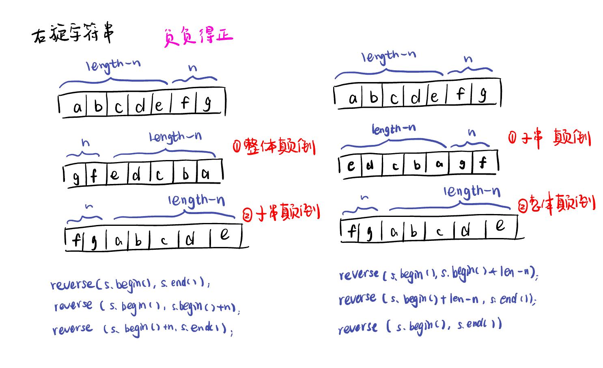
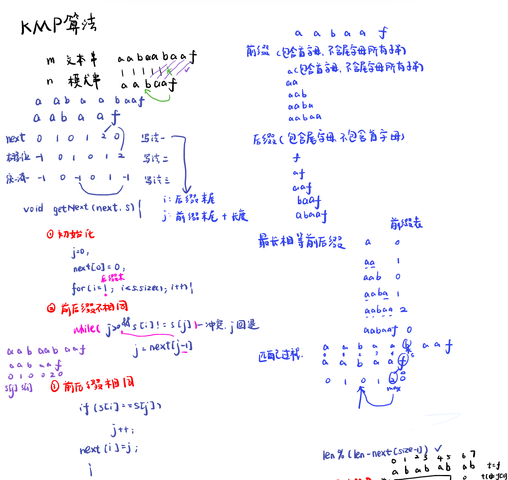
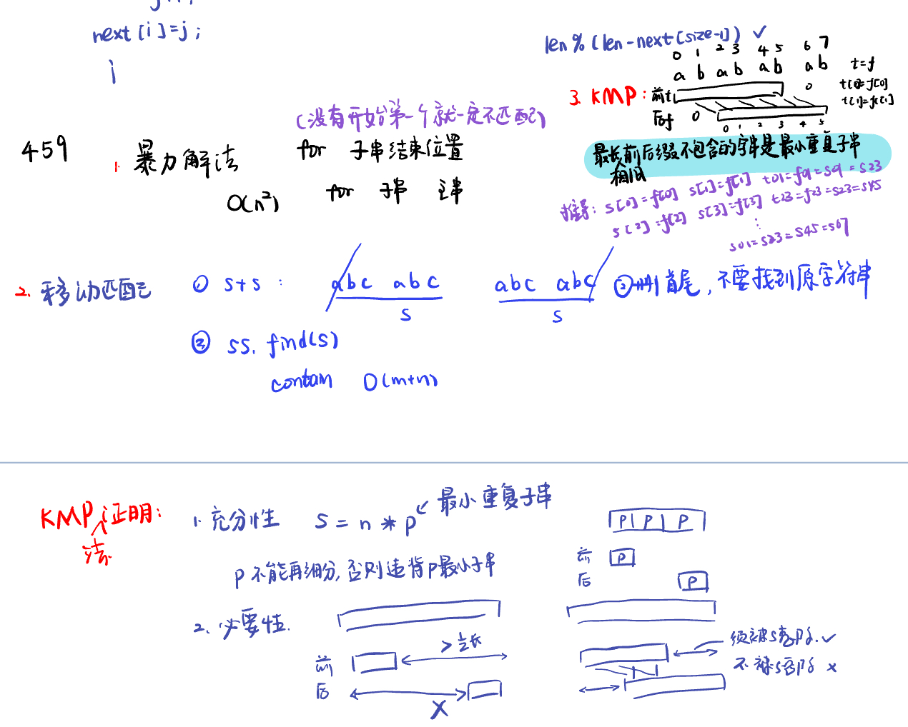

[151.翻转字符串里的单词reverse-words-in-a-string](#01)，[卡码网：55.右旋转字符串](#02)，[28. 实现 strStr()find-the-index-of-the-first-occurrence-in-a-string](#03)，[459.重复的子字符串repeated-substring-pattern](#04)，[字符串总结](#05)，[双指针总结](#06)

# <span id="01">151.翻转字符串里的单词reverse-words-in-a-string</span>

[Leetcode](https://leetcode.cn/problems/reverse-words-in-a-string/description/) [Learning Materials](https://programmercarl.com/0151.%E7%BF%BB%E8%BD%AC%E5%AD%97%E7%AC%A6%E4%B8%B2%E9%87%8C%E7%9A%84%E5%8D%95%E8%AF%8D.html)


```Python
class Solution:
    def reverse(self, s, start, end):
        while start < end:
            s[start], s[end] = s[end], s[start]
            start += 1
            end -= 1
            
    def reverseWords(self, s: str) -> str:
        result = ""
        ss = list(s)
        ss.reverse()
        fast = 0
        # 1. 首先将原字符串反转并且除掉空格, 并且加入到新的字符串当中
        # 由于Python字符串的不可变性，因此只能转换为列表进行处理
        while fast < len(ss):
            if ss[fast] != " ":
                if len(result) != 0:
                    result += " "
                while fast < len(ss) and ss[fast] !=" ":
                    result += ss[fast]
                    fast += 1
            else:
                fast += 1
        
        # 2.其次将每个单词进行翻转操作
        slow = 0
        fast = 0
        result = list(result)
        while fast <= len(result):
            if fast == len(result) or result[fast] == " ":
                self.reverse(result, slow, fast - 1)
                slow = fast + 1
                fast += 1
            else:
                fast += 1

        return "".join(result)
```

# <span id="02">卡码网：55.右旋转字符串</span>


[Leetcode](https://kamacoder.com/problempage.php?pid=1065) [Learning Materials](https://programmercarl.com/kamacoder/0055.%E5%8F%B3%E6%97%8B%E5%AD%97%E7%AC%A6%E4%B8%B2.html#%E6%80%9D%E8%B7%AF)



```Python
k = int(input())
s = input()
print(s[len(s) - k:]+s[:len(s) - k])
```


# <span id="03">28. 实现 strStr()find-the-index-of-the-first-occurrence-in-a-string</span>

[Leetcode](https://leetcode.cn/problems/find-the-index-of-the-first-occurrence-in-a-string/description/) [Learning Materials](https://programmercarl.com/0028.%E5%AE%9E%E7%8E%B0strStr.html#%E7%AE%97%E6%B3%95%E5%85%AC%E5%BC%80%E8%AF%BE)




```Python
class Solution:
    def strStr(self, haystack: str, needle: str) -> int:
        next = [0] * len(needle)
        self.getNext(next, needle)
        j = 0

        for i in range(len(haystack)):
            while j > 0 and haystack[i] != needle[j]:
                j = next[j - 1] // j 寻找之前匹配的位置
            if haystack[i] == needle[j]:
                j += 1
            if j == len(needle):
                return i - j + 1
        return -1


    def getNext(self, next: List[int] , s: str) -> None:
        j = 0
        next[0] = 0
        for i in range(1, len(s)):
            while j > 0 and s[i] != s[j]:
                j = next[j - 1]
            if s[i] == s[j]:
                j += 1
            next[i] = j
```

# <span id="04">459.重复的子字符串repeated-substring-pattern</span>

[Leetcode](https://leetcode.cn/problems/repeated-substring-pattern/description/) [Learning Materials](https://programmercarl.com/0459.%E9%87%8D%E5%A4%8D%E7%9A%84%E5%AD%90%E5%AD%97%E7%AC%A6%E4%B8%B2.html#%E7%AE%97%E6%B3%95%E5%85%AC%E5%BC%80%E8%AF%BE)



- 暴力法：

```Python
class Solution:
    def repeatedSubstringPattern(self, s: str) -> bool:
        n = len(s)
        if n <= 1:
            return False
        substr = ""
        for i in range(1, n // 2 + 1): // 查一半：因为如果子字符串长度超过原字符串长度的一半，那么它重复后长度必然会超过原字符串，所以只需要检查长度不超过原字符串一半的子字符串即可
            if n % i == 0 : //查整除：如果 n 不能被 i 整除，说明原字符串不可能由长度为 i 的子字符串重复构成
                substr = s[:i] //提取字符串 s 的前 i 个字符作为子字符串 substr
                if substr * (n // i) == s:
                    return True
        return False
```

- 移动匹配

```Python
class Solution:
    def repeatedSubstringPattern(self, s: str) -> bool:
        n = len(s)
        if n <= 1:
            return False
        
        ss = s + s # 将字符串 s 自身拼接一次
        ss = ss[1:-1] # 去掉首尾元素
        return s in ss
```

- KMP法

```Python
class Solution:
    def repeatedSubstringPattern(self, s: str) -> bool:
        next = [0] * len(s)
        self.getNext(next, s)
        if next[-1] != 0 and len(s) % (len(s) - next[-1]) == 0:
            return True
        return False


    def getNext(self, next, s):
        j = 0
        next[0] = 0
        for i in range(1, len(s)):
            while j > 0 and s[i] != s[j]:
                j = next[j - 1]
            if s[i] == s[j]:
                j += 1
            next[i] = j
        return next
```

# <span id="05">字符串总结</span>

[Interpretation](https://programmercarl.com/%E5%AD%97%E7%AC%A6%E4%B8%B2%E6%80%BB%E7%BB%93.html#%E5%8F%8D%E8%BD%AC%E7%B3%BB%E5%88%97)

- 反转系列：当需要固定规律一段一段去处理字符串的时候，要想想在在for循环的表达式上做做文章。先局部反转、再整体反转。

- KMP算法：KMP的主要思想是当出现字符串不匹配时，可以知道一部分之前已经匹配的文本内容，可以利用这些信息避免从头再去做匹配了。**主要理解j=next[x]**

前缀表：起始位置到下标i之前（包括i）的子串中，有多大长度的相同前缀后缀。

前缀：指不包含最后一个字符的所有以第一个字符开头的连续子串。

后缀：指不包含第一个字符的所有以最后一个字符结尾的连续子串。

# <span id="06">双指针总结</span>

十道题目：移除元素、反转字符串、替换数字、翻转字符串里的单词、翻转链表、删除链表的倒数第N个节点、链表相交、环形链表Ⅱ、三数之和、四数之和。

一般是将O(n^2)的时间复杂度，降为 $O(n)$ 。

- 字符串：
  
- 反转字符串：定义两个指针（也可以说是索引下标），一个从字符串前面，一个从字符串后面，两个指针同时向中间移动，并交换元素。

- 替换空格：首先扩充数组到每个空格替换成"%20"之后的大小。然后双指针从后向前替换空格。其实很多数组（字符串）填充类的问题，都可以先预先给数组扩容带填充后的大小，然后在从后向前进行操作。

- 翻转字符串里的单词：使用双指针法，用O(n)的时间复杂度完成字符串删除类的操作。

- 链表：

- 反转链表：只需要改变链表的next指针的指向，直接将链表反转 ，而不用重新定义一个新的链表。

-  链表有环：使用快慢指针（双指针法），分别定义 fast 和 slow指针，从头结点出发，fast指针每次移动两个节点，slow指针每次移动一个节点，如果 fast 和 slow指针在途中相遇 ，说明这个链表有环。

-  N数之和：通过前后两个指针不断向中间逼近，在一个for循环下完成两个for循环的工作。

