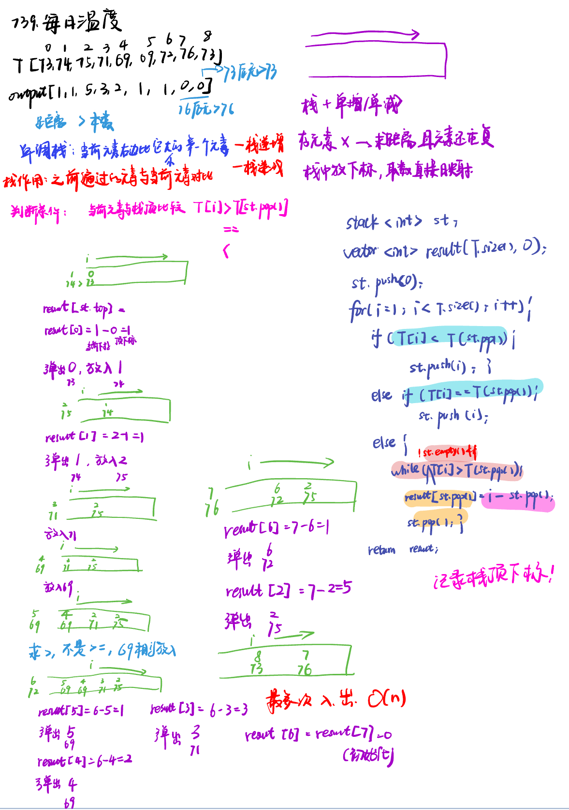
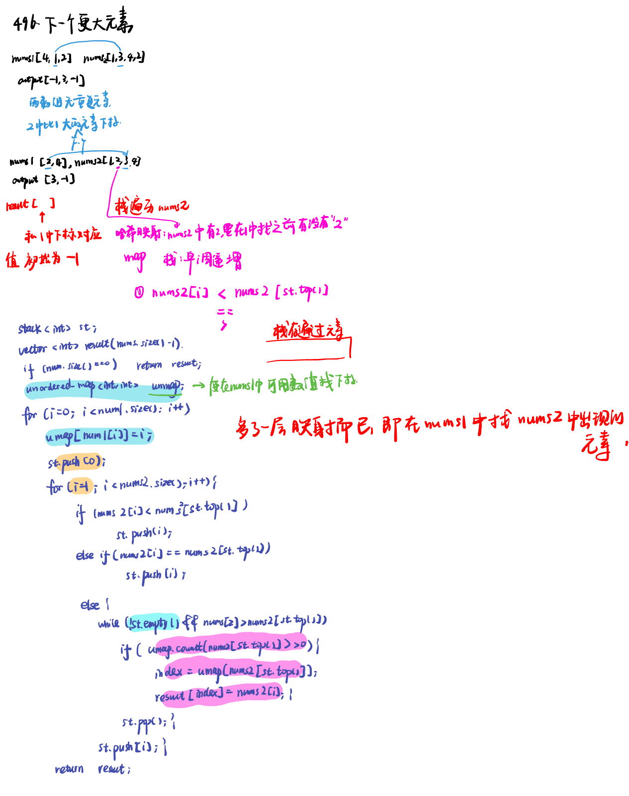
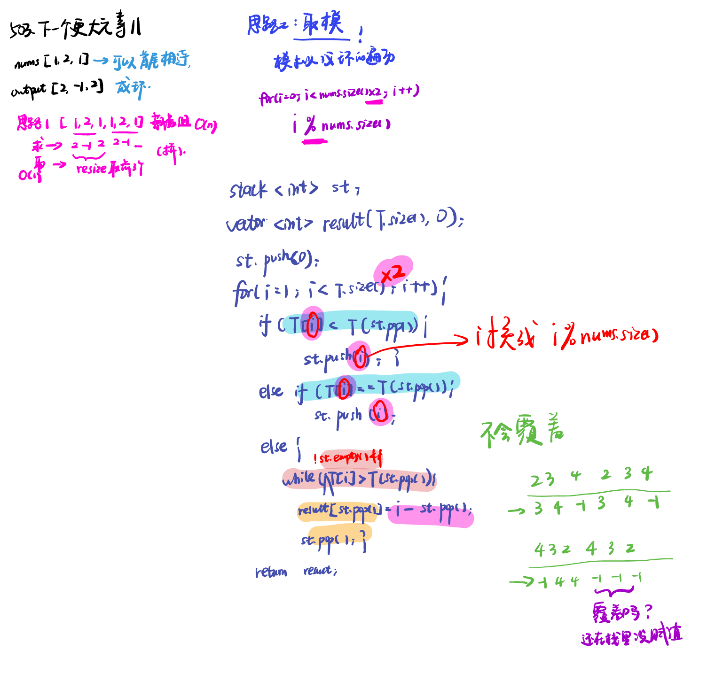

# 单调栈 ​Monotonic Stack(1)

List: 739. 每日温度，496.下一个更大元素，503.下一个更大元素II

[739. 每日温度daily-temperatures](#01)，[496.下一个更大元素 Inext-greater-element-i](#02)，[503.下一个更大元素IInext-greater-element-ii](#03)

# <span id="01">739. 每日温度daily-temperatures</span>

[Leetcode](https://leetcode.cn/problems/daily-temperatures/description/) 

[Learning Materials](https://programmercarl.com/0739.%E6%AF%8F%E6%97%A5%E6%B8%A9%E5%BA%A6.html#%E7%AE%97%E6%B3%95%E5%85%AC%E5%BC%80%E8%AF%BE)



```python
class Solution:
    def dailyTemperatures(self, temperatures: List[int]) -> List[int]:
        st = []
        result = [0] * len(temperatures)
        st.append(0)
        for i in range(1, len(temperatures)):
            if temperatures[i] <= temperatures[st[-1]]:
                st.append(i)
            else:
                while st and temperatures[i] > temperatures[st[-1]]:
                    result[st[-1]] = i - st[-1]
                    st.pop()
                st.append(i)
        return result
```
# <span id="02">496.下一个更大元素 Inext-greater-element-i</span>

[Leetcode](https://leetcode.cn/problems/next-greater-element-i/) 

[Learning Materials](https://programmercarl.com/0496.%E4%B8%8B%E4%B8%80%E4%B8%AA%E6%9B%B4%E5%A4%A7%E5%85%83%E7%B4%A0I.html)



```python
class Solution:
    def nextGreaterElement(self, nums1: List[int], nums2: List[int]) -> List[int]:
        st = []
        result = [-1] * len(nums1)
        st.append(0)
        for i in range(1, len(nums2)):
            if nums2[i] <= nums2[st[-1]]:
                st.append(i)
            else:
                while st and nums2[i] > nums2[st[-1]]:
                    if nums2[st[-1]] in nums1:
                        result[nums1.index(nums2[st[-1]])] = nums2[i]  #找元素-找下标-记录值
                    st.pop()
                st.append(i)
        return result
```


# <span id="03">503.下一个更大元素IInext-greater-element-ii</span>

[Leetcode](https://leetcode.cn/problems/next-greater-element-ii/description/) 

[Learning Materials](https://programmercarl.com/0503.%E4%B8%8B%E4%B8%80%E4%B8%AA%E6%9B%B4%E5%A4%A7%E5%85%83%E7%B4%A0II.html#%E7%AE%97%E6%B3%95%E5%85%AC%E5%BC%80%E8%AF%BE)



```python
class Solution:
    def nextGreaterElements(self, nums: List[int]) -> List[int]:
        st = []
        result = [-1] * len(nums)
        st.append(0)
        for i in range(1, len(nums) * 2):
            if nums[i % len(nums)] <= nums[st[-1]]:
                st.append(i % len(nums))
            else:
                while st and nums[i % len(nums)] > nums[st[-1]]:
                    result[st[-1]] = nums[i % len(nums)]
                    st.pop()
                st.append(i % len(nums))
        return result
```

注意要存的是什么！
