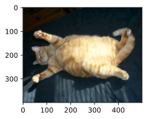
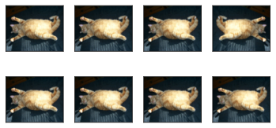
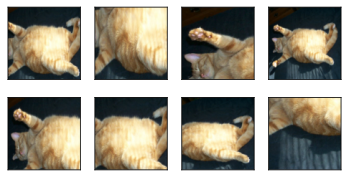
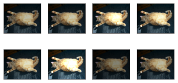
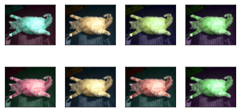
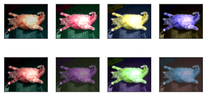
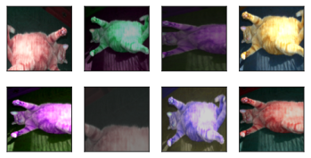
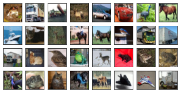

# 图像增广


```python
%matplotlib inline
import torch
import torchvision
from torch import nn
from d2l import torch as d2l
```


```python
d2l.set_figsize()
img = d2l.Image.open('../img/cat1.jpg')
d2l.plt.imshow(img);
```


    

    


大多数图像增广方法都具有一定的随机性。为了便于观察图像增广的效果，我们下面定义辅助函数`apply`。
此函数在输入图像`img`上多次运行图像增广方法`aug`并显示所有结果。


```python
# 增广再画出来
def apply(img, aug, num_rows = 2, num_cols = 4, scale = 1.5):
    Y = [aug(img) for _ in range(num_rows * num_cols)]
    d2l.show_images(Y, num_rows, num_cols, scale = scale)
```


```python
apply(img, torchvision.transforms.RandomHorizontalFlip())  #左右随机反转
```


    

    


```python
apply(img, torchvision.transforms.RandomVerticalFlip())  #上下随机反转
```


    

    


```python
shape_aug = torchvision.transforms.RandomResizedCrop(
    (200, 200), scale = (0.1, 1), ratio = (0.5, 2)) #随机大小 高宽比
apply(img, shape_aug)  # 随机裁剪
```


    

    


```python
# 改变亮度
apply(img, torchvision.transforms.ColorJitter( brightness = 0.5, contrast = 0, saturation = 0, hue = 0))
```


    

    


```python
# 改变色调
apply(img, torchvision.transforms.ColorJitter(
    brightness=0, contrast=0, saturation=0, hue=0.5))
```


    

    


```python
# 一起改
color_aug = torchvision.transforms.ColorJitter(
    brightness = 0.5, contrast = 0.5, saturation = 0.5, hue = 0.5)
apply(img, color_aug)
```


    

    


```python
augs = torchvision.transforms.Compose([
    torchvision.transforms.RandomHorizontalFlip(), color_aug, shape_aug])
apply(img, augs)
```


    

    


## [**使用图像增广进行训练**]


```python
all_images = torchvision.datasets.CIFAR10(train=True, root="../data",
                                          download=True)
d2l.show_images([all_images[i][0] for i in range(32)], 4, 8, scale=0.8);
```

    Files already downloaded and verified
    


    

    


```python
train_augs = torchvision.transforms.Compose([
     torchvision.transforms.RandomHorizontalFlip(),
     torchvision.transforms.ToTensor()])  # 变成4d矩阵

test_augs = torchvision.transforms.Compose([
     torchvision.transforms.ToTensor()])
```


```python
#定义一个辅助函数，以便于读取图像和应用图像增广
def load_cifar10(is_train, augs, batch_size):
    dataset = torchvision.datasets.CIFAR10(root="../data", train=is_train,
                                           transform=augs, download=True)
    dataloader = torch.utils.data.DataLoader(
        dataset, batch_size = batch_size, shuffle = is_train,
        num_workers = d2l.get_dataloader_workers())
    return dataloader
```


```python
def train_batch_ch13(net, X, y, loss, trainer, devices):
    """用多GPU进行小批量训练"""
    if isinstance(X, list):
        # 微调BERT中所需
        X = [x.to(devices[0]) for x in X]
    else:
        X = X.to(devices[0])
    y = y.to(devices[0])
    net.train()
    trainer.zero_grad()
    pred = net(X)
    l = loss(pred, y)
    l.sum().backward()
    trainer.step()
    train_loss_sum = l.sum()
    train_acc_sum = d2l.accuracy(pred, y)
    return train_loss_sum, train_acc_sum
```


```python
def train_ch13(net, train_iter, test_iter, loss, trainer, num_epochs,
               devices=d2l.try_all_gpus()):
    """用多GPU进行模型训练"""
    timer, num_batches = d2l.Timer(), len(train_iter)
    animator = d2l.Animator(xlabel='epoch', xlim=[1, num_epochs], ylim=[0, 1],
                            legend=['train loss', 'train acc', 'test acc'])
    net = nn.DataParallel(net, device_ids=devices).to(devices[0])
    for epoch in range(num_epochs):
        # 4个维度：储存训练损失，训练准确度，实例数，特点数
        metric = d2l.Accumulator(4)
        for i, (features, labels) in enumerate(train_iter):
            timer.start()
            l, acc = train_batch_ch13(
                net, features, labels, loss, trainer, devices)
            metric.add(l, acc, labels.shape[0], labels.numel())
            timer.stop()
            if (i + 1) % (num_batches // 5) == 0 or i == num_batches - 1:
                animator.add(epoch + (i + 1) / num_batches,
                             (metric[0] / metric[2], metric[1] / metric[3],
                              None))
        test_acc = d2l.evaluate_accuracy_gpu(net, test_iter)
        animator.add(epoch + 1, (None, None, test_acc))
    print(f'loss {metric[0] / metric[2]:.3f}, train acc '
          f'{metric[1] / metric[3]:.3f}, test acc {test_acc:.3f}')
    print(f'{metric[2] * num_epochs / timer.sum():.1f} examples/sec on '
          f'{str(devices)}')
```


```python
batch_size, devices, net = 256, d2l.try_all_gpus(), d2l.resnet18(10, 3)

def init_weights(m):
    if type(m) in [nn.Linear, nn.Conv2d]:
        nn.init.xavier_uniform_(m.weight)

net.apply(init_weights)

def train_with_data_aug(train_augs, test_augs, net, lr=0.001):
    # 加载 CIFAR - 10 训练集，使用 train_augs 进行数据增强
    # 第一个参数 True 表示加载训练集
    train_iter = load_cifar10(True, train_augs, batch_size)
    # 加载 CIFAR - 10 测试集，使用 test_augs 进行数据增强
    # 第一个参数 False 表示加载测试集
    test_iter = load_cifar10(False, test_augs, batch_size)

    # 定义损失函数，使用交叉熵损失，reduction="none" 表示不进行损失的聚合
    # 这样后续可以根据需要对每个样本的损失进行处理
    loss = nn.CrossEntropyLoss(reduction="none")

    # 定义优化器，使用 Adam 优化算法，对网络的所有参数进行优化
    # lr 是学习率，默认为 0.001
    trainer = torch.optim.Adam(net.parameters(), lr=lr)

    # 调用 train_ch13 函数进行训练
    # 训练轮数设置为 10，使用预先定义的 devices 进行训练
    train_ch13(net, train_iter, test_iter, loss, trainer, 10, devices)
```


```python
train_with_data_aug(train_augs, test_augs, net)
```


```python

```
