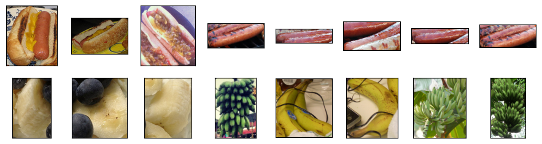

# 微调


```python
%matplotlib inline
import os
import torch
import torchvision
from torch import nn
from d2l import torch as d2l
```

## 热狗数据集来源于网络


```python
d2l.DATA_HUB['hotdog'] = (d2l.DATA_URL + 'hotdog.zip',
                         'fba480ffa8aa7e0febbb511d181409f899b9baa5')

data_dir = d2l.download_extract('hotdog')
```

    Downloading ../data\hotdog.zip from http://d2l-data.s3-accelerate.amazonaws.com/hotdog.zip...
    


```python
train_imgs = torchvision.datasets.ImageFolder(os.path.join(data_dir, 'train'))
test_imgs = torchvision.datasets.ImageFolder(os.path.join(data_dir, 'test'))
```


```python
hotdogs = [train_imgs[i][0] for i in range(8)]
not_hotdogs = [train_imgs[-i - 1][0] for i in range(8)]
d2l.show_images(hotdogs + not_hotdogs, 2, 8, scale=1.4);
```


    

    


```python
# 使用RGB通道的均值和标准差，以标准化每个通道
normalize = torchvision.transforms.Normalize(
    [0.485, 0.456, 0.406], [0.229, 0.224, 0.225])

train_augs = torchvision.transforms.Compose([
    torchvision.transforms.RandomResizedCrop(224),
    torchvision.transforms.RandomHorizontalFlip(),
    torchvision.transforms.ToTensor(),
    normalize])

test_augs = torchvision.transforms.Compose([
    torchvision.transforms.Resize([256, 256]),
    torchvision.transforms.CenterCrop(224),
    torchvision.transforms.ToTensor(),
    normalize])
```

### [**定义和初始化模型**]

我们使用在ImageNet数据集上预训练的ResNet-18作为源模型。
在这里，我们指定`pretrained=True`以自动下载预训练的模型参数。


```python
pretrained_net = torchvision.models.resnet18(pretrained=True)
pretrained_net.fc
finetune_net = torchvision.models.resnet18(pretrained=True)
finetune_net.fc = nn.Linear(finetune_net.fc.in_features, 2)
nn.init.xavier_uniform_(finetune_net.fc.weight);
```

    C:\Users\29229\anaconda3\Lib\site-packages\torchvision\models\_utils.py:208: UserWarning: The parameter 'pretrained' is deprecated since 0.13 and may be removed in the future, please use 'weights' instead.
      warnings.warn(
    C:\Users\29229\anaconda3\Lib\site-packages\torchvision\models\_utils.py:223: UserWarning: Arguments other than a weight enum or `None` for 'weights' are deprecated since 0.13 and may be removed in the future. The current behavior is equivalent to passing `weights=ResNet18_Weights.IMAGENET1K_V1`. You can also use `weights=ResNet18_Weights.DEFAULT` to get the most up-to-date weights.
      warnings.warn(msg)
    Downloading: "https://download.pytorch.org/models/resnet18-f37072fd.pth" to C:\Users\29229/.cache\torch\hub\checkpoints\resnet18-f37072fd.pth
    100%|██████████████████████████████████████████████████████████████████████████████| 44.7M/44.7M [02:57<00:00, 263kB/s]
    


    Parameter containing:
    tensor([[ 0.0540,  0.1044, -0.0749,  ..., -0.0958,  0.0765, -0.0439],
            [-0.0667,  0.0651,  0.0279,  ...,  0.0637,  0.1030, -0.0218]],
           requires_grad=True)


```python
# 定义微调模型的训练函数
def train_fine_tuning(net, learning_rate, batch_size = 128, num_epochs = 5, param_group = True):
    # 从指定目录的 train 子目录加载训练数据，使用 train_augs 进行数据增强
    # 利用 torchvision.datasets.ImageFolder 加载图像数据，按照文件夹名自动分类
    # 使用 torch.utils.data.DataLoader 创建数据迭代器，设置批量大小为 batch_size，开启数据打乱
    train_iter = torch.utils.data.DataLoader(torchvision.datasets.ImageFolder(
        os.path.join(data_dir, 'train'), transform = train_augs),
        batch_size = batch_size, shuffle = True)
    # 从指定目录的 test 子目录加载测试数据，使用 test_augs 进行数据增强
    # 同样创建数据迭代器，不过不进行数据打乱
    test_iter = torch.utils.data.DataLoader(torchvision.datasets.ImageFolder(
        os.path.join(data_dir, 'test'), transform=test_augs),
        batch_size=batch_size)
    # 调用 d2l 库中的 try_all_gpus 函数，尝试获取所有可用的 GPU 设备
    # 如果没有可用 GPU，通常会返回 CPU 设备
    devices = d2l.try_all_gpus()
    # 定义交叉熵损失函数，reduction="none" 表示不进行损失的聚合，返回每个样本的损失
    loss = nn.CrossEntropyLoss(reduction = "none")
    # 如果 param_group 为 True，对模型参数进行分组设置不同学习率
    if param_group:
        # 筛选出除了全连接层（fc）的权重和偏置之外的所有参数
        # 使用 net.named_parameters() 获取模型参数及其名称
        params_1x = [param for name, param in net.named_parameters()
                     if name not in ["fc.weight", "fc.bias"]]
        # 定义随机梯度下降（SGD）优化器
        # 对筛选出的 params_1x 使用学习率 learning_rate
        # 对全连接层（fc）的参数使用 10 倍的学习率
        # 设置权重衰减为 0.001，防止过拟合
        trainer = torch.optim.SGD([{'params':params_1x},
                                {'params':net.fc.parameters(),
                                    'lr':learning_rate * 10}],
                            lr = learning_rate, weight_decay = 0.001)
    # 如果 param_group 为 False，对所有参数使用相同的学习率
    else:
        trainer = torch.optim.SGD(net.parameters(), lr = learning_rate, weight_decay = 0.001)
    # 调用 d2l 库中的 train_ch13 函数进行模型训练
    # 传入模型、训练集和测试集迭代器、损失函数、优化器、训练轮数和设备列表
    d2l.train_ch13(net, train_iter, test_iter, loss, trainer, num_epochs, devices)
```


```python
# 调用 train_fine_tuning 函数对 finetune_net 模型进行微调
# 学习率设置为 5e-5，其他参数使用默认值
train_fine_tuning(finetune_net, 5e-5)
# 创建一个预训练的 ResNet-18 模型
scratch_net = torchvision.models.resnet18()
# 修改模型的全连接层（输出层）
# 将输入特征数保持不变，输出特征数改为 2，以适应特定的分类任务
scratch_net.fc = nn.Linear(scratch_net.fc.in_features, 2)
# 调用 train_fine_tuning 函数对 scratch_net 模型进行训练
# 学习率设置为 5e-4，不进行参数分组
train_fine_tuning(scratch_net, 5e-4, param_group=False)
```


```python

```
