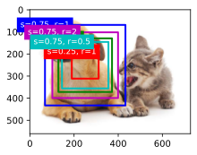
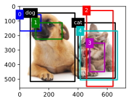
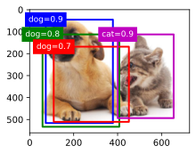
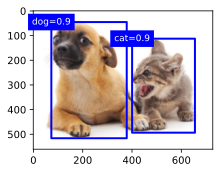

# 锚框


```python
import torch
from d2l import torch as d2l

torch.set_printoptions(2)  # 精简输出精度
```

## 生成多个锚框

假设输入图像的高度为$h$，宽度为$w$。
我们以图像的每个像素为中心生成不同形状的锚框：*缩放比*为$s\in (0, 1]$，*宽高比*为$r > 0$。
那么[**锚框的宽度和高度分别是$hs\sqrt{r}$和$hs/\sqrt{r}$。**]
请注意，当中心位置给定时，已知宽和高的锚框是确定的。

要生成多个不同形状的锚框，让我们设置许多缩放比（scale）取值$s_1,\ldots, s_n$和许多宽高比（aspect ratio）取值$r_1,\ldots, r_m$。
当使用这些比例和长宽比的所有组合以每个像素为中心时，输入图像将总共有$whnm$个锚框。
尽管这些锚框可能会覆盖所有真实边界框，但计算复杂性很容易过高。
在实践中，(**我们只考虑**)包含$s_1$或$r_1$的(**组合：**)

(**
$$(s_1, r_1), (s_1, r_2), \ldots, (s_1, r_m), (s_2, r_1), (s_3, r_1), \ldots, (s_n, r_1).$$
**)

也就是说，以同一像素为中心的锚框的数量是$n+m-1$。
对于整个输入图像，将共生成$wh(n+m-1)$个锚框。

上述生成锚框的方法在下面的`multibox_prior`函数中实现。
我们指定输入图像、尺寸列表和宽高比列表，然后此函数将返回所有的锚框。


```python
# 生成以每个像素为中心具有不同形状的锚框
def multibox_prior(data, sizes, ratios):
    # 获取输入数据的高度和宽度，data.shape[-2:] 表示取数据最后两个维度的值，即高度和宽度
    in_height, in_width = data.shape[-2:]
    # 获取数据所在的设备（如 CPU 或 GPU），并计算尺寸列表和宽高比列表的长度
    device, num_sizes, num_ratios = data.device, len(sizes), len(ratios)
    # 计算每个像素生成的锚框数量，公式为 num_sizes + num_ratios - 1
    boxes_per_pixel = (num_sizes + num_ratios - 1)
    # 将尺寸列表和宽高比列表转换为 PyTorch 张量，并放置在与输入数据相同的设备上
    size_tensor = torch.tensor(sizes, device = device)
    ratio_tensor = torch.tensor(ratios, device = device)

    # 定义锚框中心相对于像素的偏移量，这里设置为 0.5 表示锚框中心位于像素中心
    offset_h, offset_w = 0.5, 0.5
    # 计算每个像素在高度和宽度方向上的步长，即每个像素对应的相对坐标间隔
    steps_h = 1.0 / in_height
    steps_w = 1.0 / in_width

    # 计算每个像素的中心在高度方向上的相对坐标
    center_h = (torch.arange(in_height, device = device) + offset_h ) * steps_h
    # 计算每个像素的中心在宽度方向上的相对坐标
    center_w = (torch.arange(in_width, device = device) + offset_w ) * steps_w

    # 使用 torch.meshgrid 函数生成所有像素中心的坐标网格，indexing='ij' 表示按行优先的方式生成网格
    shift_y, shift_x = torch.meshgrid(center_h, center_w, indexing = 'ij')
    # 将生成的坐标网格展平为一维张量
    shift_y, shift_x = shift_y.reshape(-1), shift_x.reshape(-1)

    # 计算不同尺寸和宽高比下锚框的宽度
    # 对于第一个宽高比，使用所有尺寸计算宽度；对于其他宽高比，使用第一个尺寸计算宽度
    # 最后将计算结果乘以 in_height / in_width 进行宽高比调整
    w = torch.cat((size_tensor * torch.sqrt(ratio_tensor[0]), 
                   sizes[0] * torch.sqrt(ratio_tensor[1:])))\
                    * in_height / in_width
    # 计算不同尺寸和宽高比下锚框的高度
    h = torch.cat((size_tensor * torch.sqrt(ratio_tensor[0]), sizes[0] * torch.sqrt(ratio_tensor[1:])))

    # 计算锚框相对于中心的偏移量，格式为 [左偏移, 上偏移, 右偏移, 下偏移]
    # 然后将偏移量张量转置并重复 in_height * in_width 次，最后除以 2 得到相对偏移量
    anchor_manipulations = torch.stack((-w, -h, w, h)).T.repeat(in_height * in_width, 1) / 2
    # 生成每个像素中心的坐标张量，并重复 boxes_per_pixel 次，以匹配每个像素生成的锚框数量
    out_grid = torch.stack([shift_x, shift_y, shift_x, shift_y], dim = 1).repeat_interleave(boxes_per_pixel, dim = 0)
    # 将像素中心坐标和锚框相对偏移量相加，得到每个锚框的最终坐标
    output = out_grid + anchor_manipulations
    # 在输出张量的第 0 维添加一个维度，以符合批量处理的格式要求
    return output.unsqueeze(0)
```


```python
img = d2l.plt.imread('../img/catdog.jpg')
h, w = img.shape[:2]

print(h, w)
X = torch.rand(size=(1, 3, h, w))
Y = multibox_prior(X, sizes=[0.75, 0.5, 0.25], ratios=[1, 2, 0.5])
Y.shape
```

    561 728
    


    torch.Size([1, 2042040, 4])


```python
boxes = Y.reshape(h, w, 5, 4)
boxes[250, 250, 0, :]
```


    tensor([0.09, 0.12, 0.59, 0.77])


```python
# 显示所有边框
def show_bboxes(axes, bboxes, labels = None , colors = None):
    # 定义一个内部辅助函数，用于将对象转换为列表形式
    # 如果对象为 None，则使用默认值；如果对象不是列表或元组，则将其转换为包含该对象的列表
    def _make_list(obj, default_values = None):
        if obj is None:
            obj = default_values
        elif not isinstance(obj, (list, tuple)):
            obj = [obj]
        return obj
    # 调用 _make_list 函数将 labels 转换为列表形式
    labels = _make_list(labels)
    # 调用 _make_list 函数将 colors 转换为列表形式，并设置默认颜色列表为 ['b', 'g', 'r', 'm', 'c']
    colors = _make_list(colors, ['b', 'g', 'r', 'm', 'c'])
    # 遍历每个边界框
    for i, bbox in enumerate(bboxes):
        # 从颜色列表中选择颜色，使用取模运算确保索引不会超出颜色列表的范围
        color = colors[i % len(colors)]
        # 将边界框从 PyTorch 张量转换为 NumPy 数组，并使用 d2l.bbox_to_rect 函数将其转换为 matplotlib 的 Rectangle 对象
        rect = d2l.bbox_to_rect(bbox.detach().numpy(), color)
        # 将 Rectangle 对象添加到指定的坐标轴上
        axes.add_patch(rect)
        # 如果提供了标签，并且标签数量足够，则在边界框上添加标签
        if labels and len(labels) > i:
            # 根据边界框颜色设置标签文本颜色，如果边界框颜色为白色，则标签文本颜色为黑色，否则为白色
            text_color = 'k' if color == 'w' else 'w' 
            # 在边界框的左上角添加标签文本
            axes.text(rect.xy[0], rect.xy[1], labels[i],
                      va='center', ha='center', fontsize=9, color=text_color,
                      bbox=dict(facecolor=color, lw=0))
```


```python
d2l.set_figsize()
bbox_scale = torch.tensor((w, h, w, h))
fig = d2l.plt.imshow(img)
show_bboxes(fig.axes, boxes[250, 250, :, :] * bbox_scale,
            ['s=0.75, r=1', 's=0.5, r=1', 's=0.25, r=1', 's=0.75, r=2',
             's=0.75, r=0.5'])
```


    

    


## [**交并比（IoU）**]

我们刚刚提到某个锚框“较好地”覆盖了图像中的狗。
如果已知目标的真实边界框，那么这里的“好”该如何如何量化呢？
直观地说，可以衡量锚框和真实边界框之间的相似性。
*杰卡德系数*（Jaccard）可以衡量两组之间的相似性。
给定集合$\mathcal{A}$和$\mathcal{B}$，他们的杰卡德系数是他们交集的大小除以他们并集的大小：

$$J(\mathcal{A},\mathcal{B}) = \frac{\left|\mathcal{A} \cap \mathcal{B}\right|}{\left| \mathcal{A} \cup \mathcal{B}\right|}.$$


```python
# 定义一个函数，用于计算两组边界框之间的交并比（IoU）
# boxes1 和 boxes2 是两个二维张量，分别表示两组边界框
# 每个边界框由四个坐标表示，格式为 [左上角 x 坐标, 左上角 y 坐标, 右下角 x 坐标, 右下角 y 坐标]
def box_iou(boxes1, boxes2):
    # 定义一个匿名函数 box_area，用于计算单个边界框的面积
    # boxes[:2] 表示边界框的右下角坐标，boxes[:0] 表示左上角的 x 坐标，boxes[:3] 表示右下角的 y 坐标，boxes[:1] 表示左上角的 y 坐标
    # 通过计算宽度（右下角 x 坐标 - 左上角 x 坐标）和高度（右下角 y 坐标 - 左上角 y 坐标）的乘积得到面积
    box_area = lambda boxes: ((boxes[:, 2] - boxes[:, 0]) * (boxes[:, 3] - boxes[:, 1]))
    
    # 调用 box_area 函数计算 boxes1 中每个边界框的面积
    areas1 = box_area(boxes1)
    
    # 调用 box_area 函数计算 boxes2 中每个边界框的面积
    areas2 = box_area(boxes2)
    
    # 计算两组边界框相交区域的左上角坐标
    # boxes1[:, None, :2] 会在 boxes1 的维度中插入一个新的维度，使得其形状变为 (boxes1 的数量, 1, 2)
    # boxes2[:, :2] 的形状为 (boxes2 的数量, 2)
    # torch.max 会对两个张量对应位置的元素取最大值，得到相交区域的左上角坐标
    # 最终 inter_upperlefts 的形状为 (boxes1 的数量, boxes2 的数量, 2)
    inter_upperlefts = torch.max(boxes1[:, None, :2], boxes2[:, :2])
    
    # 计算两组边界框相交区域的右下角坐标
    # 同样使用 torch.min 对两个张量对应位置的元素取最小值，得到相交区域的右下角坐标
    # 最终 inter_lowerrights 的形状为 (boxes1 的数量, boxes2 的数量, 2)
    inter_lowerrights = torch.min(boxes1[:, None, 2:], boxes2[:, 2:])
    
    # 计算相交区域的宽度和高度
    # 用右下角坐标减去左上角坐标得到相交区域的宽度和高度
    # 使用 clamp(min = 0) 确保宽度和高度不会为负数，如果为负数则将其置为 0
    # 最终 inters 的形状为 (boxes1 的数量, boxes2 的数量, 2)
    inters = (inter_lowerrights - inter_upperlefts).clamp(min = 0)
    
    # 计算相交区域的面积
    # 将相交区域的宽度和高度相乘得到相交区域的面积
    # 最终 inter_areas 的形状为 (boxes1 的数量, boxes2 的数量)
    inter_areas = inters[:, :, 0] * inters[:, :, 1]
    
    # 计算并集区域的面积
    # 并集区域的面积等于两个边界框的面积之和减去相交区域的面积
    # areas1[:, None] 会在 areas1 的维度中插入一个新的维度，使其形状变为 (boxes1 的数量, 1)
    # 这样可以与 areas2 和 inter_areas 进行广播运算
    # 最终 union_areas 的形状为 (boxes1 的数量, boxes2 的数量)
    union_areas = areas1[:, None] + areas2 - inter_areas
    
    # 计算交并比（IoU）
    # 用相交区域的面积除以并集区域的面积得到 IoU
    # 最终返回的张量形状为 (boxes1 的数量, boxes2 的数量)
    return inter_areas / union_areas
```

## 在训练数据中标注锚框

给定图像，假设锚框是$A_1, A_2, \ldots, A_{n_a}$，真实边界框是$B_1, B_2, \ldots, B_{n_b}$，其中$n_a \geq n_b$。
让我们定义一个矩阵$\mathbf{X} \in \mathbb{R}^{n_a \times n_b}$，其中第$i$行、第$j$列的元素$x_{ij}$是锚框$A_i$和真实边界框$B_j$的IoU。
该算法包含以下步骤。

1. 在矩阵$\mathbf{X}$中找到最大的元素，并将它的行索引和列索引分别表示为$i_1$和$j_1$。然后将真实边界框$B_{j_1}$分配给锚框$A_{i_1}$。这很直观，因为$A_{i_1}$和$B_{j_1}$是所有锚框和真实边界框配对中最相近的。在第一个分配完成后，丢弃矩阵中${i_1}^\mathrm{th}$行和${j_1}^\mathrm{th}$列中的所有元素。
1. 在矩阵$\mathbf{X}$中找到剩余元素中最大的元素，并将它的行索引和列索引分别表示为$i_2$和$j_2$。我们将真实边界框$B_{j_2}$分配给锚框$A_{i_2}$，并丢弃矩阵中${i_2}^\mathrm{th}$行和${j_2}^\mathrm{th}$列中的所有元素。
1. 此时，矩阵$\mathbf{X}$中两行和两列中的元素已被丢弃。我们继续，直到丢弃掉矩阵$\mathbf{X}$中$n_b$列中的所有元素。此时已经为这$n_b$个锚框各自分配了一个真实边界框。
1. 只遍历剩下的$n_a - n_b$个锚框。例如，给定任何锚框$A_i$，在矩阵$\mathbf{X}$的第$i^\mathrm{th}$行中找到与$A_i$的IoU最大的真实边界框$B_j$，只有当此IoU大于预定义的阈值时，才将$B_j$分配给$A_i$。


```python
# 将最接近的真实边界框分配给锚框
# ground_truth 是真实边界框的张量，形状为 (num_gt_boxes, 4)，4 表示边界框的坐标信息
# anchors 是锚框的张量，形状为 (num_anchors, 4)
# device 表示计算设备，如 CPU 或 GPU
# iou_threshold 是 IoU（交并比）阈值，默认为 0.5
def assign_anchor_to_bbox(ground_truth, anchors, device, iou_threshold = 0.5):
    # 获取锚框的数量和真实边界框的数量
    num_anchors, num_gt_boxes = anchors.shape[0], ground_truth.shape[0]
    # 调用 box_iou 函数计算锚框和真实边界框之间的 IoU
    # jaccard 是一个二维张量，形状为 (num_anchors, num_gt_boxes)，每个元素表示一个锚框和一个真实边界框的 IoU
    jaccard = box_iou(anchors, ground_truth)
    # 初始化一个长度为 num_anchors 的张量 anchors_bbox_map，用于存储每个锚框分配的真实边界框的索引
    # 初始值都设为 -1，表示还未分配真实边界框
    anchors_bbox_map = torch.full((num_anchors, ), -1, dtype = torch.long, device = device)
    # 对 jaccard 张量在维度 1 上取最大值，得到每个锚框与所有真实边界框的最大 IoU 值和对应的索引
    # max_ious 是一个一维张量，形状为 (num_anchors,)，存储每个锚框的最大 IoU 值
    # indices 是一个一维张量，形状为 (num_anchors,)，存储每个锚框最大 IoU 对应的真实边界框的索引
    max_ious, indices = torch.max(jaccard, dim = 1)
    # 找出最大 IoU 值大于等于 iou_threshold 的锚框的索引
    # anc_i 是一个一维张量，存储满足条件的锚框的索引
    anc_i = torch.nonzero(max_ious >= iou_threshold).reshape(-1)
    # 根据 anc_i 找出对应的真实边界框的索引
    # box_j 是一个一维张量，存储满足条件的锚框对应的真实边界框的索引
    box_j = indices[max_ious >= iou_threshold]
    # 将满足条件的锚框分配对应的真实边界框的索引
    anchors_bbox_map[anc_i] = box_j
    # 初始化一个长度为 num_anchors 的全 -1 张量，用于标记要丢弃的列
    col_discard = torch.full((num_anchors,), -1)
    # 初始化一个长度为 num_gt_boxes 的全 -1 张量，用于标记要丢弃的行
    row_discard = torch.full((num_gt_boxes,), -1)
    # 遍历所有真实边界框
    for _ in range(num_gt_boxes):
        # 找出 jaccard 张量中的最大值的索引
        max_idx = torch.argmax(jaccard)
        # 计算最大值所在的列索引，即真实边界框的索引
        box_idx = (max_idx % num_gt_boxes).long()
        # 计算最大值所在的行索引，即锚框的索引
        anc_idx = (max_idx // num_gt_boxes).long()
        # 将该锚框分配给对应的真实边界框
        anchors_bbox_map[anc_idx] = box_idx
        # 将该真实边界框对应的列全部置为 -1，表示该列不再参与后续的分配
        jaccard[:, box_idx] = col_discard
        # 将该锚框对应的行全部置为 -1，表示该行不再参与后续的分配
        jaccard[anc_idx, :] = row_discard
    # 返回每个锚框分配的真实边界框的索引
    return anchors_bbox_map
```

### 标记类别和偏移量

假设一个锚框$A$被分配了一个真实边界框$B$。
一方面，锚框$A$的类别将被标记为与$B$相同。
另一方面，锚框$A$的偏移量将根据$B$和$A$中心坐标的相对位置以及这两个框的相对大小进行标记。
鉴于数据集内不同的框的位置和大小不同，我们可以对那些相对位置和大小应用变换，使其获得分布更均匀且易于拟合的偏移量。
这里介绍一种常见的变换。
[**给定框$A$和$B$，中心坐标分别为$(x_a, y_a)$和$(x_b, y_b)$，宽度分别为$w_a$和$w_b$，高度分别为$h_a$和$h_b$，可以将$A$的偏移量标记为：

$$\left( \frac{ \frac{x_b - x_a}{w_a} - \mu_x }{\sigma_x},
\frac{ \frac{y_b - y_a}{h_a} - \mu_y }{\sigma_y},
\frac{ \log \frac{w_b}{w_a} - \mu_w }{\sigma_w},
\frac{ \log \frac{h_b}{h_a} - \mu_h }{\sigma_h}\right),$$
**]
其中常量的默认值为 $\mu_x = \mu_y = \mu_w = \mu_h = 0, \sigma_x=\sigma_y=0.1$ ， $\sigma_w=\sigma_h=0.2$。
这种转换在下面的 `offset_boxes` 函数中实现。


```python
# 对锚框偏移量的转换
# anchors 是锚框的张量，形状通常为 (num_anchors, 4)，4 表示边界框的坐标信息（一般是 [x1, y1, x2, y2] 形式的角坐标）
# assigned_bb 是分配给锚框的真实边界框的张量，形状为 (num_anchors, 4)
# eps 是一个很小的数值，用于避免在对数运算中出现除零错误，默认为 1e-6
def offset_boxes(anchors, assigned_bb, eps = 1e-6):
    # 将锚框的角坐标表示转换为中心坐标表示
    # d2l.box_corner_to_center 是一个自定义函数，用于将角坐标 [x1, y1, x2, y2] 转换为中心坐标 [cx, cy, w, h]
    # c_anc 是转换后的锚框中心坐标张量，形状为 (num_anchors, 4)
    c_anc = d2l.box_corner_to_center(anchors)
    
    # 将分配给锚框的真实边界框的角坐标表示转换为中心坐标表示
    # c_assigned_bb 是转换后的真实边界框中心坐标张量，形状为 (num_anchors, 4)
    c_assigned_bb = d2l.box_corner_to_center(assigned_bb)
    
    # 计算中心坐标的偏移量
    # 对于中心坐标的 x 和 y 分量，计算真实边界框中心坐标与锚框中心坐标的差值，再除以锚框的宽和高
    # 乘以 10 是为了对偏移量进行缩放，增强偏移量的影响
    # offset_xy 是中心坐标偏移量的张量，形状为 (num_anchors, 2)
    offset_xy = 10 * (c_assigned_bb[:, :2] - c_anc[:, :2]) / c_anc[:, 2:]
    
    # 计算宽高的偏移量
    # 对于宽和高，计算真实边界框的宽高与锚框宽高的比值，取对数后乘以 5 进行缩放
    # 加上 eps 是为了避免对数运算中出现除零错误
    # offset_wh 是宽高偏移量的张量，形状为 (num_anchors, 2)
    offset_wh = 5 * torch.log(eps + c_assigned_bb[:, 2:] / c_anc[:, 2:])
    
    # 将中心坐标偏移量和宽高偏移量拼接在一起
    # 沿着维度 1 进行拼接，得到最终的偏移量张量
    # offset 是拼接后的偏移量张量，形状为 (num_anchors, 4)
    offset = torch.cat([offset_xy, offset_wh], axis = 1)
    
    # 返回计算得到的偏移量张量
    return offset
```


```python
# 使用真实边界框标记锚框
# anchors 是锚框的张量，形状通常为 (1, num_anchors, 4)，这里的 1 是批量维度
# labels 是真实标签的张量，形状为 (batch_size, num_objects, 5)，
# 其中 num_objects 是每张图片中目标的数量，5 表示 [类别标签, x1, y1, x2, y2]
def multibox_target(anchors, labels):
    # 获取批量大小
    batch_size = labels.shape[0]
    # 移除锚框张量的批量维度（因为所有样本的锚框是相同的），得到形状为 (num_anchors, 4) 的张量
    anchors = anchors.squeeze(0)
    # 初始化三个空列表，分别用于存储每个样本的偏移量、掩码和类别标签
    batch_offset, batch_mask, batch_class_labels = [], [], []
    # 获取锚框所在的设备（如 CPU 或 GPU）
    device = anchors.device
    # 获取锚框的数量
    num_anchors = anchors.shape[0]

    # 遍历每个样本
    for i in range(batch_size):
        # 获取当前样本的真实标签
        label = labels[i, :, :]
        # 调用 assign_anchor_to_bbox 函数，将锚框分配给真实边界框
        # 返回一个一维张量，每个元素表示一个锚框分配的真实边界框的索引，如果未分配则为 -1
        anchors_bbox_map = assign_anchor_to_bbox(label[:, 1:], anchors, device)
        # 创建一个掩码张量，用于标记哪些锚框被分配了真实边界框
        # (anchors_bbox_map >= 0) 得到一个布尔张量，将其转换为浮点型张量
        # unsqueeze(-1) 在最后一个维度上增加一个维度，然后 repeat(1, 4) 将其在最后一个维度上重复 4 次
        # 因为每个锚框有 4 个偏移量，所以需要重复 4 次
        bbox_mask = ((anchors_bbox_map >= 0).float().unsqueeze(-1)).repeat(1, 4)
        # 初始化类别标签张量，所有元素初始化为 0，表示背景类
        class_labels = torch.zeros(num_anchors, dtype=torch.long, device=device)
        # 初始化分配的真实边界框张量，所有元素初始化为 0
        assigned_bb = torch.zeros((num_anchors, 4), dtype=torch.float32, device=device)
        # 找出被分配了真实边界框的锚框的索引
        indices_true = torch.nonzero(anchors_bbox_map >= 0)
        # 获取这些锚框分配的真实边界框的索引
        bb_idx = anchors_bbox_map[indices_true]
        # 为被分配的锚框设置类别标签
        # 真实标签的第一列是类别标签，加 1 是因为背景类为 0，真实类别从 1 开始
        class_labels[indices_true] = label[bb_idx, 0].long() + 1
        # 为被分配的锚框设置对应的真实边界框
        assigned_bb[indices_true] = label[bb_idx, 1:]
        # 调用 offset_boxes 函数计算锚框到分配的真实边界框的偏移量
        # 然后乘以掩码，将未分配的锚框的偏移量置为 0
        offset = offset_boxes(anchors, assigned_bb) * bbox_mask
        # 将当前样本的偏移量展平并添加到 batch_offset 列表中
        batch_offset.append(offset.reshape(-1))
        # 将当前样本的掩码展平并添加到 batch_mask 列表中
        batch_mask.append(bbox_mask.reshape(-1))
        # 将当前样本的类别标签添加到 batch_class_labels 列表中
        batch_class_labels.append(class_labels)

    # 将每个样本的偏移量列表堆叠成一个二维张量
    bbox_offset = torch.stack(batch_offset)
    # 将每个样本的掩码列表堆叠成一个二维张量
    bbox_mask = torch.stack(batch_mask)
    # 将每个样本的类别标签列表堆叠成一个二维张量
    class_labels = torch.stack(batch_class_labels)

    # 返回偏移量、掩码和类别标签三个张量
    return (bbox_offset, bbox_mask, class_labels)
```


```python
# 例子
ground_truth = torch.tensor([[0, 0.1, 0.08, 0.52, 0.92],
                         [1, 0.55, 0.2, 0.9, 0.88]])
anchors = torch.tensor([[0, 0.1, 0.2, 0.3], [0.15, 0.2, 0.4, 0.4],
                    [0.63, 0.05, 0.88, 0.98], [0.66, 0.45, 0.8, 0.8],
                    [0.57, 0.3, 0.92, 0.9]])

fig = d2l.plt.imshow(img)
show_bboxes(fig.axes, ground_truth[:, 1:] * bbox_scale, ['dog', 'cat'], 'k')
show_bboxes(fig.axes, anchors * bbox_scale, ['0', '1', '2', '3', '4']);
```


    

    


```python
labels = multibox_target(anchors.unsqueeze(dim=0),
                         ground_truth.unsqueeze(dim=0))
```


```python
print(labels[2])
print(labels[1])
print(labels[0])
```

    tensor([[0, 1, 2, 0, 2]])
    tensor([[0., 0., 0., 0., 1., 1., 1., 1., 1., 1., 1., 1., 0., 0., 0., 0., 1., 1.,
             1., 1.]])
    tensor([[-0.00e+00, -0.00e+00, -0.00e+00, -0.00e+00,  1.40e+00,  1.00e+01,
              2.59e+00,  7.18e+00, -1.20e+00,  2.69e-01,  1.68e+00, -1.57e+00,
             -0.00e+00, -0.00e+00, -0.00e+00, -0.00e+00, -5.71e-01, -1.00e+00,
              4.17e-06,  6.26e-01]])
    

## 使用非极大值抑制预测边界框


```python
# 根据带有预测偏移量的锚框来预测边界框
def offset_inverse(anchors, offset_preds):
    # 将锚框的角坐标表示转换为中心坐标表示
    # 这里假设 d2l.box_corner_to_center 函数可以将 [x1, y1, x2, y2] 形式的角坐标转换为 [cx, cy, w, h] 形式的中心坐标
    anc = d2l.box_corner_to_center(anchors)
    
    # 计算预测边界框的中心坐标
    # offset_preds[:, :2] 是预测的中心坐标偏移量，anc[:, 2:] 是锚框的宽和高
    # 先将偏移量乘以锚框的宽和高再除以 10，然后加上锚框的中心坐标，得到预测边界框的中心坐标
    pred_bbox_xy = (offset_preds[:, :2] * anc[:, 2:] / 10) + anc[:, :2]
    
    # 计算预测边界框的宽和高
    # offset_preds[:, 2:] 是预测的宽高偏移量，先将其除以 5 后取指数，再乘以锚框的宽和高，得到预测边界框的宽和高
    pred_bbox_wh = torch.exp(offset_preds[:, 2:] / 5) * anc[:, 2:]
    
    # 将预测的中心坐标和宽高拼接在一起，形成预测边界框的中心坐标表示
    pred_bbox = torch.cat((pred_bbox_xy, pred_bbox_wh), axis = 1)
    
    # 将预测边界框的中心坐标表示转换为角坐标表示
    # 这里假设 d2l.box_center_to_corner 函数可以将 [cx, cy, w, h] 形式的中心坐标转换为 [x1, y1, x2, y2] 形式的角坐标
    predicted_bbox = d2l.box_center_to_corner(pred_bbox)
    
    # 返回预测边界框的角坐标表示
    return predicted_bbox
```


```python
# 对预测边界框的置信度进行排序
def nms(boxes, scores, iou_threshold):
    # 对置信度分数进行降序排序，得到排序后的索引
    B = torch.argsort(scores, dim = -1, descending = True)
    
    # 用于存储最终保留的边界框索引
    keep = []
    
    # 当还有待处理的边界框索引时，继续循环
    while B.numel() > 0:
        # 选择置信度最高的边界框的索引
        i = B[0]
        # 将该索引添加到保留列表中
        keep.append(i)
        
        # 如果只剩下一个边界框索引，退出循环
        if B.numel() == 1: break
        
        # 计算置信度最高的边界框与其余边界框的 IoU（交并比）
        iou = box_iou(boxes[i, :].reshape(-1, 4), boxes[B[1:], :].reshape(-1, 4)).reshape(-1)
        
        # 找出 IoU 小于等于阈值的边界框的索引
        inds = torch.nonzero(iou <= iou_threshold).reshape(-1)
        
        # 更新待处理的边界框索引，只保留 IoU 小于等于阈值的边界框的索引
        B = B[inds + 1]
    
    # 将保留的边界框索引转换为张量并返回
    return torch.tensor(keep, device = boxes.device)
```


```python
# 使用非极大值抑制来预测边界框
def multibox_detection(cls_probs, offset_preds, anchors, nms_threshold = 0.5, pos_threshold = 0.009999999):
    # 获取设备信息和批量大小
    device, batch_size = cls_probs.device, cls_probs.shape[0]
    
    # 移除锚框的批量维度（因为所有样本的锚框是相同的）
    anchors = anchors.squeeze(0)
    
    # 获取类别数量和锚框数量
    num_classes, num_anchors = cls_probs.shape[1], cls_probs.shape[2]
    
    # 用于存储每个样本的预测结果
    out = []
    
    # 遍历每个样本
    for i in range(batch_size):
        # 获取当前样本的类别概率和偏移量预测
        cls_prob, offset_pred = cls_probs[i], offset_preds[i].reshape(-1, 4)
        
        # 找到每个锚框对应的最大类别概率和类别索引
        # 这里忽略了背景类（索引为 0），从索引 1 开始取
        conf, class_id = torch.max(cls_prob[1:], 0)
        
        # 根据预测的偏移量和锚框，计算预测边界框的角坐标表示
        predicted_bb = offset_inverse(anchors, offset_pred)
        
        # 使用非极大值抑制（NMS）筛选出保留的边界框索引
        keep = nms(predicted_bb, conf, nms_threshold)
        
        # 生成所有锚框的索引
        all_idx = torch.arange(num_anchors, dtype = torch.long, device = device)
        
        # 将保留的索引和所有索引拼接在一起
        combined = torch.cat((keep, all_idx))
        
        # 找出唯一的索引和它们的出现次数
        uniques, counts = combined.unique(return_counts = True)
        
        # 找出只出现一次的索引，即未被保留的索引
        non_keep = uniques[counts == 1]
        
        # 将保留的索引和未被保留的索引按顺序拼接在一起
        all_id_sorted = torch.cat((keep, non_keep))
        
        # 将未被保留的锚框的类别索引设为 -1，表示背景
        class_id[non_keep] = -1
        
        # 根据排序后的索引重新排列类别索引
        class_id = class_id[all_id_sorted]
        
        # 根据排序后的索引重新排列置信度分数和预测边界框
        conf, predicted_bb = conf[all_id_sorted], predicted_bb[all_id_sorted]
        
        # 找出置信度分数低于阈值的索引
        below_min_idx = (conf < pos_threshold)
        
        # 将置信度分数低于阈值的锚框的类别索引设为 -1，表示背景
        class_id[below_min_idx] = -1
        
        # 对于置信度分数低于阈值的锚框，将置信度分数取反
        conf[below_min_idx] = 1 - conf[below_min_idx]
        
        # 将类别索引、置信度分数和预测边界框拼接在一起，形成最终的预测信息
        pred_info = torch.cat((class_id.unsqueeze(1), conf.unsqueeze(1), predicted_bb), dim = 1)
        
        # 将当前样本的预测信息添加到输出列表中
        out.append(pred_info)
    
    # 将所有样本的预测信息堆叠在一起，形成一个张量并返回
    return torch.stack(out)
```


```python
anchors = torch.tensor([[0.1, 0.08, 0.52, 0.92], [0.08, 0.2, 0.56, 0.95],
                      [0.15, 0.3, 0.62, 0.91], [0.55, 0.2, 0.9, 0.88]])
offset_preds = torch.tensor([0] * anchors.numel())
cls_probs = torch.tensor([[0] * 4,  # 背景的预测概率
                      [0.9, 0.8, 0.7, 0.1],  # 狗的预测概率
                      [0.1, 0.2, 0.3, 0.9]])  # 猫的预测概率
```


```python
fig = d2l.plt.imshow(img)
show_bboxes(fig.axes, anchors * bbox_scale,
            ['dog=0.9', 'dog=0.8', 'dog=0.7', 'cat=0.9'])
```


    

    


```python
output = multibox_detection(cls_probs.unsqueeze(dim=0),
                            offset_preds.unsqueeze(dim=0),
                            anchors.unsqueeze(dim=0),
                            nms_threshold=0.5)
output
```


    tensor([[[ 0.00,  0.90,  0.10,  0.08,  0.52,  0.92],
             [ 1.00,  0.90,  0.55,  0.20,  0.90,  0.88],
             [-1.00,  0.80,  0.08,  0.20,  0.56,  0.95],
             [-1.00,  0.70,  0.15,  0.30,  0.62,  0.91]]])


```python
fig = d2l.plt.imshow(img)
for i in output[0].detach().numpy():
    if i[0] == -1:
        continue
    label = ('dog=', 'cat=')[int(i[0])] + str(i[1])
    show_bboxes(fig.axes, [torch.tensor(i[2:]) * bbox_scale], label)
```


    

    


```python

```
