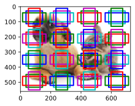
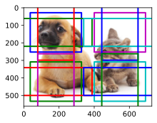
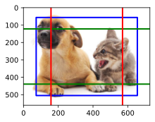
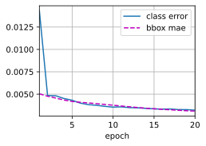
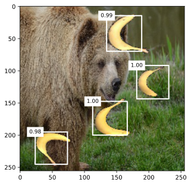

# 多尺度目标检测


```python
%matplotlib inline
import torch
from d2l import torch as d2l

img = d2l.plt.imread('../img/catdog.jpg')
h, w = img.shape[:2]
h, w
```


    (561, 728)


在特征图（`fmap`）上生成锚框（`anchors`），每个单位（像素）作为锚框的中心
由于锚框中的$(x, y)$轴坐标值（`anchors`）已经被除以特征图（`fmap`）的宽度和高度，因此这些值介于0和1之间，表示特征图中锚框的相对位置。


```python
# 定义一个函数，用于显示锚框
# fmap_w 表示特征图的宽度
# fmap_h 表示特征图的高度
# s 是一个列表，包含了锚框的尺度
def display_anchors(fmap_w, fmap_h, s):
    # 设置图形的大小，使用 d2l 库中的 set_figsize 函数
    d2l.set_figsize()
    
    # 创建一个全零的特征图张量
    # 第一个维度表示批量大小，这里设为 1，表示只有一个样本
    # 第二个维度表示通道数，这里设为 10，实际通道数不影响锚框的生成
    # 第三个维度表示特征图的高度，由输入参数 fmap_h 决定
    # 第四个维度表示特征图的宽度，由输入参数 fmap_w 决定
    fmap = torch.zeros((1, 10, fmap_h, fmap_w))
    
    # 使用 d2l 库中的 multibox_prior 函数生成锚框
    # fmap 是输入的特征图
    # sizes=s 表示锚框的尺度，由输入参数 s 决定
    # ratios=[1, 2, 0.5] 表示锚框的宽高比，这里设置了三种宽高比：1:1、2:1 和 0.5:1
    # anchors 是生成的锚框张量，形状为 (1, num_anchors, 4)，其中 num_anchors 是生成的锚框数量，4 表示每个锚框的坐标信息（xmin, ymin, xmax, ymax）
    anchors = d2l.multibox_prior(fmap, sizes=s, ratios=[1, 2, 0.5])
    
    # 创建一个缩放因子张量，用于将锚框的坐标从特征图尺度转换到图像尺度
    # 假设 w 和 h 是图像的宽度和高度，这里需要确保 w 和 h 已经在代码中定义
    # bbox_scale 的形状为 (4,)，四个元素分别表示 xmin、ymin、xmax、ymax 的缩放因子
    bbox_scale = torch.tensor((w, h, w, h))
    
    # 使用 d2l 库中的 show_bboxes 函数在图像上显示锚框
    # d2l.plt.imshow(img) 用于显示图像，这里需要确保 img 已经在代码中定义
    # .axes 获取图像的坐标轴对象
    # anchors[0] * bbox_scale 将锚框的坐标从特征图尺度转换到图像尺度
    # 最后将转换后的锚框在图像上显示出来
    d2l.show_bboxes(d2l.plt.imshow(img).axes,
                    anchors[0] * bbox_scale)
```


```python
display_anchors(fmap_w=4, fmap_h=4, s=[0.15])
```


    

    


```python
display_anchors(fmap_w=2, fmap_h=2, s=[0.4])
```


    

    


```python
# 特征图的高度和宽度减小一半，然后将锚框的尺度增加到0.8
display_anchors(fmap_w=1, fmap_h=1, s=[0.8])
```


    

    


# SSD的实现


```python
import torch
import torchvision
from torch import nn
from torch.nn import functional as F
from d2l import torch as d2l
```


```python
# 类别预测层函数
# 该函数用于创建一个卷积层，用于预测每个锚框对应的目标类别
# num_inputs: 输入特征图的通道数
# num_anchors: 锚框的数量
# num_classes: 目标类别的数量（不包括背景类）
def cls_predictor(num_inputs, num_anchors, num_classes):
    # 使用 nn.Conv2d 创建一个卷积层
    # 输入通道数为 num_inputs
    # 输出通道数为 num_anchors * (num_classes + 1)，其中加 1 是因为要包含背景类的预测
    # kernel_size = 3 表示卷积核大小为 3x3
    # padding = 1 可以保证卷积操作后特征图的尺寸不变
    return nn.Conv2d(num_inputs, num_anchors * (num_classes + 1), kernel_size=3, padding=1)


# 边界框预测层函数
# 该函数用于创建一个卷积层，用于预测每个锚框的边界框偏移量
# num_inputs: 输入特征图的通道数
# num_anchors: 锚框的数量
def bbox_predictor(num_inputs, num_anchors):
    # 使用 nn.Conv2d 创建一个卷积层
    # 输入通道数为 num_inputs
    # 输出通道数为 num_anchors * 4，因为每个锚框需要预测 4 个坐标值（xmin, ymin, xmax, ymax）
    # kernel_size = 3 表示卷积核大小为 3x3
    # padding = 1 可以保证卷积操作后特征图的尺寸不变
    return nn.Conv2d(num_inputs, num_anchors * 4, kernel_size=3, padding=1)
```


```python
# 简单的前向传播函数
# 该函数将输入 x 通过指定的块 block 进行前向传播
# x: 输入张量
# block: 要通过的网络块（可以是 nn.Sequential 或其他可调用的网络结构）
def forward(x, block):
    return block(x)

Y1 = forward(torch.zeros((2, 8, 20, 20)), cls_predictor(8, 5, 10))
Y2 = forward(torch.zeros((2, 16, 10, 10)), cls_predictor(16, 3, 10))
Y1.shape, Y2.shape
```


    (torch.Size([2, 55, 20, 20]), torch.Size([2, 33, 10, 10]))


```python
# 将预测结果进行扁平化处理的函数
# 该函数先将预测结果的通道维度移动到最后，然后进行扁平化操作
# pred: 预测结果张量，形状通常为 (batch_size, channels, height, width)
def flatten_pred(pred):
    # 使用 permute 方法将通道维度（dim=1）移动到最后，得到 (batch_size, height, width, channels) 的形状
    pred = pred.permute(0, 2, 3, 1)
    # 使用 torch.flatten 方法从 start_dim = 1 开始进行扁平化，即将 height、width 和 channels 维度展平
    return torch.flatten(pred, start_dim=1)

# 拼接多个预测结果的函数
# 该函数对多个预测结果进行扁平化处理后，沿着指定维度拼接起来
# preds: 包含多个预测结果张量的列表
def concat_preds(preds):
    # 使用列表推导式对列表中的每个预测结果调用 flatten_pred 函数进行扁平化处理
    # 然后使用 torch.cat 函数沿着 dim = 1 维度将它们拼接起来
    return torch.cat([flatten_pred(p) for p in preds], dim=1)
```


```python
concat_preds([Y1, Y2]).shape
```


    torch.Size([2, 25300])


```python
# 高和宽减半块函数
# 该函数构建一个包含多个层的网络块，用于将输入特征图的高度和宽度减半
# in_channels: 输入特征图的通道数
# out_channels: 输出特征图的通道数
def down_sample_blk(in_channels, out_channels):
    blk = []
    # 构建两个卷积、批量归一化和 ReLU 激活的序列
    for _ in range(2):
        # 添加一个卷积层，将输入通道数转换为输出通道数
        blk.append(nn.Conv2d(in_channels, out_channels, kernel_size=3, padding=1))
        # 添加一个批量归一化层，用于对特征图进行归一化处理，有助于训练的稳定性
        blk.append(nn.BatchNorm2d(out_channels))
        # 添加一个 ReLU 激活函数，引入非线性
        blk.append(nn.ReLU())
        in_channels = out_channels
    # 添加一个最大池化层，其核大小为 2x2，步长为 2，用于将特征图的高度和宽度减半
    blk.append(nn.MaxPool2d(2))
    # 将构建的层序列转换为一个 nn.Sequential 顺序模型
    return nn.Sequential(*blk)
```


```python
forward(torch.zeros((2, 3, 20, 20)), down_sample_blk(3, 10)).shape
```


    torch.Size([2, 10, 10, 10])


```python
# 基本网络块函数
# 该函数构建一个由多个 down_sample_blk 组成的基本网络块，用于提取图像的基础特征
def base_net():
    blk = []
    num_filters = [3, 16, 32, 64]
    # 遍历 num_filters 列表，构建多个 down_sample_blk 块，逐步提取更高级的特征
    for i in range(len(num_filters) - 1):
        blk.append(down_sample_blk(num_filters[i], num_filters[i + 1]))
    # 将构建的块序列转换为一个 nn.Sequential 顺序模型
    return nn.Sequential(*blk)
forward(torch.zeros((2, 3, 256, 256)), base_net()).shape
```


    torch.Size([2, 64, 32, 32])


```python
# 根据不同的索引 i 获取对应的网络块函数
# 该函数根据索引 i 返回不同的网络块，用于构建完整的模型结构
# i: 表示网络块的索引
def get_blk(i):
    if i == 0:
        # 如果索引为 0，返回基本网络块
        blk = base_net()
    elif i == 1:
        # 如果索引为 1，返回一个将通道数从 64 转换为 128 的下采样块
        blk = down_sample_blk(64, 128)
    elif i == 4:
        # 如果索引为 4，返回一个自适应最大池化层，将输出特征图大小固定为 1x1
        blk = nn.AdaptiveMaxPool2d((1, 1))
    else:
        # 其他情况，返回一个将通道数保持为 128 的下采样块
        blk = down_sample_blk(128, 128)
    return blk

# 对每个块进行前向传播的函数
# 该函数对输入张量 X 通过指定的网络块 blk 进行前向传播，并生成锚框、类别预测和边界框预测
# X: 输入张量
# blk: 要进行前向传播的网络块
# size: 用于生成锚框的尺度列表
# ratio: 用于生成锚框的宽高比列表
# cls_predictor: 类别预测层
# bbox_predictor: 边界框预测层
def blk_forward(X, blk, size, ratio, cls_predictor, bbox_predictor):
    # 对输入 X 通过网络块 blk 进行前向传播，得到特征图 Y
    Y = blk(X)
    # 根据特征图 Y 使用 d2l.multibox_prior 函数生成锚框
    anchors = d2l.multibox_prior(Y, sizes=size, ratios=ratio)
    # 使用类别预测层 cls_predictor 对特征图 Y 进行预测，得到类别预测结果 cls_preds
    cls_preds = cls_predictor(Y)
    # 使用边界框预测层 bbox_predictor 对特征图 Y 进行预测，得到边界框预测结果 bbox_preds
    bbox_preds = bbox_predictor(Y)
    # 返回特征图 Y、锚框、类别预测结果和边界框预测结果
    return Y, anchors, cls_preds, bbox_preds
```


```python
# 超参数
sizes = [[0.2, 0.272], [0.37, 0.447], [0.54, 0.619], [0.71, 0.79],
         [0.88, 0.961]]
ratios = [[1, 2, 0.5]] * 5
num_anchors = len(sizes[0]) + len(ratios[0]) - 1
```


```python
# TinySSD 模型类定义
# 该类定义了一个 TinySSD 目标检测模型
class TinySSD(nn.Module):
    def __init__(self, num_classes, **kwargs):
        super(TinySSD, self).__init__(**kwargs)
        self.num_classes = num_classes
        idx_to_in_channels = [64, 128, 128, 128, 128]
        # 循环为每个块、类别预测层和边界框预测层创建并注册成员变量
        for i in range(5):
            # 根据索引 i 获取对应的网络块，并注册为模型的成员变量 blk_{i}
            setattr(self, f'blk_{i}', get_blk(i))
            # 根据索引 i 获取输入通道数，创建对应的类别预测层并注册为模型的成员变量 cls_{i}
            setattr(self, f'cls_{i}', cls_predictor(idx_to_in_channels[i], num_anchors, num_classes))
            # 根据索引 i 获取输入通道数，创建对应的边界框预测层并注册为模型的成员变量 bbox_{i}
            setattr(self, f'bbox_{i}', bbox_predictor(idx_to_in_channels[i], num_anchors))

    def forward(self, X):
        anchors, cls_preds, bbox_preds = [None] * 5, [None] * 5, [None] * 5
        # 循环对每个块进行前向传播，并保存相应的结果
        for i in range(5):
            X, anchors[i], cls_preds[i], bbox_preds[i] = blk_forward(X, getattr(self, f'blk_{i}'), sizes[i], ratios[i],
                                                                    getattr(self, f'cls_{i}'),
                                                                    getattr(self, f'bbox_{i}'))
        # 将所有块生成的锚框在 dim = 1 维度上拼接起来
        anchors = torch.cat(anchors, dim=1)
        # 将所有块的类别预测结果进行拼接和处理
        cls_preds = concat_preds(cls_preds)
        cls_preds = cls_preds.reshape(cls_preds.shape[0], -1, self.num_classes + 1)
        # 将所有块的边界框预测结果进行拼接
        bbox_preds = concat_preds(bbox_preds)
        # 返回拼接后的锚框、类别预测结果和边界框预测结果
        return anchors, cls_preds, bbox_preds
```


```python
# 创建 TinySSD 模型实例，指定目标类别数为 1
net = TinySSD(num_classes=1)
# 创建一个形状为 (32, 3, 256, 256) 的全零张量作为输入
X = torch.zeros((32, 3, 256, 256))
# 将输入张量传入模型进行前向传播，得到锚框、类别预测结果和边界框预测结果
anchors, cls_preds, bbox_preds = net(X)

print('output anchors:', anchors.shape)
print('output class preds:', cls_preds.shape)
print('output bbox preds:', bbox_preds.shape)
```

    output anchors: torch.Size([1, 5444, 4])
    output class preds: torch.Size([32, 5444, 2])
    output bbox preds: torch.Size([32, 21776])
    


```python
# 训练模型
# 读取数据
```


```python
batch_size = 32
train_iter, _ = d2l.load_data_bananas(batch_size)
```

    read 1000 training examples
    read 100 validation examples
    


```python
device, net = d2l.try_gpu(), TinySSD(num_classes=1)
trainer = torch.optim.SGD(net.parameters(), lr=0.2, weight_decay=5e-4)
```


```python
# 计算总损失的函数
# 该函数计算模型的类别损失和边界框损失，并返回总损失
# cls_preds: 类别预测结果张量
# cls_labels: 真实类别标签张量
# bbox_preds: 边界框预测结果张量
# bbox_labels: 真实边界框标签张量
# bbox_masks: 边界框掩码张量，用于标记哪些边界框是有效的
def calc_loss(cls_preds, cls_labels, bbox_preds, bbox_labels, bbox_masks):
    batch_size, num_classes = cls_preds.shape[0], cls_preds.shape[2]
    # 计算类别损失
    # 先将 cls_preds 和 cls_labels 展平，计算交叉熵损失
    # 然后再将损失重新调整为 (batch_size, -1) 的形状，并在 dim = 1 上求平均
    cls = cls_loss(cls_preds.reshape(-1, num_classes), cls_labels.reshape(-1)).reshape(batch_size, -1).mean(dim=1)
    # 计算边界框损失
    # 将 bbox_preds 和 bbox_labels 与掩码 bbox_masks 相乘，然后在 dim = 1 上求平均
    bbox = bbox_loss(bbox_preds * bbox_masks, bbox_labels * bbox_masks).mean(dim=1)
    # 返回类别损失和边界框损失的和作为总损失
    return cls + bbox

# 评估类别预测准确率的函数
# 该函数计算类别预测结果中预测正确的数量
# cls_preds: 类别预测结果张量
# cls_labels: 真实类别标签张量
def cls_eval(cls_preds, cls_labels):
    # 对类别预测结果在 dim = -1 上取最大值的索引，得到预测的类别
    # 将预测类别转换为与真实标签相同的数据类型，然后比较是否相等
    # 最后计算相等的元素数量并转换为浮点数返回
    return float((cls_preds.argmax(dim=-1).type(cls_labels.dtype) == cls_labels).sum())


# 评估边界框预测误差的函数
# 该函数计算预测边界框与真实边界框之间的误差总和
# bbox_preds: 边界框预测结果张量
# bbox_labels: 真实边界框标签张量
# bbox_masks: 边界框掩码张量，用于标记哪些边界框是有效的
def bbox_eval(bbox_preds, bbox_labels, bbox_masks):
    # 计算预测边界框与真实边界框的绝对误差，并乘以掩码
    # 然后对所有元素求和并转换为浮点数返回
    return float((torch.abs((bbox_labels - bbox_preds) * bbox_masks)).sum())
```


```python
# 训练的轮数
num_epochs, timer = 20, d2l.Timer()
# 创建一个用于可视化训练过程的动画器
animator = d2l.Animator(xlabel='epoch', xlim=[1, num_epochs], legend=['class error', 'bbox mae'])
# 将模型移动到指定的设备（如 GPU）上
net = net.to(device)
for epoch in range(num_epochs):
    # 创建一个累加器，用于记录类别预测正确数量、总样本数量、边界框预测误差和有效边界框数量
    metric = d2l.Accumulator(4)
    # 将模型设置为训练模式
    net.train()
    for features, target in train_iter:
        timer.start()
        # 梯度清零
        trainer.zero_grad()
        # 将输入特征和目标标签移动到指定的设备上
        X, Y = features.to(device), target.to(device)
        # 将输入特征传入模型，得到锚框、类别预测结果和边界框预测结果
        anchors, cls_preds, bbox_preds = net(X)
        # 根据锚框和目标标签生成边界框标签、边界框掩码和类别标签
        bbox_labels, bbox_masks, cls_labels = d2l.multibox_target(anchors, Y)
        # 计算总损失
        l = calc_loss(cls_preds, cls_labels, bbox_preds, bbox_labels, bbox_masks)
        # 反向传播计算梯度
        l.mean().backward()
        # 更新模型参数
        trainer.step()
        # 将类别预测正确数量、总样本数量、边界框预测误差和有效边界框数量累加到 metric 中
        metric.add(cls_eval(cls_preds, cls_labels), cls_labels.numel(), bbox_eval(bbox_preds, bbox_labels, bbox_masks),
                   bbox_labels.numel())
    # 计算类别预测误差和边界框平均绝对误差
    cls_err, bbox_mae = 1 - metric[0] / metric[1], metric[2] / metric[3]
    # 将当前轮次的类别预测误差和边界框平均绝对误差添加到动画器中进行可视化
    animator.add(epoch + 1, (cls_err, bbox_mae))
print(f'class err {cls_err:.2e}, bbox mae {bbox_mae:.2e}')
print(f'{len(train_iter.dataset) / timer.stop():.1f} examples/sec on '
      f'{str(device)}')
```

    class err 3.22e-03, bbox mae 3.12e-03
    809.4 examples/sec on cpu
    


    

    


```python
# 预测目标
X = torchvision.io.read_image('../img/banana.jpg').unsqueeze(0).float()
img = X.squeeze(0).permute(1, 2, 0).long()
```


```python
# 预测函数
# 该函数对输入图像进行预测，返回预测结果
# X: 输入图像张量
def predict(X):
    # 将模型设置为评估模式
    net.eval()
    # 将输入图像传入模型，得到锚框、类别预测结果和边界框预测结果
    anchors, cls_preds, bbox_preds = net(X.to(device))
    # 对类别预测结果在 dim = 2 上应用 softmax 函数，得到类别概率
    # 然后将通道维度移动到前面，方便后续处理
    cls_probs = F.softmax(cls_preds, dim=2).permute(0, 2, 1)
    # 使用 multibox_detection 函数对类别概率、边界框预测结果和锚框进行处理，得到最终的检测结果
    output = d2l.multibox_detection(cls_probs, bbox_preds, anchors)
    # 筛选出检测结果中类别索引不为 -1 的索引（-1 通常表示背景或无效检测）
    idx = [i for i, row in enumerate(output[0]) if row[0] != -1]
    # 返回筛选后的检测结果
    return output[0, idx]
output = predict(X)
```


```python
# 显示预测结果的函数
# 该函数用于在图像上绘制预测的边界框，并显示其置信度分数
# img: 原始图像
# output: 预测结果张量
# threshold: 置信度阈值，只有置信度高于该阈值的预测框才会显示
def display(img, output, threshold):
    # 使用 d2l.set_figsize 函数设置图形的大小为 (5, 5)
    d2l.set_figsize((5, 5))
    # 使用 d2l.plt.imshow 函数显示原始图像，并将图像对象赋值给 fig
    fig = d2l.plt.imshow(img)
    # 遍历预测结果中的每一行（每个预测框）
    for row in output:
        # 获取预测框的置信度分数，并转换为浮点数类型
        score = float(row[1])
        # 如果置信度分数低于阈值，则跳过该预测框，不进行绘制
        if score < threshold:
            continue
        # 获取原始图像的高度和宽度
        h, w = img.shape[0:2]
        # 将预测框的坐标乘以图像的宽度和高度，将归一化的坐标转换为实际的图像坐标
        bbox = [row[2:6] * torch.tensor((w, h, w, h), device=row.device)]
        # 使用 d2l.show_bboxes 函数在图像的坐标轴上绘制预测框
        # 并标注上置信度分数，格式为保留两位小数的浮点数
        # 边框颜色设置为白色（'w'）
        d2l.show_bboxes(fig.axes, bbox, '%.2f' % score, 'w')

# 显示预测结果，设置置信度阈值为 0.9
# 这里假设前面已经得到了预测结果 output 和原始图像 img
display(img, output.cpu(), threshold=0.9)
```


    

    


```python

```
