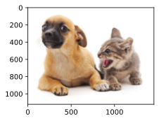
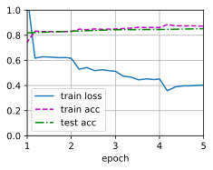
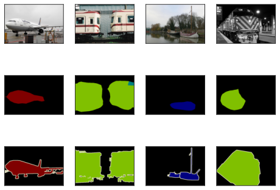

# 全卷积网络FCN


```python
import torch
import torchvision
from torch import nn
from torch.nn import functional as F
from d2l import torch as d2l
```

使用在ImageNet数据集上预训练的ResNet-18模型来提取图像特征]，并将该网络记为pretrained_net。 ResNet-18模型的最后几层包括全局平均汇聚层和全连接层，然而全卷积网络中不需要它们。


```python
pretrained_net = torchvision.models.resnet18(pretrained=True)
list(pretrained_net.children())[-3:]
```

    C:\Users\29229\anaconda3\Lib\site-packages\torchvision\models\_utils.py:208: UserWarning: The parameter 'pretrained' is deprecated since 0.13 and may be removed in the future, please use 'weights' instead.
      warnings.warn(
    C:\Users\29229\anaconda3\Lib\site-packages\torchvision\models\_utils.py:223: UserWarning: Arguments other than a weight enum or `None` for 'weights' are deprecated since 0.13 and may be removed in the future. The current behavior is equivalent to passing `weights=ResNet18_Weights.IMAGENET1K_V1`. You can also use `weights=ResNet18_Weights.DEFAULT` to get the most up-to-date weights.
      warnings.warn(msg)
    


    [Sequential(
       (0): BasicBlock(
         (conv1): Conv2d(256, 512, kernel_size=(3, 3), stride=(2, 2), padding=(1, 1), bias=False)
         (bn1): BatchNorm2d(512, eps=1e-05, momentum=0.1, affine=True, track_running_stats=True)
         (relu): ReLU(inplace=True)
         (conv2): Conv2d(512, 512, kernel_size=(3, 3), stride=(1, 1), padding=(1, 1), bias=False)
         (bn2): BatchNorm2d(512, eps=1e-05, momentum=0.1, affine=True, track_running_stats=True)
         (downsample): Sequential(
           (0): Conv2d(256, 512, kernel_size=(1, 1), stride=(2, 2), bias=False)
           (1): BatchNorm2d(512, eps=1e-05, momentum=0.1, affine=True, track_running_stats=True)
         )
       )
       (1): BasicBlock(
         (conv1): Conv2d(512, 512, kernel_size=(3, 3), stride=(1, 1), padding=(1, 1), bias=False)
         (bn1): BatchNorm2d(512, eps=1e-05, momentum=0.1, affine=True, track_running_stats=True)
         (relu): ReLU(inplace=True)
         (conv2): Conv2d(512, 512, kernel_size=(3, 3), stride=(1, 1), padding=(1, 1), bias=False)
         (bn2): BatchNorm2d(512, eps=1e-05, momentum=0.1, affine=True, track_running_stats=True)
       )
     ),
     AdaptiveAvgPool2d(output_size=(1, 1)),
     Linear(in_features=512, out_features=1000, bias=True)]


创建一个全卷积网络net。 它复制了ResNet-18中大部分的预训练层，除了最后的全局平均汇聚层和最接近输出的全连接层。


```python
net = nn.Sequential(*list(pretrained_net.children())[:-2])
```


```python
X = torch.rand(size=(1, 3, 320, 480))
net(X).shape
```


    torch.Size([1, 512, 10, 15])


使用$1\times1$卷积层将输出通道数转换为Pascal VOC2012数据集的类数（21类）。
最后需要将特征图的高度和宽度增加32倍，从而将其变回输入图像的高和宽。


```python
num_classes = 21
net.add_module('final_conv', nn.Conv2d(512, num_classes, kernel_size=1))
net.add_module('transpose_conv', nn.ConvTranspose2d(num_classes, num_classes,
                                    kernel_size=64, padding=16, stride=32))
```

## 初始化转置卷积层

1. 将输出图像的坐标$(x,y)$映射到输入图像的坐标$(x',y')$上。
例如，根据输入与输出的尺寸之比来映射。
请注意，映射后的$x′$和$y′$是实数。
2. 在输入图像上找到离坐标$(x',y')$最近的4个像素。
3. 输出图像在坐标$(x,y)$上的像素依据输入图像上这4个像素及其与$(x',y')$的相对距离来计算。


```python
def bilinear_kernel(in_channels, out_channels, kernel_size):
    """
    该函数用于生成双线性插值核，用于图像的上采样操作。双线性插值核是一种常用的上采样滤波器，它可以在图像上采样时平滑地增加图像的分辨率。
    参数:
    in_channels (int): 输入通道数。
    out_channels (int): 输出通道数。
    kernel_size (int): 卷积核的大小。
    返回:
    torch.Tensor: 生成的双线性插值核，形状为 (in_channels, out_channels, kernel_size, kernel_size)。
    """
    # 计算因子 factor，用于后续计算中心点和双线性插值核的值
    factor = (kernel_size + 1) // 2
    """
    解释：(kernel_size + 1) // 2 是为了计算一个因子，该因子在后续计算双线性插值核时会用到。
    例如，如果 kernel_size 是 3，那么 (3 + 1) // 2 = 2；如果 kernel_size 是 4，那么 (4 + 1) // 2 = 2。
    """

    # 根据 kernel_size 的奇偶性确定中心点的位置
    if kernel_size % 2 == 1:
        # 如果 kernel_size 是奇数，中心点的索引是 factor - 1
        center = factor - 1
    else:
        # 如果 kernel_size 是偶数，中心点的位置是 factor - 0.5
        center = factor - 0.5
    """
    解释：对于奇数大小的卷积核，中心点是整数索引；对于偶数大小的卷积核，中心点在两个整数索引之间，所以用 factor - 0.5 表示。
    例如，当 kernel_size = 3 时，factor = 2，center = 1；当 kernel_size = 4 时，factor = 2，center = 1.5。
    """

    # 生成两个一维的张量，分别用于表示行和列的索引
    og = (torch.arange(kernel_size).reshape(-1, 1),
          torch.arange(kernel_size).reshape(1, -1))
    """
    解释：torch.arange(kernel_size) 生成一个从 0 到 kernel_size - 1 的一维张量。
    reshape(-1, 1) 将其转换为列向量，reshape(1, -1) 将其转换为行向量。
    例如，当 kernel_size = 3 时，og[0] 是 [[0], [1], [2]]，og[1] 是 [[0, 1, 2]]。
    """

    # 计算双线性插值核的值
    filt = (1 - torch.abs(og[0] - center) / factor) * \
           (1 - torch.abs(og[1] - center) / factor)
    """
    解释：这是双线性插值核的核心计算公式。
    对于每个位置 (i, j)，计算 (1 - |i - center| / factor) * (1 - |j - center| / factor)。
    这样可以得到一个二维的双线性插值核，中心的值最大，向边缘逐渐减小。
    """

    # 初始化一个全零的张量，用于存储最终的双线性插值核
    weight = torch.zeros((in_channels, out_channels,
                          kernel_size, kernel_size))
    """
    解释：torch.zeros 函数创建一个全零的张量，形状为 (in_channels, out_channels, kernel_size, kernel_size)。
    这个张量将用于存储最终的双线性插值核。
    """

    # 将计算得到的双线性插值核赋值给 weight 张量的对应位置
    weight[range(in_channels), range(out_channels), :, :] = filt
    """
    解释：通过索引操作，将计算得到的双线性插值核 filt 赋值给 weight 张量的每个通道对的位置。
    range(in_channels) 和 range(out_channels) 用于选择每个输入通道和输出通道的组合。
    :, : 表示选择该通道对的整个卷积核区域。
    """

    # 返回最终的双线性插值核
    return weight
```


```python
conv_trans = nn.ConvTranspose2d(3, 3, kernel_size=4, padding=1, stride=2,
                                bias=False)
conv_trans.weight.data.copy_(bilinear_kernel(3, 3, 4));
```


```python
#读取图像X，将上采样的结果记作Y。为了打印图像，我们需要调整通道维的位置。
img = torchvision.transforms.ToTensor()(d2l.Image.open('../img/catdog.jpg'))
X = img.unsqueeze(0)
Y = conv_trans(X)
out_img = Y[0].permute(1, 2, 0).detach()
```


```python
d2l.set_figsize()
print('input image shape:', img.permute(1, 2, 0).shape)
d2l.plt.imshow(img.permute(1, 2, 0));
print('output image shape:', out_img.shape)
d2l.plt.imshow(out_img);
```

    input image shape: torch.Size([561, 728, 3])
    output image shape: torch.Size([1122, 1456, 3])
    


    

    


```python
W = bilinear_kernel(num_classes, num_classes, 64)
net.transpose_conv.weight.data.copy_(W);
```

## 实例


```python
batch_size, crop_size = 32, (320, 480)
train_iter, test_iter = d2l.load_data_voc(batch_size, crop_size)
```

    read 1114 examples
    read 1078 examples
    


```python
# 定义一个自定义的损失函数，用于计算模型输出和真实标签之间的损失
# 此函数基于交叉熵损失，并进行了特定的缩减操作
def loss(inputs, targets):
    # F.cross_entropy 是 PyTorch 中用于计算交叉熵损失的函数
    # 交叉熵损失常用于分类问题，衡量模型预测的概率分布与真实标签的概率分布之间的差异
    # reduction='none' 表示不进行任何缩减操作，直接返回每个样本的损失值
    # 得到一个形状为 (batch_size, ...) 的张量，其中 batch_size 是批量大小
    per_sample_loss = F.cross_entropy(inputs, targets, reduction='none')
    # 对第一个维度（通常是通道维度）求均值，将每个样本在通道维度上的损失进行平均
    mean_loss_1 = per_sample_loss.mean(1)
    # 再次对第一个维度求均值，进一步对损失进行平均
    return mean_loss_1.mean(1)

# 定义训练的相关参数
# num_epochs 表示训练的总轮数，即模型将对整个训练数据集进行 5 次遍历
num_epochs = 5
# lr 是学习率，控制模型在每次参数更新时的步长
# 学习率过大可能导致模型无法收敛，学习率过小则会使训练速度变慢
lr = 0.001
# wd 是权重衰减系数，用于防止模型过拟合
# 它在优化过程中对模型的权重进行惩罚，使得权重不会变得过大
wd = 1e-3
# 尝试获取所有可用的 GPU 设备
# d2l 是一个自定义的深度学习工具包，try_all_gpus 函数用于检测系统中可用的 GPU
# 并返回一个包含这些 GPU 设备的列表，如果没有可用的 GPU，可能返回一个空列表
devices = d2l.try_all_gpus()

# 创建一个随机梯度下降（SGD）优化器，用于更新模型的参数
# torch.optim.SGD 是 PyTorch 中实现随机梯度下降优化算法的类
# net.parameters() 表示模型中需要更新的参数
# lr=lr 指定学习率，weight_decay=wd 指定权重衰减系数
# 在训练过程中，优化器会根据计算得到的梯度和这些参数来更新模型的权重
trainer = torch.optim.SGD(net.parameters(), lr=lr, weight_decay=wd)

# 选择合适的设备（GPU 或 CPU）
# torch.device('cuda' if torch.cuda.is_available() else 'cpu') 检查系统中是否有可用的 GPU
# 如果有，则选择 cuda 设备；否则，选择 cpu 设备
device = torch.device('cuda' if torch.cuda.is_available() else 'cpu')
# 将模型 net 移动到指定的设备上，确保模型的计算在该设备上进行
net = net.to(device)

# 调用 d2l 工具包中的 train_ch13 函数开始训练模型
# net 是待训练的模型
# train_iter 是训练数据集的迭代器，用于按批次提供训练数据
# test_iter 是测试数据集的迭代器，用于在训练过程中评估模型的性能
# loss 是自定义的损失函数，用于计算模型的损失
# trainer 是优化器，用于更新模型的参数
# num_epochs 是训练的总轮数
# [device] 是包含训练设备的列表，确保训练过程在指定的设备上进行
d2l.train_ch13(net, train_iter, test_iter, loss, trainer, num_epochs, [device])
```

    loss 0.404, train acc 0.873, test acc 0.853
    3.3 examples/sec on [device(type='cpu')]
    


    

    


```python
# 修改 predict 函数
def predict(img):
    X = test_iter.dataset.normalize_image(img).unsqueeze(0)
    pred = net(X.to(device)).argmax(dim=1)
    return pred.reshape(pred.shape[1], pred.shape[2])
```


```python
def label2image(pred):
    colormap = torch.tensor(d2l.VOC_COLORMAP, device=device)
    X = pred.long()
    return colormap[X, :]
```


```python
# 从指定的数据源下载并解压 VOC 2012 数据集
# d2l.download_extract 是 d2l 工具包中封装的函数，用于处理数据集的下载和提取操作
# 'voc2012' 是数据集的标识，用于指定要下载的数据集
# 'VOCdevkit/VOC2012' 是解压后数据集的相对路径
voc_dir = d2l.download_extract('voc2012', 'VOCdevkit/VOC2012')

# 从指定路径读取 VOC 2012 数据集的测试图像和对应的标签
# d2l.read_voc_images 是 d2l 工具包中的函数，用于读取 VOC 数据集的图像和标签
# voc_dir 是数据集的路径，False 表示读取测试集（如果为 True 则读取训练集）
test_images, test_labels = d2l.read_voc_images(voc_dir, False)

# 设置要处理的图像数量为 4
n = 4
# 初始化一个空列表 imgs，用于存储后续处理后的图像
imgs = []

# 选择合适的计算设备
# torch.device 用于指定计算设备，'cuda' 表示使用 GPU，'cpu' 表示使用 CPU
# torch.cuda.is_available() 用于检查系统中是否有可用的 GPU，如果有则选择 GPU，否则选择 CPU
device = torch.device('cuda' if torch.cuda.is_available() else 'cpu')

# 将模型 net 移动到指定的计算设备上
# 确保模型的计算在所选设备上进行，这样输入数据和模型参数才能在同一设备上进行运算
net = net.to(device)

# 循环处理前 n 张测试图像
for i in range(n):
    # 定义裁剪矩形区域，格式为 (左, 上, 宽, 高)
    # 这里表示从图像的左上角 (0, 0) 开始，裁剪宽度为 320 像素，高度为 480 像素的区域
    crop_rect = (0, 0, 320, 480)
    
    # 对第 i 张测试图像进行裁剪操作
    # torchvision.transforms.functional.crop 是 torchvision 中的函数，用于对图像进行裁剪
    # test_images[i] 是第 i 张测试图像，*crop_rect 是将裁剪矩形区域的参数解包传入函数
    X = torchvision.transforms.functional.crop(test_images[i], *crop_rect)
    
    # 对裁剪后的图像进行预测，并将预测结果转换为可视化的图像
    # predict 是自定义的预测函数，用于对输入图像进行语义分割预测
    # label2image 是自定义的函数，用于将预测的标签转换为可视化的图像
    pred = label2image(predict(X))
    
    # 将裁剪后的原始图像、预测结果图像和裁剪后的标签图像添加到 imgs 列表中
    # X.permute(1,2,0) 是将图像的通道维度从 (C, H, W) 转换为 (H, W, C)，以符合可视化的要求
    # pred.cpu() 是将预测结果从 GPU 移动到 CPU 上，方便后续的可视化操作
    # torchvision.transforms.functional.crop(test_labels[i], *crop_rect) 是对第 i 张标签图像进行裁剪
    # .permute(1,2,0) 同样是将标签图像的通道维度进行转换
    imgs += [X.permute(1,2,0), pred.cpu(),
             torchvision.transforms.functional.crop(
                 test_labels[i], *crop_rect).permute(1,2,0)]

# 显示处理后的图像
# d2l.show_images 是 d2l 工具包中的函数，用于显示图像
# imgs[::3] 表示从 imgs 列表中每隔 3 个元素取一个，即取出所有的原始图像
# imgs[1::3] 表示从 imgs 列表中第 1 个元素开始，每隔 3 个元素取一个，即取出所有的预测结果图像
# imgs[2::3] 表示从 imgs 列表中第 2 个元素开始，每隔 3 个元素取一个，即取出所有的标签图像
# 3 表示每行显示 3 张图像，n 表示总共显示 n 组图像，scale=2 表示图像的缩放比例为 2
d2l.show_images(imgs[::3] + imgs[1::3] + imgs[2::3], 3, n, scale=2);
```


    

    


```python

```
