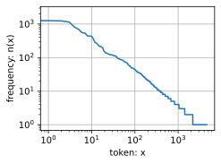
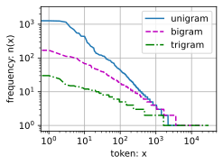

# 语言模型和数据集


```python
import random
import re
import torch
from d2l import torch as d2l
```


```python
d2l.DATA_HUB['time_machine'] = (d2l.DATA_URL + 'timemachine.txt',
                                '090b5e7e70c295757f55df93cb0a180b9691891a')

def read_time_machine():  
    """将时间机器数据集加载到文本行的列表中"""
    with open(d2l.download('time_machine'), 'r') as f:
        lines = f.readlines()
    return [re.sub('[^A-Za-z]+', ' ', line).strip().lower() for line in lines]
    
lines = read_time_machine()

tokens = d2l.tokenize(lines)
# 因为每个文本行不一定是一个句子或一个段落，因此我们把所有文本行拼接到一起
corpus = [token for line in tokens for token in line]
vocab = d2l.Vocab(corpus)
vocab.token_freqs[:10]
```


    [('the', 2261),
     ('i', 1267),
     ('and', 1245),
     ('of', 1155),
     ('a', 816),
     ('to', 695),
     ('was', 552),
     ('in', 541),
     ('that', 443),
     ('my', 440)]


```python
freqs = [freq for token, freq in vocab.token_freqs]
d2l.plot(freqs, xlabel='token: x', ylabel='frequency: n(x)',
         xscale='log', yscale='log')
```


    

    


```python
# 其他的词元组合，比如二元语法、三元语法
from collections import defaultdict

class BigramVocab:
    def __init__(self, tokens, min_freq=0, reserved_tokens=None):
        if reserved_tokens is None:
            reserved_tokens = []
        # 统计词频
        counter = defaultdict(int)
        for token in tokens:
            counter[token] += 1
        self.token_freqs = sorted(counter.items(), key=lambda x: x[1], reverse=True)
        # 构建词表
        self.idx_to_token = ['<unk>'] + reserved_tokens + [
            token for token, freq in self.token_freqs if freq >= min_freq
        ]
        self.token_to_idx = {token: idx for idx, token in enumerate(self.idx_to_token)}

    def __len__(self):
        return len(self.idx_to_token)

    def __getitem__(self, tokens):
        if not isinstance(tokens, (list, tuple)):
            return self.token_to_idx.get(tokens, self.token_to_idx['<unk>'])
        return [self.__getitem__(token) for token in tokens]

# 使用自定义的 BigramVocab
bigram_tokens = [pair for pair in zip(corpus[:-1], corpus[1:])]
bigram_vocab = BigramVocab(bigram_tokens)
print(bigram_vocab.token_freqs[:10])
```

    [(('of', 'the'), 309), (('in', 'the'), 169), (('i', 'had'), 130), (('i', 'was'), 112), (('and', 'the'), 109), (('the', 'time'), 102), (('it', 'was'), 99), (('to', 'the'), 85), (('as', 'i'), 78), (('of', 'a'), 73)]
    


```python
from collections import defaultdict

class TrigramVocab:
    def __init__(self, tokens, min_freq=0, reserved_tokens=None):
        if reserved_tokens is None:
            reserved_tokens = []
        # 统计词频
        counter = defaultdict(int)
        for token in tokens:
            counter[token] += 1
        self.token_freqs = sorted(counter.items(), key=lambda x: x[1], reverse=True)
        # 构建词表
        self.idx_to_token = ['<unk>'] + reserved_tokens + [
            token for token, freq in self.token_freqs if freq >= min_freq
        ]
        self.token_to_idx = {token: idx for idx, token in enumerate(self.idx_to_token)}

    def __len__(self):
        return len(self.idx_to_token)

    def __getitem__(self, tokens):
        if not isinstance(tokens, (list, tuple)):
            return self.token_to_idx.get(tokens, self.token_to_idx['<unk>'])
        return [self.__getitem__(token) for token in tokens]

# 使用自定义的 TrigramVocab
trigram_tokens = [triple for triple in zip(corpus[:-2], corpus[1:-1], corpus[2:])]
trigram_vocab = TrigramVocab(trigram_tokens)
print(trigram_vocab.token_freqs[:10])
```

    [(('the', 'time', 'traveller'), 59), (('the', 'time', 'machine'), 30), (('the', 'medical', 'man'), 24), (('it', 'seemed', 'to'), 16), (('it', 'was', 'a'), 15), (('here', 'and', 'there'), 15), (('seemed', 'to', 'me'), 14), (('i', 'did', 'not'), 14), (('i', 'saw', 'the'), 13), (('i', 'began', 'to'), 13)]
    


```python
bigram_freqs = [freq for token, freq in bigram_vocab.token_freqs]
trigram_freqs = [freq for token, freq in trigram_vocab.token_freqs]
d2l.plot([freqs, bigram_freqs, trigram_freqs], xlabel='token: x',
         ylabel='frequency: n(x)', xscale='log', yscale='log',
         legend=['unigram', 'bigram', 'trigram'])
```


    

    


## 读取长序列数据


```python
# 随机采样
# 随机采样函数，用于生成一个小批量子序列
def seq_data_iter_random(corpus, batch_size, num_steps):  
    """使用随机抽样生成一个小批量子序列"""
    # 从随机偏移量开始对序列进行分区，随机范围包括num_steps-1
    # 这一步的目的是为了让每次抽样的起始位置随机，增加数据的随机性
    # 如果不进行随机偏移，每次抽样的起始位置都是固定的，可能会导致模型学习到一些不必要的规律
    corpus = corpus[random.randint(0, num_steps - 1):]
    # 减去1，是因为我们需要考虑标签
    # 我们要预测下一个时间步的值，所以最后一个元素不能作为子序列的起始位置
    # 例如，一个长度为10的序列，num_steps为3，我们最多只能有7个长度为3的子序列
    num_subseqs = (len(corpus) - 1) // num_steps
    # 长度为num_steps的子序列的起始索引
    # 生成子序列的起始索引，方便后续根据这些索引提取子序列
    initial_indices = list(range(0, num_subseqs * num_steps, num_steps))
    # 在随机抽样的迭代过程中，
    # 来自两个相邻的、随机的、小批量中的子序列不一定在原始序列上相邻
    # 打乱起始索引的顺序，使得每个小批量中的子序列是随机选取的
    # 这样可以避免模型学习到相邻子序列之间的顺序关系，提高模型的泛化能力
    random.shuffle(initial_indices)

    def data(pos):
        # 返回从pos位置开始的长度为num_steps的序列
        # 这个函数用于根据起始索引提取子序列
        return corpus[pos: pos + num_steps]

    num_batches = num_subseqs // batch_size
    # 遍历每个小批量
    for i in range(0, batch_size * num_batches, batch_size):
        # 在这里，initial_indices包含子序列的随机起始索引
        # 提取当前小批量中所有子序列的起始索引
        initial_indices_per_batch = initial_indices[i: i + batch_size]
        # 根据起始索引提取输入序列X
        X = [data(j) for j in initial_indices_per_batch]
        # 根据起始索引+1提取目标序列Y，即下一个时间步的值
        Y = [data(j + 1) for j in initial_indices_per_batch]
        # 使用生成器返回当前小批量的输入序列X和目标序列Y
        yield torch.tensor(X), torch.tensor(Y)
```


```python
my_seq = list(range(35))
for X, Y in seq_data_iter_random(my_seq, batch_size=2, num_steps=5):
    print('X: ', X, '\nY:', Y)
```

    X:  tensor([[17, 18, 19, 20, 21],
            [12, 13, 14, 15, 16]]) 
    Y: tensor([[18, 19, 20, 21, 22],
            [13, 14, 15, 16, 17]])
    X:  tensor([[ 7,  8,  9, 10, 11],
            [ 2,  3,  4,  5,  6]]) 
    Y: tensor([[ 8,  9, 10, 11, 12],
            [ 3,  4,  5,  6,  7]])
    X:  tensor([[27, 28, 29, 30, 31],
            [22, 23, 24, 25, 26]]) 
    Y: tensor([[28, 29, 30, 31, 32],
            [23, 24, 25, 26, 27]])
    


```python
# 顺序分区
def seq_data_iter_sequential(corpus, batch_size, num_steps):  
    """使用顺序分区生成一个小批量子序列"""
    # 从随机偏移量开始划分序列
    offset = random.randint(0, num_steps)
    num_tokens = ((len(corpus) - offset - 1) // batch_size) * batch_size
    Xs = torch.tensor(corpus[offset: offset + num_tokens])
    Ys = torch.tensor(corpus[offset + 1: offset + 1 + num_tokens])
    Xs, Ys = Xs.reshape(batch_size, -1), Ys.reshape(batch_size, -1)
    num_batches = Xs.shape[1] // num_steps
    for i in range(0, num_steps * num_batches, num_steps):
        X = Xs[:, i: i + num_steps]
        Y = Ys[:, i: i + num_steps]
        yield X, Y
```


```python
for X, Y in seq_data_iter_sequential(my_seq, batch_size=2, num_steps=5):
    print('X: ', X, '\nY:', Y)
```

    X:  tensor([[ 2,  3,  4,  5,  6],
            [18, 19, 20, 21, 22]]) 
    Y: tensor([[ 3,  4,  5,  6,  7],
            [19, 20, 21, 22, 23]])
    X:  tensor([[ 7,  8,  9, 10, 11],
            [23, 24, 25, 26, 27]]) 
    Y: tensor([[ 8,  9, 10, 11, 12],
            [24, 25, 26, 27, 28]])
    X:  tensor([[12, 13, 14, 15, 16],
            [28, 29, 30, 31, 32]]) 
    Y: tensor([[13, 14, 15, 16, 17],
            [29, 30, 31, 32, 33]])
    


```python
# 封装
class SeqDataLoader:  
    """加载序列数据的迭代器"""
    def __init__(self, batch_size, num_steps, use_random_iter, max_tokens):
        if use_random_iter:
            self.data_iter_fn = d2l.seq_data_iter_random
        else:
            self.data_iter_fn = d2l.seq_data_iter_sequential
        self.corpus, self.vocab = d2l.load_corpus_time_machine(max_tokens)
        self.batch_size, self.num_steps = batch_size, num_steps

    def __iter__(self):
        return self.data_iter_fn(self.corpus, self.batch_size, self.num_steps)
        
def load_data_time_machine(batch_size, num_steps,  
                           use_random_iter=False, max_tokens=10000):
    """返回时光机器数据集的迭代器和词表"""
    data_iter = SeqDataLoader(
        batch_size, num_steps, use_random_iter, max_tokens)
    return data_iter, data_iter.vocab
```


```python

```
