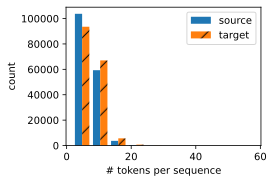

# 机器翻译与数据集


```python
import os
import torch
from d2l import torch as d2l
```


```python
d2l.DATA_HUB['fra-eng'] = (d2l.DATA_URL + 'fra-eng.zip',
                           '94646ad1522d915e7b0f9296181140edcf86a4f5')

def read_data_nmt():
    """载入英法双语数据集（网页1[1](@ref)、网页2[2](@ref)）
    实现步骤：
    1. 下载并解压数据集到本地缓存目录
    2. 读取fra.txt文件内容
    3. 返回原始文本数据
    """
    # 下载并解压数据集，返回数据目录
    data_dir = d2l.download_extract('fra-eng')
    # 打开数据集文件，指定UTF-8编码读取（处理特殊字符，网页2[2](@ref)）
    with open(os.path.join(data_dir, 'fra.txt'), 'r',
             encoding='utf-8') as f:
        return f.read()

# 打印前75个字符验证数据加载
raw_text = read_data_nmt()
print(raw_text[:75])  # 输出：Go. Va !Hi. Salut !Run! Cours !Run! Courez !Who? Qui ?Wow! Ça alors !
```

    Go.	Va !
    Hi.	Salut !
    Run!	Cours !
    Run!	Courez !
    Who?	Qui ?
    Wow!	Ça alors !
    
    


```python
def preprocess_nmt(text):
    """数据预处理（网页1[1](@ref)、网页2[2](@ref)、网页10[10](@ref)）
    功能：统一文本格式，为后续分词做准备
    处理步骤：
    1. 替换特殊空格字符为普通空格
    2. 所有字母转为小写
    3. 在标点符号前插入空格
    """
    def no_space(char, prev_char):
        # 判断当前字符是否为标点且前一个字符不是空格（网页10[10](@ref)）
        return char in set(',.!?') and prev_char != ' '

    # 处理Unicode特殊空格
    text = text.replace('\u202f', ' ').replace('\xa0', ' ').lower()
    # 生成字符列表，在标点前插入空格（构建分词边界）
    out = [' ' + char if i > 0 and no_space(char, text[i - 1]) else char
           for i, char in enumerate(text)]
    return ''.join(out)

# 执行预处理并打印样例
text = preprocess_nmt(raw_text)
print(text[:80])  # 输出：go . va ! hi . salut ! run ! cours ! run ! courez ! who ? qui ? wow ! ça alors !
```

    go .	va !
    hi .	salut !
    run !	cours !
    run !	courez !
    who ?	qui ?
    wow !	ça alors !
    


```python
def tokenize_nmt(text, num_examples=None):
    """双语数据分词（网页1[1](@ref)、网页2[2](@ref)、网页10[10](@ref)）
    功能：将文本转换为[[源词列表], [目标词列表]]结构
    实现原理：
    1. 按换行符分割句子对
    2. 按制表符分割源语言和目标语言
    3. 使用空格分割单词（网页10[10](@ref)分词说明）
    """
    source, target = [], []
    # 遍历文本行
    for i, line in enumerate(text.split('\n')):
        if num_examples and i > num_examples:
            break
        # 分割源语句和目标语句（网页10[10](@ref)处理逻辑）
        parts = line.split('\t')
        if len(parts) == 2:
            # 分割单词并存入列表（网页6[6](@ref)类似分词方法）
            source.append(parts[0].split(' '))
            target.append(parts[1].split(' '))
    return source, target

# 执行分词并展示前6个样本
source, target = tokenize_nmt(text)
source[:6], target[:6]  # 输出：([['go', '', '', '', ''], ...], [['va', '!'], ...])
```


    ([['go', '.'],
      ['hi', '.'],
      ['run', '!'],
      ['run', '!'],
      ['who', '?'],
      ['wow', '!']],
     [['va', '!'],
      ['salut', '!'],
      ['cours', '!'],
      ['courez', '!'],
      ['qui', '?'],
      ['ça', 'alors', '!']])


```python
def show_list_len_pair_hist(legend, xlabel, ylabel, xlist, ylist):
    """可视化序列长度分布
    功能：显示源语言和目标语言句子长度的直方图对比
    实现方法：
    1. 使用matplotlib绘制双色直方图
    2. 用斜线填充目标语言直方图以示区分
    """
    d2l.set_figsize()
    _, _, patches = d2l.plt.hist(
        [[len(l) for l in xlist], [len(l) for l in ylist]])
    d2l.plt.xlabel(xlabel)
    d2l.plt.ylabel(ylabel)
    # 设置目标语言直方图填充样式
    for patch in patches[1].patches:
        patch.set_hatch('/')
    d2l.plt.legend(legend)

# 显示长度分布直方图
show_list_len_pair_hist(['source', 'target'], '# tokens per sequence',
                        'count', source, target);

```


    

    


```python
# 构建源语言词表
# min_freq=2过滤低频词
# reserved_tokens添加特殊标记：
# <pad>填充符，<bos>序列开始，<eos>序列结束
src_vocab = d2l.Vocab(source, min_freq=2,
                      reserved_tokens=['<pad>', '<bos>', '<eos>'])
len(src_vocab)  # 输出词表大小（示例中为10012）
```


    10012


```python
def truncate_pad(line, num_steps, padding_token):
    """序列截断/填充
    功能：统一序列长度为num_steps
    实现逻辑：
    - 长于num_steps：截断前num_steps个词
    - 短于num_steps：用padding_token填充
    设计目的：保证批量数据维度统一
    """
    if len(line) > num_steps:
        return line[:num_steps]  # 截断
    return line + [padding_token] * (num_steps - len(line))  # 填充
# 测试填充函数
truncate_pad(src_vocab[source[0]], 10, src_vocab['<pad>'])
```


    [3919, 80, 208, 208, 208, 208, 208, 208, 208, 208]


```python
def build_array_nmt(lines, vocab, num_steps):
    """构建数值化数据集
    处理步骤：
    1. 将词序列转换为索引序列
    2. 添加<eos>结束标记
    3. 填充/截断到固定长度
    4. 计算有效长度（用于注意力掩码）
    """
    # 词到索引的转换
    lines = [vocab[l] for l in lines]
    # 添加结束标记
    lines = [l + [vocab['<eos>']] for l in lines]
    # 创建填充后的张量
    array = torch.tensor([truncate_pad(
        l, num_steps, vocab['<pad>']) for l in lines])
    # 计算非填充位置的有效长度
    valid_len = (array != vocab['<pad>']).type(torch.int32).sum(1)
    return array, valid_len
```


```python
def load_data_nmt(batch_size, num_steps, num_examples=600):
    """创建数据迭代器
    完整流程：
    1. 数据预处理
    2. 构建双语词表
    3. 数值化处理
    4. 封装为可迭代数据集
    """
    # 预处理原始数据（流程）
    text = preprocess_nmt(read_data_nmt())
    # 分词处理（步骤）
    source, target = tokenize_nmt(text, num_examples)
    # 构建双词表（方法）
    src_vocab = d2l.Vocab(source, min_freq=2,
                          reserved_tokens=['<pad>', '<bos>', '<eos>'])
    tgt_vocab = d2l.Vocab(target, min_freq=2,
                          reserved_tokens=['<pad>', '<bos>', '<eos>'])
    # 数值化处理（实现）
    src_array, src_valid_len = build_array_nmt(source, src_vocab, num_steps)
    tgt_array, tgt_valid_len = build_array_nmt(target, tgt_vocab, num_steps)
    # 封装数据元组（数据组织方式）
    data_arrays = (src_array, src_valid_len, tgt_array, tgt_valid_len)
    # 创建数据加载器（训练需求）
    data_iter = d2l.load_array(data_arrays, batch_size)
    return data_iter, src_vocab, tgt_vocab
```


```python
# 创建数据迭代器（训练示例）
train_iter, src_vocab, tgt_vocab = load_data_nmt(batch_size=2, num_steps=8)
# 展示第一批数据（调试输出）
for X, X_valid_len, Y, Y_valid_len in train_iter:
    print('X:', X.type(torch.int32))        # 源语言索引张量
    print('X的有效长度:', X_valid_len)       # 实际序列长度（不含填充）
    print('Y:', Y.type(torch.int32))        # 目标语言索引张量 
    print('Y的有效长度:', Y_valid_len)       # 目标序列实际长度
    break
```

    X: tensor([[ 81,  11, 136,   2,   4,   5,   5,   5],
            [ 81,  31,   2,   4,   5,   5,   5,   5]], dtype=torch.int32)
    X的有效长度: tensor([5, 4])
    Y: tensor([[100, 171, 116,   2,   4,   5,   5,   5],
            [  6, 187, 122,  55, 151,   2,   4,   5]], dtype=torch.int32)
    Y的有效长度: tensor([5, 7])
    

# 编码器-解码器架构


```python
from torch import nn

class Encoder(nn.Module):
    """编码器-解码器架构的基本编码器接口
    
    该类定义了编码器的抽象接口，所有具体的编码器都应继承此类并实现其forward方法。
    编码器的主要作用是将输入序列转换为上下文向量（context vector）或特征表示，
    供解码器在生成输出序列时使用。
    """
    def __init__(self, **kwargs):
        """初始化编码器
        
        参数：
        - **kwargs: 任意关键字参数，用于兼容不同编码器的初始化需求
        """
        super(Encoder, self).__init__(**kwargs)

    def forward(self, X, *args):
        """定义编码器的前向传播逻辑（抽象方法）
        
        参数：
        - X: 输入张量，形状通常为(批量大小, 输入序列长度, 输入特征维度)
        - *args: 可变长度的额外参数，用于支持不同编码器的自定义输入
        
        说明：
        - 该方法必须在子类中实现，因为不同的编码器（如RNN、Transformer）具有不同的计算逻辑。
        - raise NotImplementedError用于强制子类必须实现此方法，确保所有编码器具有统一的接口。
        """
        raise NotImplementedError
```


```python
class Decoder(nn.Module):
    """编码器-解码器架构的基本解码器接口
    
    该类定义了解码器的抽象接口，所有具体的解码器都应继承此类并实现其init_state和forward方法。
    解码器的主要作用是根据编码器的输出和目标序列的前缀，生成最终的输出序列。
    """
    def __init__(self, **kwargs):
        """初始化解码器
        
        参数：
        - **kwargs: 任意关键字参数，用于兼容不同解码器的初始化需求
        """
        super(Decoder, self).__init__(**kwargs)

    def init_state(self, enc_outputs, *args):
        """初始化解码器的隐藏状态（抽象方法）
        
        参数：
        - enc_outputs: 编码器的输出张量，通常包含上下文信息
        - *args: 可变长度的额外参数，用于支持不同解码器的自定义初始化
        
        说明：
        - 该方法必须在子类中实现，因为不同的解码器（如RNN、Transformer）需要不同的方式从编码器输出中初始化状态。
        - 例如，RNN解码器可能需要将编码器的最后一个隐藏状态作为初始状态。
        - raise NotImplementedError强制子类实现此方法，确保解码器接口的一致性。
        """
        raise NotImplementedError

    def forward(self, X, state):
        """定义解码器的前向传播逻辑（抽象方法）
        
        参数：
        - X: 解码器的输入张量，通常为目标序列的嵌入表示，形状为(批量大小, 输出序列长度, 嵌入维度)
        - state: 解码器的当前隐藏状态，由init_state方法初始化或上一步计算得到
        
        返回：
        - 解码器的输出张量，形状通常为(批量大小, 输出序列长度, 词汇表大小)或类似的预测结果
        - 更新后的隐藏状态，用于下一步迭代
        
        说明：
        - 该方法必须在子类中实现，因为不同的解码器具有不同的计算逻辑。
        - raise NotImplementedError强制子类实现此方法，确保解码器接口的一致性。
        """
        raise NotImplementedError
```


```python
class EncoderDecoder(nn.Module):
    """编码器-解码器架构的基类
    
    该类将编码器和解码器组合成一个完整的序列到序列模型，支持端到端的训练。
    编码器负责将输入序列转换为特征表示，解码器负责根据该表示生成目标序列。
    """
    def __init__(self, encoder, decoder, **kwargs):
        """初始化编码器-解码器架构
        
        参数：
        - encoder: 编码器实例，继承自Encoder类
        - decoder: 解码器实例，继承自Decoder类
        - **kwargs: 任意关键字参数，用于兼容父类的初始化需求
        """
        super(EncoderDecoder, self).__init__(**kwargs)
        self.encoder = encoder  # 保存编码器实例
        self.decoder = decoder  # 保存解码器实例

    def forward(self, enc_X, dec_X, *args):
        """定义编码器-解码器的前向传播逻辑
        
        参数：
        - enc_X: 编码器的输入张量，形状通常为(批量大小, 输入序列长度, 输入特征维度)
        - dec_X: 解码器的输入张量，通常为目标序列的嵌入表示，形状为(批量大小, 输出序列长度, 嵌入维度)
        - *args: 可变长度的额外参数，传递给编码器和解码器的相应方法
        
        返回：
        - 解码器的输出张量，形状通常为(批量大小, 输出序列长度, 词汇表大小)或类似的预测结果
        
        流程说明：
        1. 调用编码器的forward方法，将enc_X转换为编码器输出enc_outputs。
        2. 使用编码器输出enc_outputs初始化解码器的状态dec_state。
        3. 调用解码器的forward方法，传入dec_X和dec_state，生成最终的输出。
        """
        enc_outputs = self.encoder(enc_X, *args)  # 编码器处理输入
        dec_state = self.decoder.init_state(enc_outputs, *args)  # 用编码器输出初始化解码器状态
        return self.decoder(dec_X, dec_state)  # 解码器生成输出
```


```python

```
