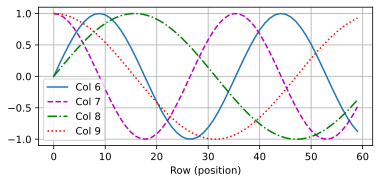
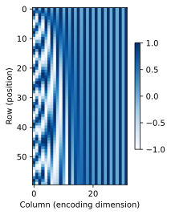

# 自注意力和位置编码


```python
import math
import torch
from torch import nn
from d2l import torch as d2l
```


```python
num_hiddens, num_heads = 100, 5
attention = d2l.MultiHeadAttention(num_hiddens, num_heads, 0.5)
attention.eval()
```

    C:\Users\29229\anaconda3\Lib\site-packages\torch\nn\modules\lazy.py:181: UserWarning: Lazy modules are a new feature under heavy development so changes to the API or functionality can happen at any moment.
      warnings.warn('Lazy modules are a new feature under heavy development '
    


    MultiHeadAttention(
      (attention): DotProductAttention(
        (dropout): Dropout(p=0.5, inplace=False)
      )
      (W_q): LazyLinear(in_features=0, out_features=100, bias=False)
      (W_k): LazyLinear(in_features=0, out_features=100, bias=False)
      (W_v): LazyLinear(in_features=0, out_features=100, bias=False)
      (W_o): LazyLinear(in_features=0, out_features=100, bias=False)
    )


```python
batch_size, num_queries, valid_lens = 2, 4, torch.tensor([3, 2])
X = torch.ones((batch_size, num_queries, num_hiddens))
attention(X, X, X, valid_lens).shape
```


    torch.Size([2, 4, 100])


```python
import torch
import torch.nn as nn
# 假设 d2l 是一个自定义的深度学习工具包，提供了 plot 函数用于绘图
# 这里我们不详细展开 d2l 的实现，仅假设它存在且有相应功能

class PositionalEncoding(nn.Module):
    def __init__(self, num_hiddens, dropout, max_len=1000):
        """
        位置编码类的初始化函数。位置编码用于为输入序列添加位置信息，帮助模型捕捉序列中的顺序关系。

        参数:
        num_hiddens (int): 隐藏层维度，即输入序列每个元素的特征维度。
        dropout (float): Dropout 概率，用于防止过拟合。
        max_len (int): 最大序列长度，默认为 1000。
        """
        # 调用父类的初始化方法
        super(PositionalEncoding, self).__init__()
        # 创建一个 Dropout 层，用于在训练过程中随机丢弃部分神经元，防止过拟合
        self.dropout = nn.Dropout(dropout)
        # 初始化位置编码矩阵 P，形状为 (1, max_len, num_hiddens)
        # 这里初始化为全零矩阵，后续会填充具体的位置编码值
        self.P = torch.zeros((1, max_len, num_hiddens))
        # 创建一个从 0 到 max_len - 1 的一维张量 X，用于生成位置编码
        # 然后将其形状调整为 (-1, 1)，即列向量
        # 接着除以 10000 的幂，幂次由 0 到 num_hiddens 以步长 2 生成，再除以 num_hiddens
        # 这样做是为了让不同维度的位置编码有不同的周期
        X = torch.arange(max_len, dtype=torch.float32).reshape(
            -1, 1) / torch.pow(
                10000,
                torch.arange(0, num_hiddens, 2, dtype=torch.float32) /
                num_hiddens)
        # 将 X 的正弦值填充到位置编码矩阵 P 的偶数维度（索引从 0 开始）
        self.P[:, :, 0::2] = torch.sin(X)
        # 将 X 的余弦值填充到位置编码矩阵 P 的奇数维度（索引从 1 开始）
        self.P[:, :, 1::2] = torch.cos(X)

    def forward(self, X):
        """
        前向传播函数，将输入序列与位置编码相加，并应用 Dropout。

        参数:
        X (torch.Tensor): 输入序列，形状为 (batch_size, seq_len, num_hiddens)

        返回:
        torch.Tensor: 经过位置编码和 Dropout 处理后的序列
        """
        # 将输入序列 X 与位置编码矩阵 P 的前 seq_len 行相加
        # 确保位置编码矩阵的设备与输入序列的设备一致
        X = X + self.P[:, :X.shape[1], :].to(X.device)
        # 对相加后的结果应用 Dropout 并返回
        return self.dropout(X)
```


```python
# 定义隐藏层维度和序列长度
encoding_dim, num_steps = 32, 60
# 创建位置编码实例，Dropout 概率设为 0，即不进行 Dropout
pos_encoding = PositionalEncoding(encoding_dim, 0)
# 将模型设置为评估模式，不进行 Dropout 等训练时的操作
pos_encoding.eval()
# 输入一个全零的张量，形状为 (1, num_steps, encoding_dim)
# 调用位置编码的前向传播函数，得到经过位置编码处理后的序列
X = pos_encoding(torch.zeros((1, num_steps, encoding_dim)))
# 提取位置编码矩阵 P 的前 num_steps 行，用于绘图
P = pos_encoding.P[:, :X.shape[1], :]
# 使用 d2l.plot 函数绘制位置编码矩阵 P 的第 6 到第 9 列（索引从 0 开始）
# x 轴表示序列中的位置，y 轴表示位置编码的值
# 图例显示列的编号
d2l.plot(torch.arange(num_steps), P[0, :, 6:10].T, xlabel='Row (position)',
         figsize=(6, 2.5), legend=["Col %d" % d for d in torch.arange(6, 10)])
```


    

    


### 结果分析
- **周期性特征**：由于位置编码使用了正弦和余弦函数，所以绘制的曲线会呈现出周期性。不同的列（即不同的特征维度）具有不同的周期，这有助于模型区分不同位置的元素。
- **位置信息**：位置编码的目的是为模型提供序列中元素的位置信息。通过观察曲线，我们可以看到不同位置的元素具有不同的位置编码值，这样模型在处理序列时就可以利用这些位置信息来捕捉元素之间的顺序关系。
- **维度差异**：不同列的曲线形状不同，这是因为不同维度的位置编码使用了不同的频率（即不同的幂次）。这种设计使得模型可以从多个维度获取位置信息，增强了模型对位置的感知能力。

### 记忆方法
- **初始化部分**：
    1. 调用父类初始化方法。
    2. 创建 Dropout 层。
    3. 初始化位置编码矩阵 `P` 为全零。
    4. 计算 `X`，并根据 `X` 的正弦和余弦值填充 `P` 的偶数和奇数维度。
- **前向传播部分**：
    1. 将输入序列 `X` 与位置编码矩阵 `P` 相加。
    2. 应用 Dropout 并返回结果。

### 应用场景
位置编码常用于 Transformer 等基于注意力机制的模型中，这些模型本身不具备对序列顺序的感知能力，通过添加位置编码可以让模型更好地处理序列数据，如自然语言处理中的文本序列、时间序列分析等。 


```python
# 打印从 0 到 7 的整数的二进制表示
for i in range(8):
    # 使用 f-string 格式化输出
    # {i} 表示当前循环的整数
    # {i:>03b} 表示将整数 i 转换为二进制字符串，并且右对齐，不足 3 位时在左边补 0
    print(f'{i} in binary is {i:>03b}')

# 调整位置编码矩阵 P 的形状
# P 原本的形状可能是 (1, seq_len, num_hiddens)
# 第一个 unsqueeze(0) 会在最前面添加一个维度，形状变为 (1, 1, seq_len, num_hiddens)
# 第二个 unsqueeze(0) 再次在最前面添加一个维度，形状变为 (1, 1, 1, seq_len, num_hiddens)
# 这里添加额外的维度可能是为了满足 d2l.show_heatmaps 函数对输入形状的要求
P = P[0, :, :].unsqueeze(0).unsqueeze(0)

# 使用 d2l 工具包中的 show_heatmaps 函数绘制热力图
# P 是输入的位置编码矩阵，用于生成热力图的数据
# xlabel 是 x 轴的标签，这里表示编码维度
# ylabel 是 y 轴的标签，这里表示序列中的位置
# figsize 是图形的大小，设置为 (3.5, 4)
# cmap 是颜色映射，这里使用 'Blues' 颜色方案，颜色越深表示值越大
d2l.show_heatmaps(P, xlabel='Column (encoding dimension)',
                  ylabel='Row (position)', figsize=(3.5, 4), cmap='Blues')

"""
位置信息：从热力图中可以看到不同位置（y 轴）在不同编码维度（x 轴）上的位置编码值的分布情况。颜色的变化反映了位置编码的周期性和不同维度之间的差异。
周期性特征：由于位置编码使用了正弦和余弦函数，热力图中可能会呈现出周期性的颜色变化，这有助于模型捕捉序列中的位置信息。
维度差异：不同的编码维度可能具有不同的颜色模式，这表明不同维度的位置编码对位置的敏感度不同，模型可以从多个维度获取位置信息。
"""
```

    0 in binary is 000
    1 in binary is 001
    2 in binary is 010
    3 in binary is 011
    4 in binary is 100
    5 in binary is 101
    6 in binary is 110
    7 in binary is 111
    


    

    


要解读位置编码的热力图，需结合其设计原理和可视化结果的特征。以下是详细的分析步骤：

---

### 1. **热力图的基本信息**
   - **坐标轴含义**：
     - **Y轴（Row）**：表示序列中的位置（从0到最大长度，如示例中的60）。
     - **X轴（Column）**：表示编码维度（如示例中的32个维度）。
   - **颜色含义**：使用`Blues`颜色映射，颜色越深表示对应位置和维度的编码值越大（接近1），颜色越浅表示值越小（接近-1或0）。

---

### 2. **核心模式解读**
   - **周期性特征**：
     - 热力图中会呈现明显的**水平条纹**，这是因为位置编码通过正弦和余弦函数生成，具有周期性。
     - 不同维度的条纹密度不同：**低频维度**（如前几个维度）的条纹较宽（周期长），**高频维度**（如后几个维度）的条纹较窄（周期短）。这是因为公式中对频率进行了指数级缩放（`10000^(2i/d)`），使得不同维度的周期不同。

   - **奇偶维度的交替模式**：
     - 观察热力图的列会发现，**偶数维度（0, 2, 4...）**和**奇数维度（1, 3, 5...）**的颜色变化模式不同。
     - 偶数维度使用正弦函数，其值从0开始逐渐增大到1，再减小到-1，最后回到0；奇数维度使用余弦函数，其值从1开始逐渐减小到-1，再增大到1。这种交替设计确保了位置编码的唯一性。

   - **位置区分能力**：
     - 每个位置在不同维度上的编码值组合是唯一的。例如，位置0和位置1在某些维度上的值差异明显，这帮助模型区分不同位置。
     - 由于正弦和余弦函数的正交性，不同位置的编码向量在高维空间中具有不同的方向，增强了模型对位置的敏感性。

---

### 3. **对模型的意义**
   - **捕捉绝对位置**：热力图显示每个位置在所有维度上的唯一编码，使模型能够直接学习到序列中元素的绝对位置信息。
   - **适应长序列**：位置编码的周期性设计（尤其是低频维度）有助于模型在处理长序列时保持位置信息的稳定性，避免因序列过长而导致的位置混淆。
   - **增强注意力机制**：当注意力机制结合位置编码时，模型可以同时考虑内容相似性和位置关系，提升对序列结构的理解。

---

### 4. **示例热力图的典型现象**
   - **横向条纹**：同一维度上，颜色随位置变化呈现周期性波动，反映正弦/余弦函数的周期性。
   - **纵向差异**：不同维度的波动频率不同，低频维度（如前几列）的颜色变化缓慢，高频维度（如后几列）的颜色变化密集。
   - **对称性**：由于正弦和余弦的对称性，某些维度的颜色分布可能呈现对称模式（例如，位置i和位置max_len-i在某些维度上的值对称）。

---

### 总结
通过热力图，我们可以直观地看到位置编码如何通过正弦和余弦函数为每个位置生成唯一的高维向量。这种设计不仅为模型提供了位置信息，还通过多频率的周期性变化增强了模型对序列结构的建模能力。解读热力图时，需重点关注周期性、维度差异和位置唯一性，这些特征共同解释了位置编码为何能有效提升序列模型的性能。


```python

```
