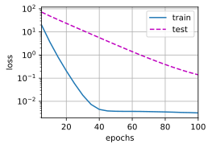
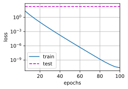
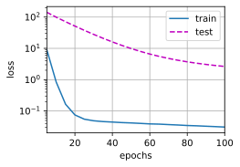

# 权重衰退

## 生成数据集
生成公式如下：

(**$$y = 0.05 + \sum_{i = 1}^d 0.01 x_i + \epsilon \text{ where }
\epsilon \sim \mathcal{N}(0, 0.01^2).$$**)

我们选择标签是关于输入的线性函数。
标签同时被均值为0，标准差为0.01高斯噪声破坏。
为了使过拟合的效果更加明显，我们可以将问题的维数增加到$d = 200$，
并使用一个只包含20个样本的小训练集。


```python
import torch
from torch import nn
from d2l import torch as d2l
```


```python
n_train, n_test, num_inputs, batch_size = 20, 100, 200, 5 #数据越简单，模型越复杂，越容易过拟合
true_w, true_b = torch.ones((num_inputs, 1)) * 0.01, 0.05  #真实数据
train_data = d2l.synthetic_data(true_w, true_b, n_train) #生成测试数据集
train_iter = d2l.load_array(train_data, batch_size) #迭代器
test_data = d2l.synthetic_data(true_w, true_b, n_test) 
test_iter = d2l.load_array(test_data, batch_size, is_train=False)

# true_w：使用 torch.ones((num_inputs, 1)) 创建一个形状为 (num_inputs, 1) 的张量，其中所有元素初始化为 1，然后乘以 0.01，得到一个形状为 (200, 1) 的张量，代表真实的权重参数。
```


```python
## 初始化模型参数
def init_params():
    w = torch.normal(0, 1, size = (num_inputs, 1), requires_grad = True)
    b = torch.zeros(1, requires_grad = True)
    return [w, b]

# 定义L2 范数惩罚
def l2_penalty(w):
    return torch.sum(w.pow(2)) / 2  #λ会写在外面
```


```python
def train(lambd):
    w, b = init_params()
    net, loss = lambda X: d2l.linreg(X, w, b), d2l.squared_loss
    num_epochs, lr = 100, 0.003
    animator = d2l.Animator(xlabel = 'epochs', ylabel = 'loss', yscale = 'log', xlim = [5, num_epochs], legend = ['train', 'test'])
    for epoch in range(num_epochs):
        for X, y in train_iter:
            l = loss(net(X), y) + lambd * l2_penalty(w)
            l.sum().backward()
            d2l.sgd([w, b], lr, batch_size)
        if (epoch + 1) % 5 == 0:
            animator.add(epoch + 1, (d2l.evaluate_loss(net, train_iter, loss),
                                     d2l.evaluate_loss(net, test_iter, loss)))
    print('w的l2范数是：', torch.norm(w).item())
```


```python
# 忽略正则化，直接实现
train(lambd = 0)
```

    w的l2范数是： 13.327942848205566
    


    

    


```python
# 使用权重衰退
train(lambd = 3)
```

    w的l2范数是： 0.3751027584075928
    


    

    


```python
## 简单实现
def train_concise(wd):
    net = nn.Sequential(nn.Linear(num_inputs, 1))
    for param in net.parameters():
        param.data.normal_()
    loss = nn.MSELoss(reduction='none')
    num_epochs, lr = 100, 0.003
    # 偏置参数没有衰减
    trainer = torch.optim.SGD([
        {"params":net[0].weight,'weight_decay': wd},  # 区别：把参数放在函数里面
        {"params":net[0].bias}], lr=lr)
    animator = d2l.Animator(xlabel='epochs', ylabel='loss', yscale='log',
                            xlim=[5, num_epochs], legend=['train', 'test'])
    for epoch in range(num_epochs):
        for X, y in train_iter:
            trainer.zero_grad()
            l = loss(net(X), y)
            l.mean().backward()
            trainer.step()
        if (epoch + 1) % 5 == 0:
            animator.add(epoch + 1,
                         (d2l.evaluate_loss(net, train_iter, loss),
                          d2l.evaluate_loss(net, test_iter, loss)))
    print('w的L2范数：', net[0].weight.norm().item())
```


```python
train_concise(0)
```

    w的L2范数： 13.731993675231934
    


    

    


```python
train_concise(3)
```

    w的L2范数： 0.5378920435905457
    


    

    


```python

```
